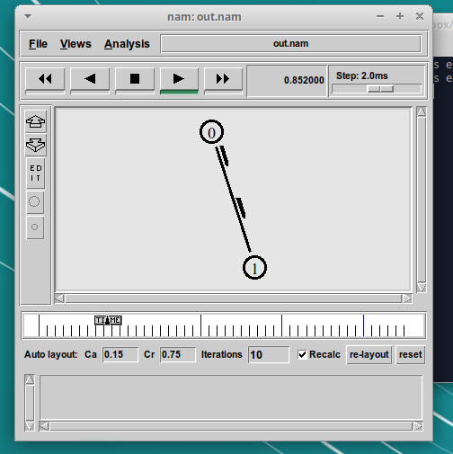

---
## Front matter
lang: ru-RU
title: Отчёт по лабораторной работе №1
subtitle: Имитационное моделирование
author:
  - Екатерина Канева, НФИбд-02-22
institute:
  - Российский университет дружбы народов, Москва, Россия
date: 14 февраля 2025

## i18n babel
babel-lang: russian
babel-otherlangs: english

## Formatting pdf
toc: false
toc-title: Содержание
slide_level: 2
aspectratio: 169
section-titles: true
theme: metropolis
header-includes:
 - \metroset{progressbar=frametitle,sectionpage=progressbar,numbering=fraction}
---

# Информация

## Докладчик

* Канева Екатерина Павловна
* студент группы НФИбд-02-22
* Российский университет дружбы народов
* [1132222004@rudn.ru](mailto:1132222004@rudn.ru)
* <https://nevseros.github.io/ru/>

# Вводная часть

## Цель

Целью выполнения лабораторной работы является приобретение навыков моделирования сетей передачи данных с помощью средства имитационного моделирования NS-2, а также анализ полученных результатов моделирования.

## Задания

* Создать шаблон для выполнения заданий.
* Смоделировать сеть из двух узлов.
* Смоделировать сеть из трёх узлов.
* Смоделировать кольцевую сеть из 7 узлов.
* Смоделировать кольцевую сеть из 5 узлов и 1 некольцевого узла.

# Выполнение лабораторной работы

## Создание шаблона

Для начала я создала шаблон для выполнения заданий (рис. 1):

{#fig:1 width=50%}

## Рассмотрение первого примера

Для рассмотрения примера я создала файл `example1.tcl` (рис. 2):

{#fig:2 width=30%}

## Работа первого примера

{#fig:4 width=40%}

## Рассмотрение второго примера

Для рассмотрения примера я создала файл `example2.tcl` (рис. 4):

{#fig:6 width=30%}

## Работа второго примера

{#fig:8 width=30%}

## Работа второго примера

{#fig:9 width=30%}

## Рассмотрение третьего примера

Для рассмотрения примера я создала файл `example3.tcl` (рис. 7):

{#fig:11 width=30%}

## Работа третьего примера

{#fig:13 width=30%}

## Работа третьего примера

{#fig:14 width=30%}

## Работа третьего примера

{#fig:15 width=30%}

## Доработка схемы - упражнение

Требовалось повторить следующую топологию (рис. 11) с некоторыми условиями, похожими на предыдущие пункты:

{#fig:17 width=40%}

## Рассмотрение кода

Для выполнения этого упражнения я создала следующий файл `task.tcl` (рис. 12):

{#fig:18 width=25%}

## Работа схемы

{#fig:21 width=30%}

## Работа схемы

{#fig:22 width=30%}

## Работа схемы

{#fig:23 width=30%}

# Результаты

## Выводы

Приобрели навыки моделирования сетей передачи данных с помощью средства имитационного моделирования NS-2, проанализировали полученные результаты моделирования и доработали схему.