---
## Front matter
title: "Отчёт по лабораторной работе №1"
subtitle: "Имитационное моделирование"
author: "Екатерина Канева, НФИбд-02-22"

## Generic otions
lang: ru-RU
toc-title: "Содержание"

## Bibliography
bibliography: bib/cite.bib
csl: pandoc/csl/gost-r-7-0-5-2008-numeric.csl

## Pdf output format
toc: true # Table of contents
toc-depth: 2
lof: true # List of figures
lot: true # List of tables
fontsize: 12pt
linestretch: 1.5
papersize: a4
documentclass: scrreprt
## I18n polyglossia
polyglossia-lang:
  name: russian
  options:
	- spelling=modern
	- babelshorthands=true
polyglossia-otherlangs:
  name: english
## I18n babel
babel-lang: russian
babel-otherlangs: english
## Fonts
mainfont: IBM Plex Serif
romanfont: IBM Plex Serif
sansfont: IBM Plex Sans
monofont: IBM Plex Mono
mathfont: STIX Two Math
mainfontoptions: Ligatures=Common,Ligatures=TeX,Scale=0.94
romanfontoptions: Ligatures=Common,Ligatures=TeX,Scale=0.94
sansfontoptions: Ligatures=Common,Ligatures=TeX,Scale=MatchLowercase,Scale=0.94
monofontoptions: Scale=MatchLowercase,Scale=0.94,FakeStretch=0.9
mathfontoptions:
## Biblatex
biblatex: true
biblio-style: "gost-numeric"
biblatexoptions:
  - parentracker=true
  - backend=biber
  - hyperref=auto
  - language=auto
  - autolang=other*
  - citestyle=gost-numeric
## Pandoc-crossref LaTeX customization
figureTitle: "Рис."
tableTitle: "Таблица"
listingTitle: "Листинг"
lofTitle: "Список иллюстраций"
lotTitle: "Список таблиц"
lolTitle: "Листинги"
## Misc options
indent: true
header-includes:
  - \usepackage{indentfirst}
  - \usepackage{float} # keep figures where there are in the text
  - \floatplacement{figure}{H} # keep figures where there are in the text
---

# Цель работы

Приобретение навыков моделирования сетей передачи данных с помощью средства имитационного моделирования NS-2, а также анализ полученных результатов моделирования.

# Задание

* Создать шаблон для выполнения заданий.
* Смоделировать сеть из двух узлов.
* Смоделировать сеть из трёх узлов.
* Смоделировать кольцевую сеть из 7 узлов.
* Смоделировать кольцевую сеть из 5 узлов и 1 некольцевого узла.

# Выполнение лабораторной работы

### Шаблон

Сначала я создала шаблон для выполнения заданий согласно описанию из лабораторной работы (рис. [-@fig:1]):

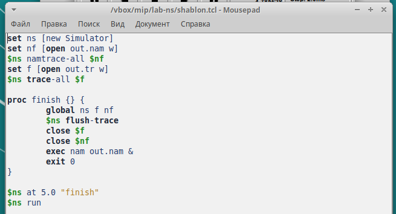{#fig:1 width=70%}

### Два узла

**Постановка задачи.** Требуется смоделировать сеть передачи данных, состоящую из двух узлов, соединённых дуплексной линией связи с полосой пропускания 2 Мб/с и задержкой 10 мс, очередью с обслуживанием типа DropTail. От одного узла к другому по протоколу UDP осуществляется передача пакетов, размером 500 байт, с постоянной скоростью 200 пакетов в секунду.

Для рассмотрения этого примера я создала следующий файл `example1.tcl` (рис. [-@fig:2]):

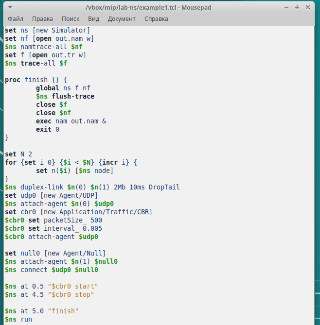{#fig:2 width=70%}

Получилась следующая схема (рис. [-@fig:3]):

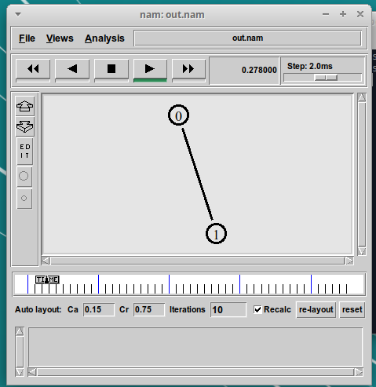{#fig:3 width=70%}

Она работала (рис. [-@fig:4] и [-@fig:5]):

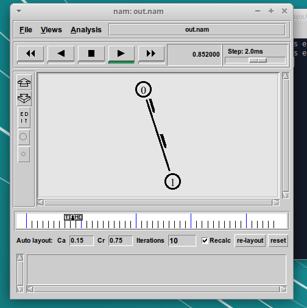{#fig:4 width=70%}

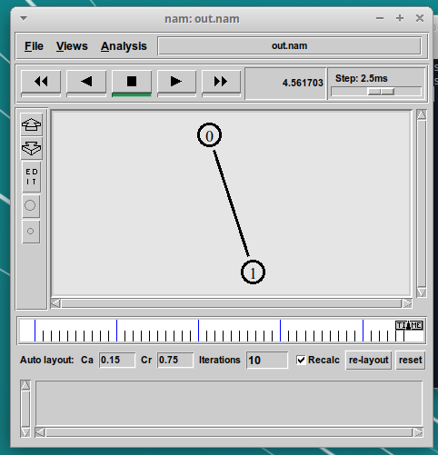{#fig:5 width=70%}

### Три узла, усложнённая топология

**Постановка задачи**. Описание моделируемой сети:
- сеть состоит из 4 узлов (n0, n1, n2, n3);
- между узлами n0 и n2, n1 и n2 установлено дуплексное соединение с пропускной способностью 2 Мбит/с и задержкой 10 мс;
- между узлами n2 и n3 установлено дуплексное соединение с пропускной способностью 1,7 Мбит/с и задержкой 20 мс;
- каждый узел использует очередь с дисциплиной DropTail для накопления пакетов, максимальный размер которой составляет 10;
- TCP-источник на узле n0 подключается к TCP-приёмнику на узле n3 (по-умолчанию, максимальный размер пакета, который TCP-агент может генери-
ровать, равняется 1KByte);
- TCP-приёмник генерирует и отправляет ACK пакеты отправителю и откидывает полученные пакеты;
- UDP-агент, который подсоединён к узлу n1, подключён к null-агенту на узле n3 (null-агент просто откидывает пакеты);
- генераторы трафика ftp и cbr прикреплены к TCP и UDP агентам соответственно;
- генератор cbr генерирует пакеты размером 1 Кбайт со скоростью 1 Мбит/с;
- работа cbr начинается в 0,1 секунду и прекращается в 4,5 секунды, а ftp начинает работать в 1,0 секунду и прекращает в 4,0 секунды.

Для рассмотрения этого примера я создала следующий файл `example2.tcl` (рис. [-@fig:6]):

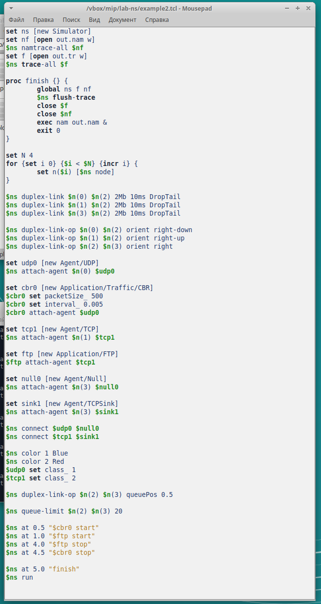{#fig:6 width=70%}

Получилась следующая схема (рис. [-@fig:7]):

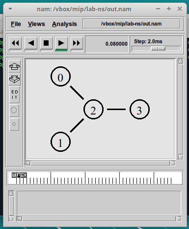{#fig:7 width=70%}

Она работала (рис. [-@fig:8], [-@fig:9] и [-@fig:10]):

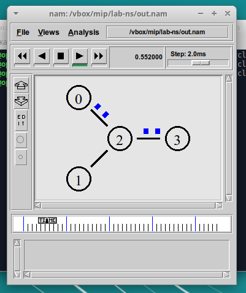{#fig:8 width=70%}

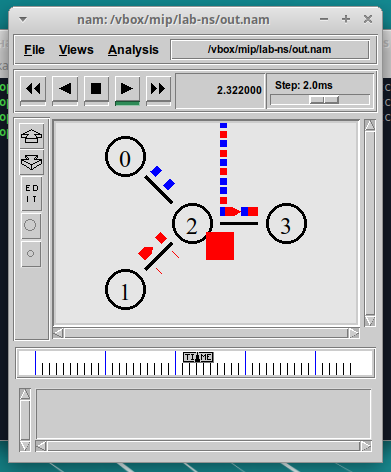{#fig:9 width=70%}

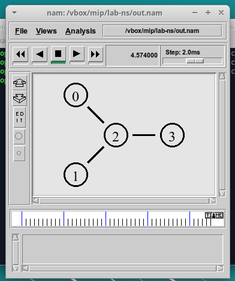{#fig:10 width=70%}

### Кольцевая топология

**Постановка задачи**. Требуется построить модель передачи данных по сети с кольцевой топологией и динамической маршрутизацией пакетов:
- сеть состоит из 7 узлов, соединённых в кольцо;
- данные передаются от узла n(0) к узлу n(3) по кратчайшему пути;
- с 1 по 2 секунду модельного времени происходит разрыв соединения между узлами n(1) и n(2);
- при разрыве соединения маршрут передачи данных должен измениться на резервный.

Для рассмотрения этого примера я создала следующий файл `example3.tcl` (рис. [-@fig:11]):

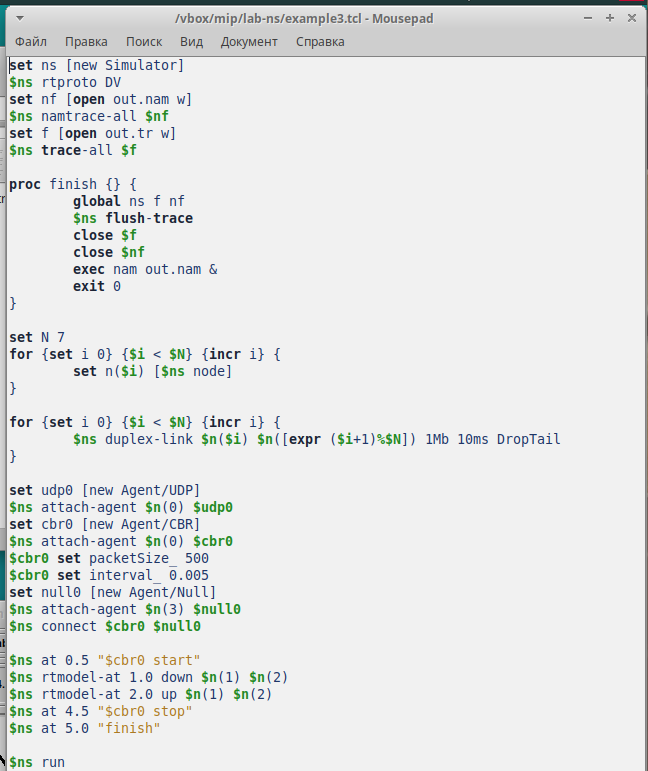{#fig:11 width=70%}

Получилась следующая схема (рис. [-@fig:12]):

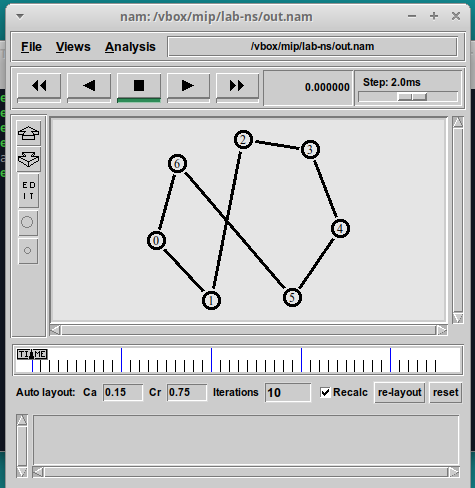{#fig:12 width=70%}

Она работала (рис. [-@fig:13], [-@fig:14], [-@fig:15] и [-@fig:16]):

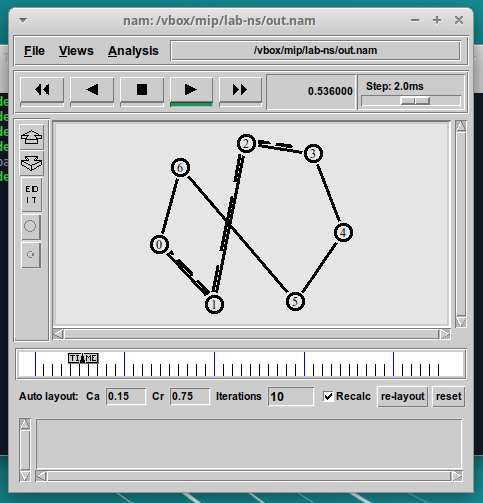{#fig:13 width=70%}

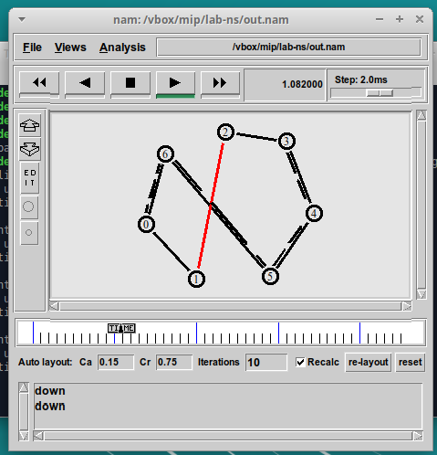{#fig:14 width=70%}

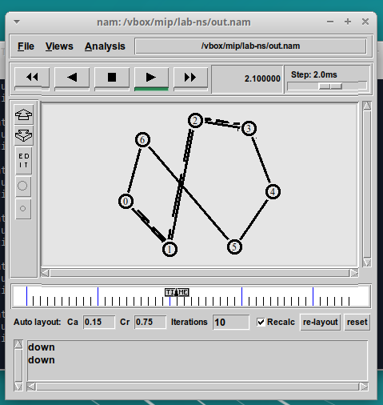{#fig:15 width=70%}

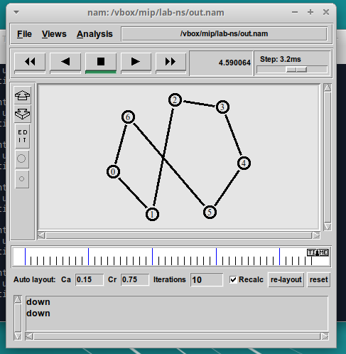{#fig:16 width=70%}

### Доработка схемы

**Упражнение**. Внесите следующие изменения в реализацию примера с кольцевой
топологией сети:
- топология сети должна соответствовать представленной на рис. [-@fig:17]:

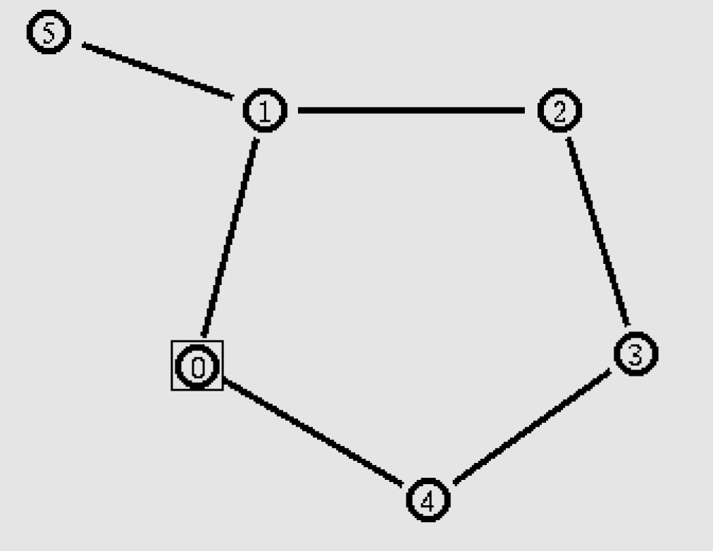{#fig:17 width=70%}

- передача данных должна осуществляться от узла n(0) до узла n(5) по кратчайшему пути в течение 5 секунд модельного времени;
- передача данных должна идти по протоколу TCP (тип Newreno), на принимающей стороне используется TCPSink-объект типа DelAck; поверх TCP работает протокол FTP с 0,5 до 4,5 секунд модельного времени;
- с 1 по 2 секунду модельного времени происходит разрыв соединения между узлами n(0) и n(1);
- при разрыве соединения маршрут передачи данных должен измениться на резервный, после восстановления соединения пакеты снова должны пойти по кратчайшему пути.

Для выполнения этого упражнения я создала следующий файл `task.tcl` (рис. [-@fig:18]):

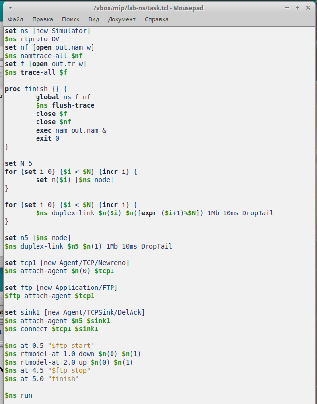{#fig:18 width=70%}

Получилась следующая схема (рис. [-@fig:12]):

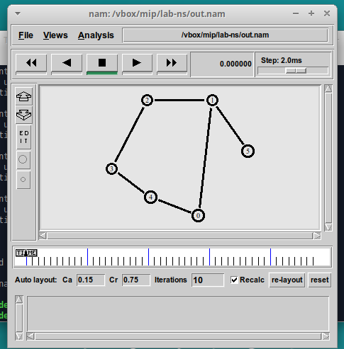{#fig:19 width=70%}

Она работала (рис. [-@fig:20], [-@fig:21], [-@fig:22], [-@fig:23] и [-@fig:24]):

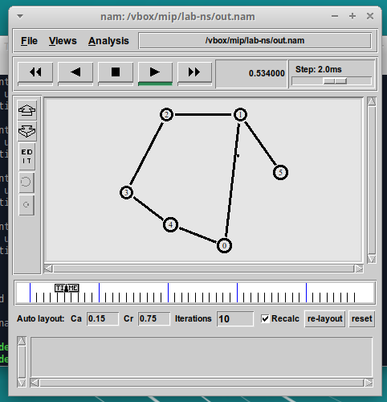{#fig:20 width=70%}

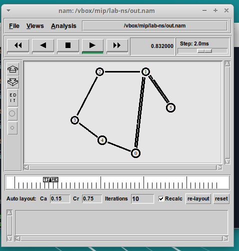{#fig:21 width=70%}

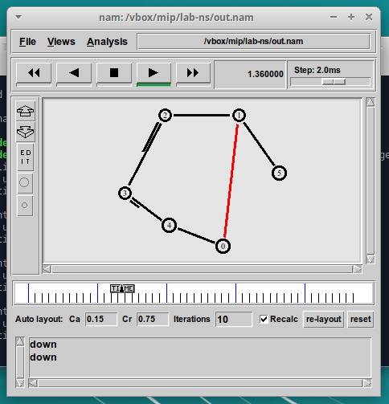{#fig:22 width=70%}

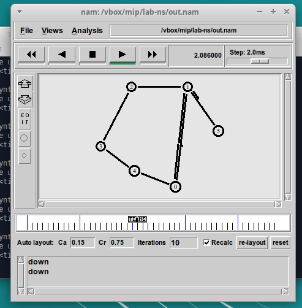{#fig:23 width=70%}

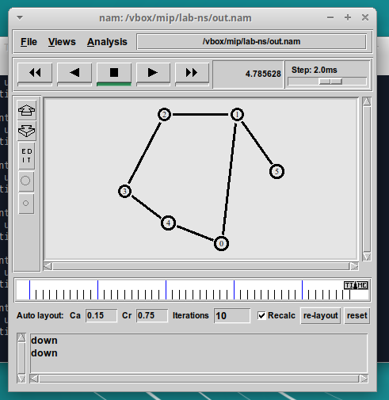{#fig:24 width=70%}

# Выводы

Приобрели навыки моделирования сетей передачи данных с помощью средства имитационного моделирования NS-2, проанализировали полученные результаты моделирования и доработали схему.
