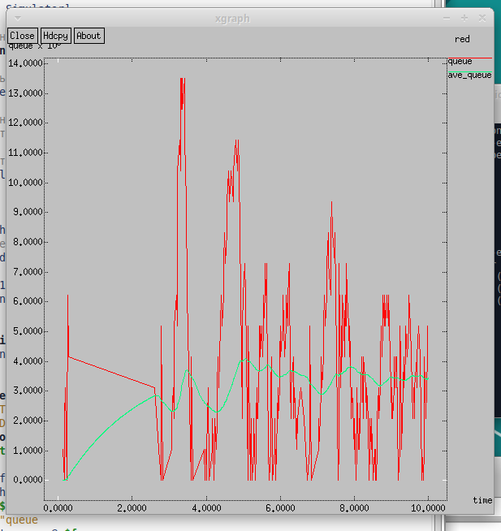
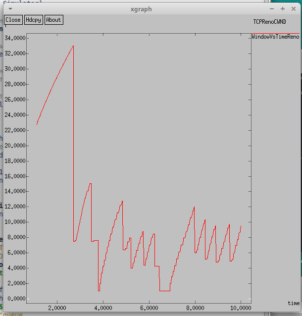
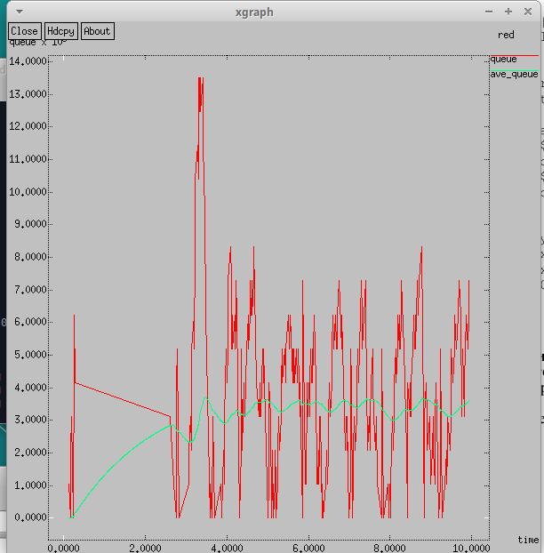
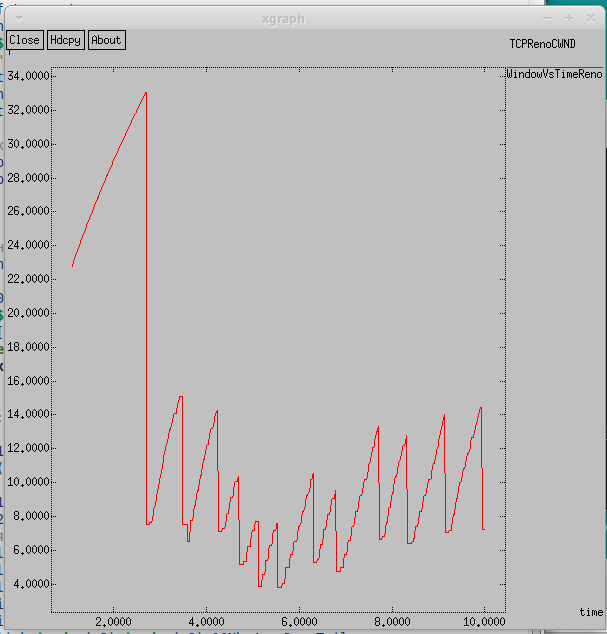
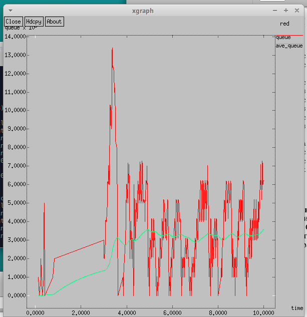
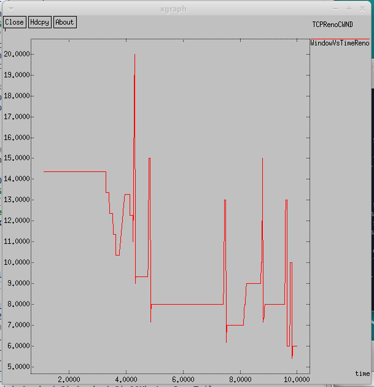
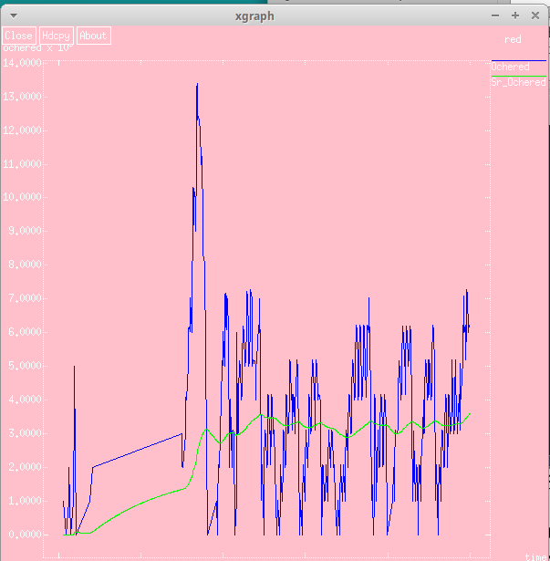
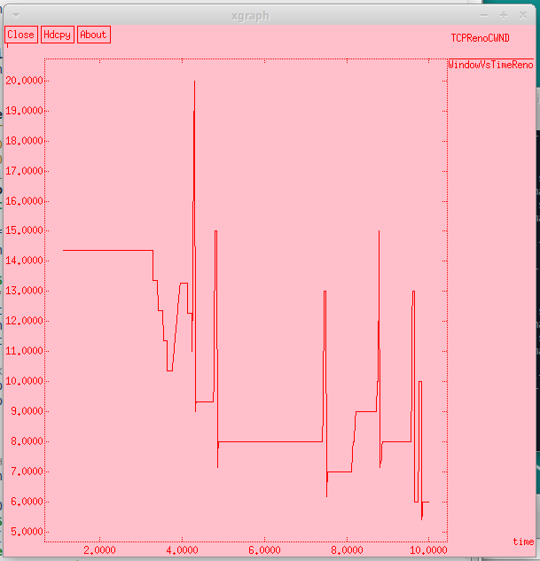

---
## Front matter
lang: ru-RU
title: Презентация по лабораторной работе №2
subtitle: Имитационное моделирование
author:
  - Екатерина Канева, НФИбд-02-22
institute:
  - Российский университет дружбы народов, Москва, Россия
date: 22 февраля 2025

## i18n babel
babel-lang: russian
babel-otherlangs: english

## Formatting pdf
toc: false
toc-title: Содержание
slide_level: 2
aspectratio: 169
section-titles: true
theme: metropolis
header-includes:
 - \metroset{progressbar=frametitle,sectionpage=progressbar,numbering=fraction}
---

# Информация

## Докладчик

* Канева Екатерина Павловна
* студент группы НФИбд-02-22
* Российский университет дружбы народов
* [1132222004@rudn.ru](mailto:1132222004@rudn.ru)
* <https://nevseros.github.io/ru/>

# Вводная часть

## Цель

Научиться работать с мониторингом очередей, TCP, дисциплиной RED, сравнить различные протоколы.

## Задания

На основе имеющейся модели изменить тип протокола с Reno на NewReno, а затем на Vegas, сравнить. Также, внести изменения при отображении окон с графиками.

# Выполнение работы

## Создание изначальной сети

У базовой сети были следубщие требования:

- сеть состоит из 6 узлов;
- между всеми узлами установлено дуплексное соединение с различными пропускной способностью и задержкой 10 мс;
- узел r1 использует очередь с дисциплиной RED для накопления пакетов, максимальный размер которой составляет 25;
- TCP-источники на узлах s1 и s2 подключаются к TCP-приёмнику на узле s3;
- генераторы трафика FTP прикреплены к TCP-агентам.

## Длина очереди

{#fig:1 width=40%}

## TCP-окно

{#fig:2 width=40%}

## NewReno

Далее, следуя заданию, изменим Reno для s1 на NewReno. Для этого изменила следующую часть кода:

```
set tcp1 [$ns create-connection TCP/Newreno $node_(s1) TCPSink $node_(s3) 0]
```

## Длина очереди

{#fig:3 width=40%}

## TCP-окно

{#fig:4 width=40%}

## Vegas

Далее, следуя заданию, изменим Newreno для s1 на Vegas. Для этого изменила следующую часть кода:

```
set tcp1 [$ns create-connection TCP/Vegas $node_(s1) TCPSink $node_(s3) 0]
```

## Длина очереди

{#fig:5 width=40%}

## TCP-окно

{#fig:6 width=40%}

## Изменение отображения

Далее я внесла изменения при отображении окон с графиками (измените цвет фона, цвет траекторий, подписи к осям, подпись траектории в легенде). Для этого внесла изменения в процедуру finish, например:

```
  exec xgraph -fg red -bg pink -bb -tk -x time -t "TCPRenoCWND" WindowVsTimeReno &
  exec xgraph -fg white -bg pink -bb -tk -x time -y ochered temp.queue &
```

## Длина очереди

{#fig:7 width=40%}

## TCP-окно

{#fig:8 width=40%}

# Заключение

## Вывод

Научилась работать с мониторингом очередей, TCP, дисциплиной RED, сравнила различные протоколы.