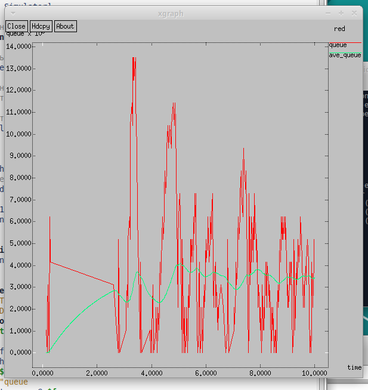
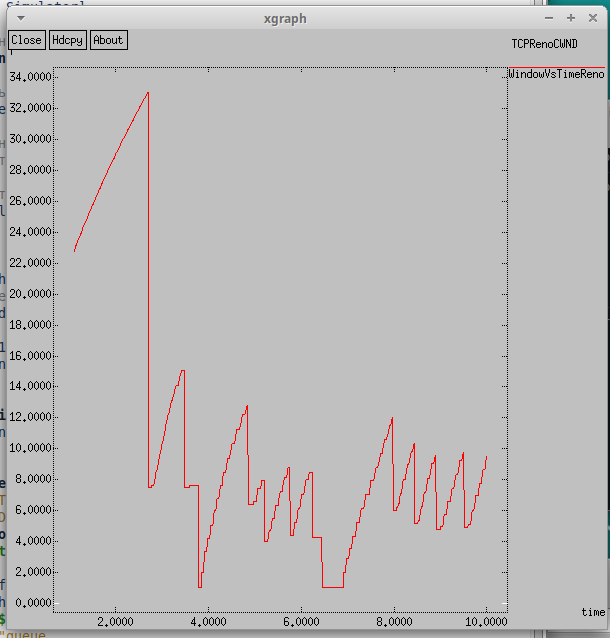
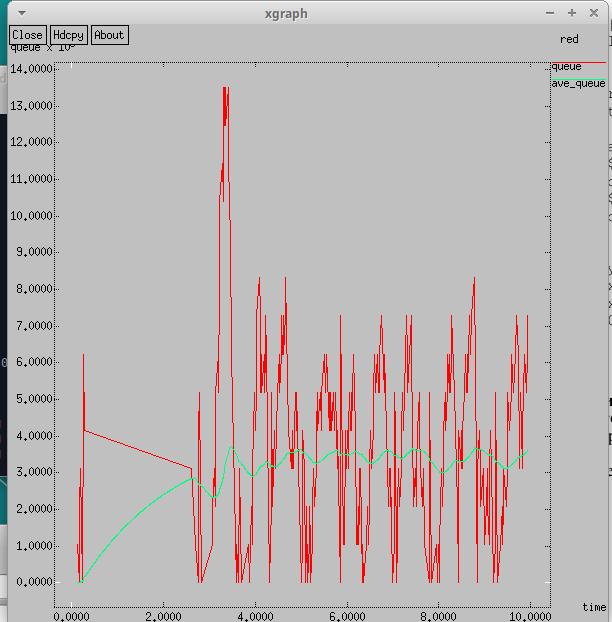
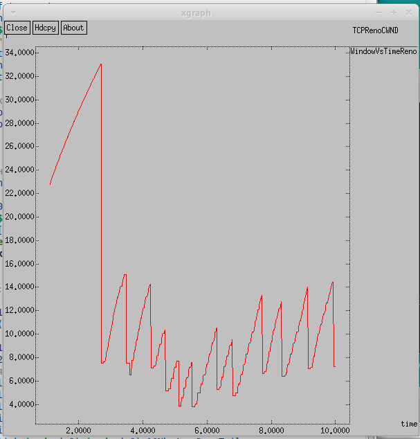
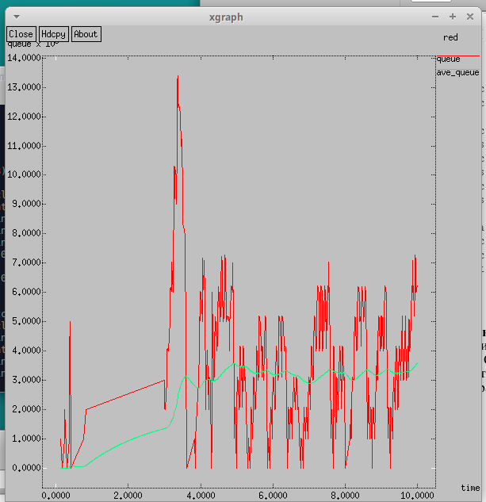
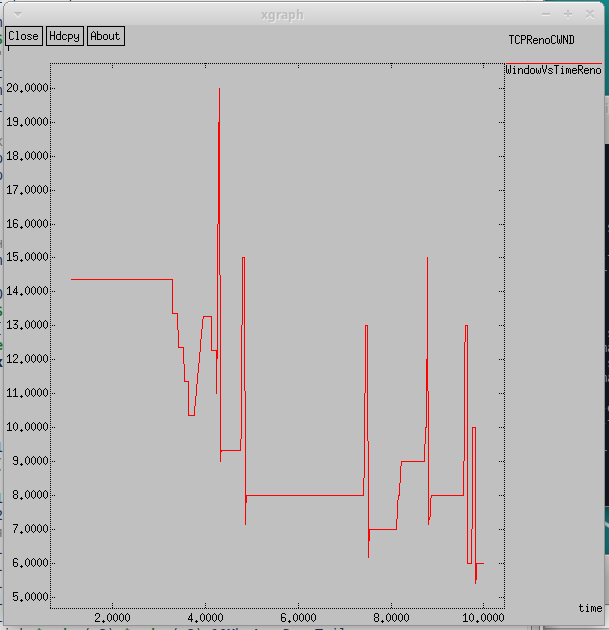
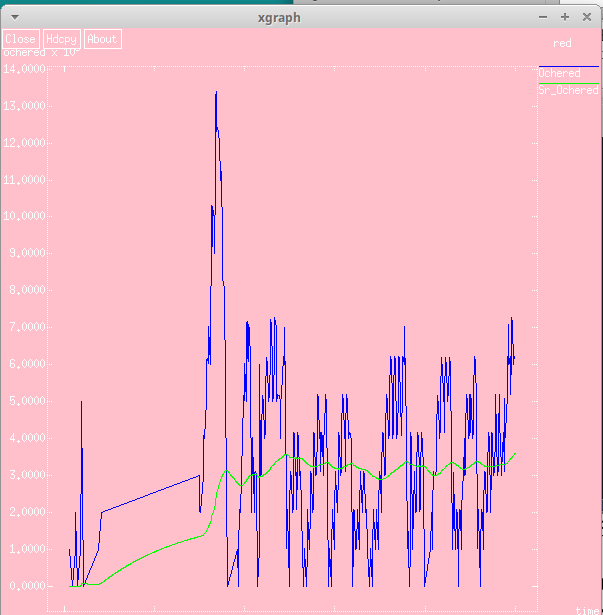
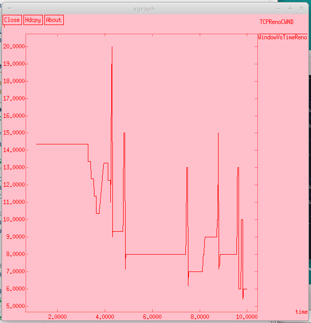

---
## Front matter
title: "Отчёт по лабораторной работе №2"
subtitle: "Имитационное моделирование"
author: "Екатерина Канева, НФИбд-02-22"

## Generic otions
lang: ru-RU
toc-title: "Содержание"

## Bibliography
bibliography: bib/cite.bib
csl: pandoc/csl/gost-r-7-0-5-2008-numeric.csl

## Pdf output format
toc: true # Table of contents
toc-depth: 2
lof: true # List of figures
lot: true # List of tables
fontsize: 12pt
linestretch: 1.5
papersize: a4
documentclass: scrreprt
## I18n polyglossia
polyglossia-lang:
  name: russian
  options:
	- spelling=modern
	- babelshorthands=true
polyglossia-otherlangs:
  name: english
## I18n babel
babel-lang: russian
babel-otherlangs: english
## Fonts
mainfont: IBM Plex Serif
romanfont: IBM Plex Serif
sansfont: IBM Plex Sans
monofont: IBM Plex Mono
mathfont: STIX Two Math
mainfontoptions: Ligatures=Common,Ligatures=TeX,Scale=0.94
romanfontoptions: Ligatures=Common,Ligatures=TeX,Scale=0.94
sansfontoptions: Ligatures=Common,Ligatures=TeX,Scale=MatchLowercase,Scale=0.94
monofontoptions: Scale=MatchLowercase,Scale=0.94,FakeStretch=0.9
mathfontoptions:
## Biblatex
biblatex: true
biblio-style: "gost-numeric"
biblatexoptions:
  - parentracker=true
  - backend=biber
  - hyperref=auto
  - language=auto
  - autolang=other*
  - citestyle=gost-numeric
## Pandoc-crossref LaTeX customization
figureTitle: "Рис."
tableTitle: "Таблица"
listingTitle: "Листинг"
lofTitle: "Список иллюстраций"
lotTitle: "Список таблиц"
lolTitle: "Листинги"
## Misc options
indent: true
header-includes:
  - \usepackage{indentfirst}
  - \usepackage{float} # keep figures where there are in the text
  - \floatplacement{figure}{H} # keep figures where there are in the text
---

# Цель работы

Научиться работать с мониторингом очередей, TCP, дисциплиной RED, сравнить различные протоколы.

# Задание

На основе имеющейся модели изменить тип протокола с Reno на NewReno, а затем на Vegas, сравнить. Также, внести изменения при отображении окон с графиками.

# Теоретическое введение

Протокол управления передачей (Transmission Control Protocol, TCP) имеет средства управления потоком и коррекции ошибок, ориентирован на установление соединения.

# Выполнение лабораторной работы

Для начала я создала файл с уже описанным в тексте кодом, запустила, чтобы сделать модель, отвечающую следующим требованиям:

- сеть состоит из 6 узлов;
- между всеми узлами установлено дуплексное соединение с различными пропускной способностью и задержкой 10 мс;
- узел r1 использует очередь с дисциплиной RED для накопления пакетов, максимальный размер которой составляет 25;
- TCP-источники на узлах s1 и s2 подключаются к TCP-приёмнику на узле s3;
- генераторы трафика FTP прикреплены к TCP-агентам.

Получились следующие графики (рис. [-@fig:1] и [-@fig:2]):

{#fig:1 width=70%}

{#fig:2 width=70%}

Далее, следуя заданию, изменим Reno для s1 на NewReno. Для этого изменила следующую часть кода:

```
set tcp1 [$ns create-connection TCP/Newreno $node_(s1) TCPSink $node_(s3) 0]
```

Получились следующие графики (рис. [-@fig:3] и [-@fig:4]):

{#fig:3 width=70%}

{#fig:4 width=70%}

Далее, следуя заданию, изменим Newreno для s1 на Vegas. Для этого изменила следующую часть кода:

```
set tcp1 [$ns create-connection TCP/Vegas $node_(s1) TCPSink $node_(s3) 0]
```

Получились следующие графики (рис. [-@fig:5] и [-@fig:6]):

{#fig:5 width=70%}

{#fig:6 width=70%}

По графикам видно, что средняя длина очереди почти не поменялась, она так и лежит в пределах 3. Однако на графике изменения окна видно, что максимальное значение у Vegas значительно меньше, а значит Vegas лучше обрабатывает большую нагрузку и теряет меньше пакетов.

Далее я внесла изменения при отображении окон с графиками (измените цвет фона, цвет траекторий, подписи к осям, подпись траектории в легенде). Для этого внесла изменения в процедуру finish:

```
  puts $f "TitleText: red"
  puts $f "Device: Postscript"
  puts $f "0.Color: Blue"
  puts $f "1.Color: Green"
  if { [info exists tchan_] } {
    close $tchan_
  }
  exec rm -f temp.q temp.a
  exec touch temp.a temp.q

  exec awk $awkCode all.q
  puts $f \"Ochered"
  exec cat temp.q >@ $f
  puts $f \n\"Sr_Ochered"
  exec cat temp.a >@ $f
  close $f
  # Запуск xgraph с графиками окна TCP и очереди:
  exec xgraph -fg red -bg pink -bb -tk -x time -t "TCPRenoCWND" WindowVsTimeReno &
  exec xgraph -fg white -bg pink -bb -tk -x time -y ochered temp.queue &
  exit 0
``` 

Получились следующие графики (рис. [-@fig:7] и [-@fig:8]):

{#fig:7 width=70%}

{#fig:8 width=70%}

# Выводы

Научилась работать с мониторингом очередей, TCP, дисциплиной RED, сравнила различные протоколы.