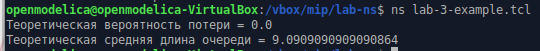
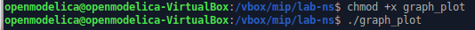
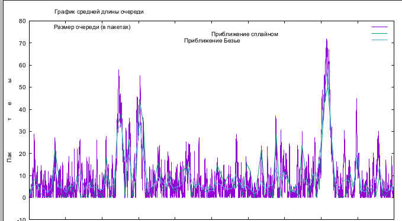

---
## Front matter
lang: ru-RU
title: Презентация по лабораторной работе №3
subtitle: Имитационное моделирование
author:
  - Екатерина Канева, НФИбд-02-22
institute:
  - Российский университет дружбы народов, Москва, Россия
date: 22 февраля 2025

## i18n babel
babel-lang: russian
babel-otherlangs: english

## Formatting pdf
toc: false
toc-title: Содержание
slide_level: 2
aspectratio: 169
section-titles: true
theme: metropolis
header-includes:
 - \metroset{progressbar=frametitle,sectionpage=progressbar,numbering=fraction}
---

# Информация

## Докладчик

* Канева Екатерина Павловна
* студент группы НФИбд-02-22
* Российский университет дружбы народов
* [1132222004@rudn.ru](mailto:1132222004@rudn.ru)
* <https://nevseros.github.io/ru/>

# Вводная часть

## Цель

Смоделировать систему массового обслуживания (СМО).

## Задания

* Реализовать СМО М/М/1.
* Посчитать среднюю вероятность потери и длину очереди.
* Построить график изменения длины очереди.

# Выполнение работы

## Реализация СМО и вычисления

Сначала я реализовала СМО в файле `lab-3-example.tcl`, согласно тексту лабораторной работы, далее запустила файл. Получились следующие значения:

{#fig:1 width=50%}

## Построение графика

Далее я создала файл graph_plot, поместила в него код, реализующий построение графика, сделала его исполняемым и запустила:

{#fig:2 width=50%}

## График

Получился файл qm.pdf, содержащий график:

{#fig:3 width=50%}

# Заключение

## Вывод

Смоделировала СМО М/М/1.