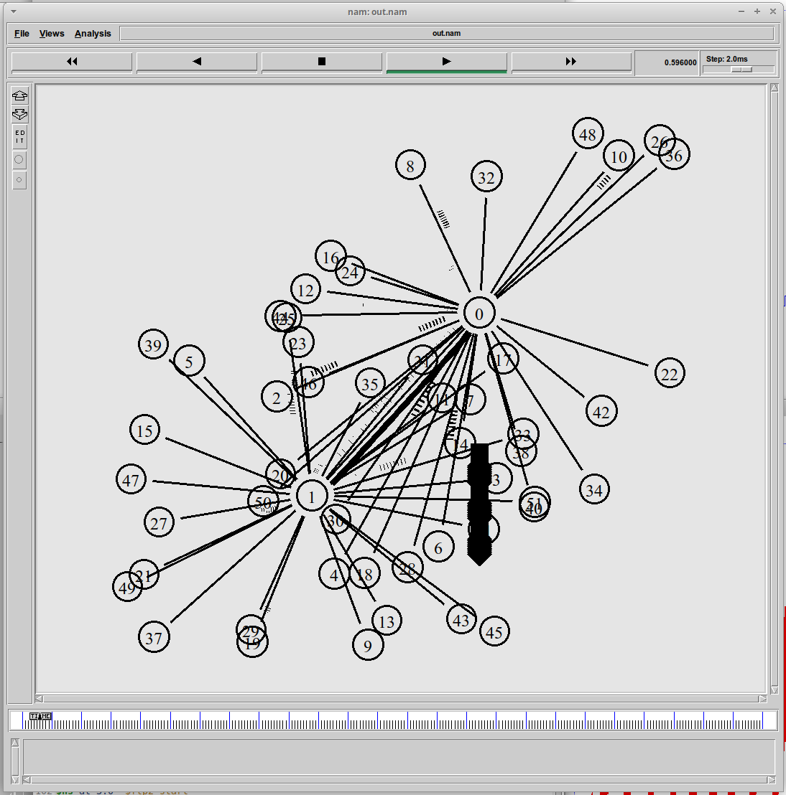

---
## Front matter
lang: ru-RU
title: Презентация по лабораторной работе №4
subtitle: Имитационное моделирование
author:
  - Екатерина Канева, НФИбд-02-22
institute:
  - Российский университет дружбы народов, Москва, Россия
date: 28 февраля 2025

## i18n babel
babel-lang: russian
babel-otherlangs: english

## Formatting pdf
toc: false
toc-title: Содержание
slide_level: 2
aspectratio: 169
section-titles: true
theme: metropolis
header-includes:
 - \metroset{progressbar=frametitle,sectionpage=progressbar,numbering=fraction}
---

# Информация

## Докладчик

* Канева Екатерина Павловна
* студент группы НФИбд-02-22
* Российский университет дружбы народов
* [1132222004@rudn.ru](mailto:1132222004@rudn.ru)
* <https://nevseros.github.io/ru/>

# Вводная часть

## Цель

Выполнить задание для самостоятельной работы.

## Задания

* Для приведённой схемы разработать имитационную модель в пакете NS-2.
* Построить график изменения размера окна TCP (в Xgraph и в GNUPlot).
* Построить график изменения длины очереди и средней длины очереди на первом маршрутизаторе.
* Оформить отчёт о выполненной работе.

# Выполнение работы

## Реализация модели

Реализовала модель, ниже приведён пример реализации топологии:

{width=45%}

## Реализация модели

Пример реализации вывода в XGraph:

{width=45%}

## Схема

{width=45%}

## Графики

{width=40%}

## Графики

{width=40%}

## Графики

{width=40%}

## Графики

{width=40%}

## Отрисовка в GNUPlot

Далее я реализовала код, строящий графики в GNUPlot, пример для первого графика:

{width=50%}

## Графики

{width=50%}

## Графики

{width=50%}

## Графики

{width=50%}

## Графики

{width=50%}

# Заключение

## Вывод

Выполнила задание для самостоятельной работы.