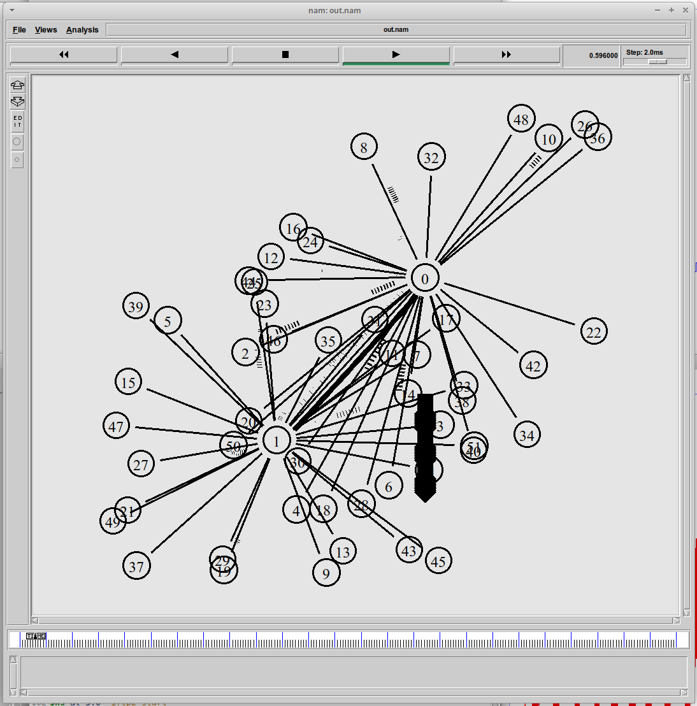
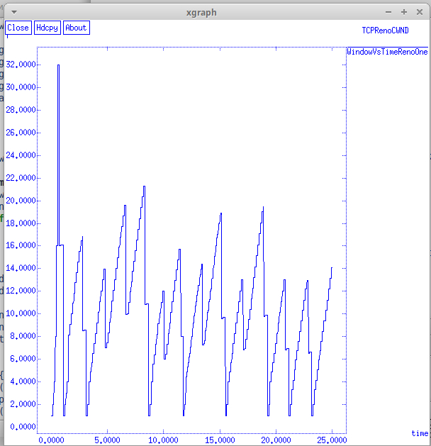
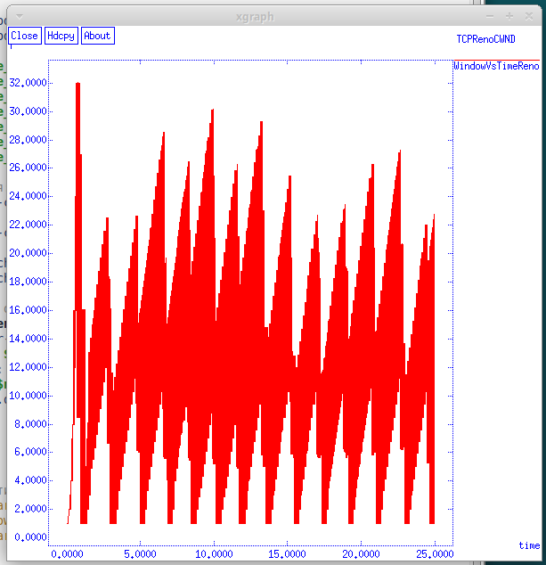
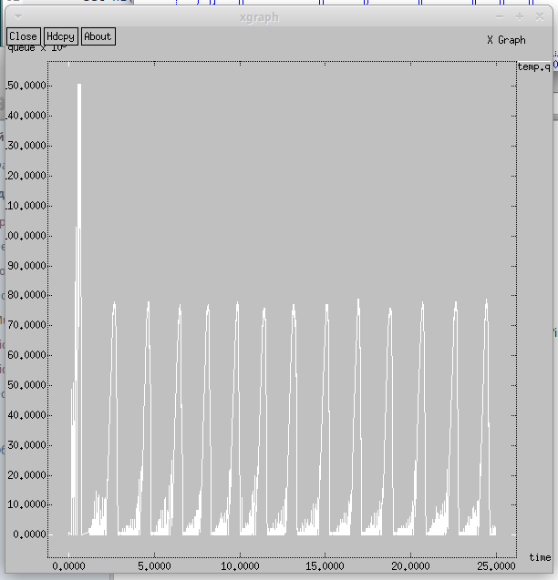
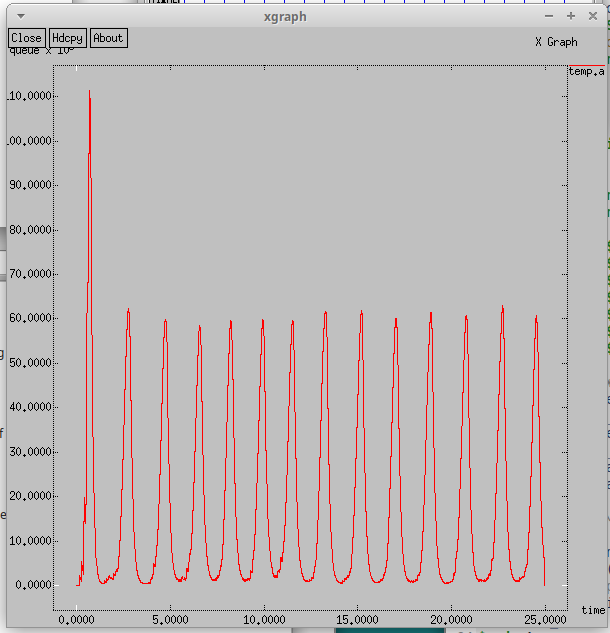
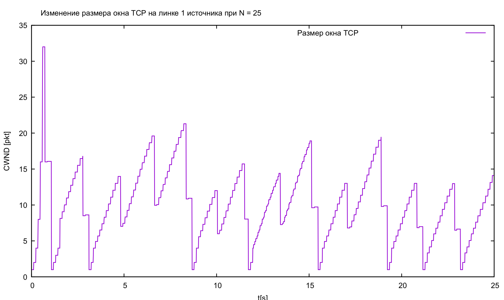
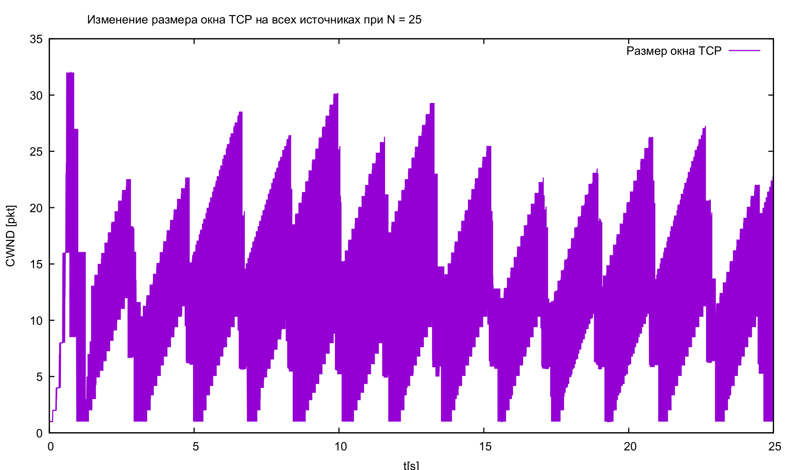
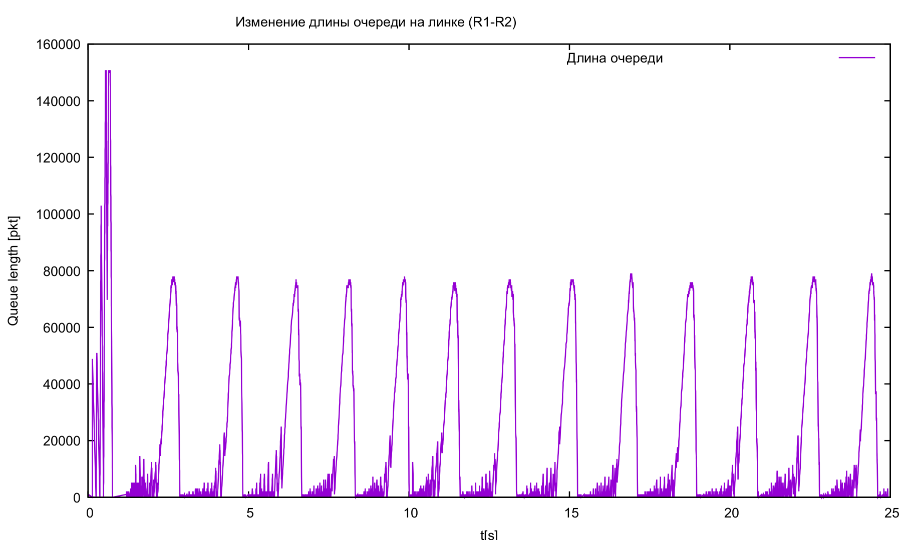
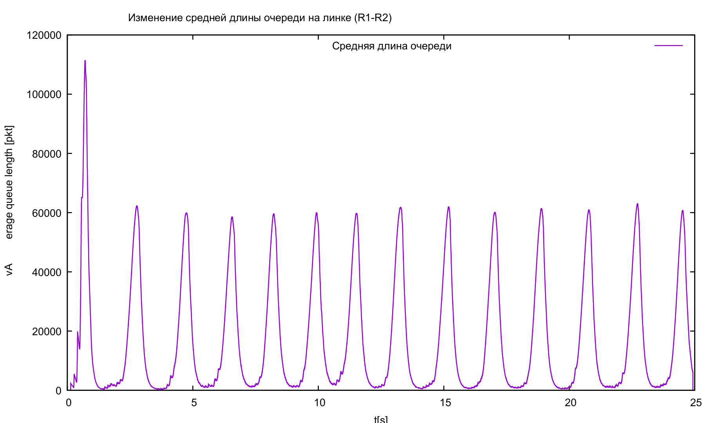

---
## Front matter
title: "Лабораторная работа №4"
subtitle: "Имитационное моделирование"
author: "Екатерина Канева, НФИбд-02-22"

## Generic otions
lang: ru-RU
toc-title: "Содержание"

## Bibliography
bibliography: bib/cite.bib
csl: pandoc/csl/gost-r-7-0-5-2008-numeric.csl

## Pdf output format
toc: true # Table of contents
toc-depth: 2
lof: true # List of figures
lot: true # List of tables
fontsize: 12pt
linestretch: 1.5
papersize: a4
documentclass: scrreprt
## I18n polyglossia
polyglossia-lang:
  name: russian
  options:
	- spelling=modern
	- babelshorthands=true
polyglossia-otherlangs:
  name: english
## I18n babel
babel-lang: russian
babel-otherlangs: english
## Fonts
mainfont: IBM Plex Serif
romanfont: IBM Plex Serif
sansfont: IBM Plex Sans
monofont: IBM Plex Mono
mathfont: STIX Two Math
mainfontoptions: Ligatures=Common,Ligatures=TeX,Scale=0.94
romanfontoptions: Ligatures=Common,Ligatures=TeX,Scale=0.94
sansfontoptions: Ligatures=Common,Ligatures=TeX,Scale=MatchLowercase,Scale=0.94
monofontoptions: Scale=MatchLowercase,Scale=0.94,FakeStretch=0.9
mathfontoptions:
## Biblatex
biblatex: true
biblio-style: "gost-numeric"
biblatexoptions:
  - parentracker=true
  - backend=biber
  - hyperref=auto
  - language=auto
  - autolang=other*
  - citestyle=gost-numeric
## Pandoc-crossref LaTeX customization
figureTitle: "Рис."
tableTitle: "Таблица"
listingTitle: "Листинг"
lofTitle: "Список иллюстраций"
lotTitle: "Список таблиц"
lolTitle: "Листинги"
## Misc options
indent: true
header-includes:
  - \usepackage{indentfirst}
  - \usepackage{float} # keep figures where there are in the text
  - \floatplacement{figure}{H} # keep figures where there are in the text
---

# Цель работы

Выполнить задание для самостоятельной работы.

# Задание

* Для приведённой схемы разработать имитационную модель в пакете NS-2.
* Построить график изменения размера окна TCP (в Xgraph и в GNUPlot).
* Построить график изменения длины очереди и средней длины очереди на первом маршрутизаторе.
* Оформить отчёт о выполненной работе.

# Теоретическое введение

Network Simulator (NS-2) — один из программных симуляторов моделирования процессов в компьютерных сетях. NS-2 позволяет описать топологию сети, конфигурацию источников и приёмников трафика, параметры соединений (полосу пропускания, задержку, вероятность потерь пакетов и т.д.) и множество других параметров моделируемой системы. Данные о динамике трафика, состоянии соединений и объектов сети, а также информация о работе протоколов фиксируются в генерируемом trace-файле.

Процесс создания модели сети для NS-2 состоит из нескольких этапов:

1) создание нового объекта класса Simulator, в котором содержатся методы, необходимые для дальнейшего описания модели (например, методы new и delete используются для создания и уничтожения объектов соответственно);
2) описание топологии моделируемой сети с помощью трёх основных функциональных блоков: узлов (nodes), соединений (links) и агентов (agents);
3) задание различных действий, характеризующих работу сети.

# Выполнение лабораторной работы

Нужно было смоделировать следующую сеть:

- сеть состоит из N TCP-источников, N TCP-приёмников, двух маршрутизаторов R1 и R2 между источниками и приёмниками (N — не менее 20);
- между TCP-источниками и первым маршрутизатором установлены дуплексные соединения с пропускной способностью 100 Мбит/с и задержкой 20 мс очередью типа DropTail;
- между TCP-приёмниками и вторым маршрутизатором установлены дуплексные соединения с пропускной способностью 100 Мбит/с и задержкой 20 мс очередью типа DropTail;
- между маршрутизаторами установлено симплексное соединение (R1–R2) с пропускной способностью 20 Мбит/с и задержкой 15 мс очередью типа RED, размером буфера 300 пакетов; в обратную сторону — симплексное соединение (R2–R1) с пропускной способностью 15 Мбит/с и задержкой 20 мс очередью типа DropTail;
- данные передаются по протоколу FTP поверх TCPReno;
- параметры алгоритма RED: q_min = 75, q_max = 150, q_w = 0; 002, p_max = 0:1;
- максимальный размер TCP-окна 32; размер передаваемого пакета 500 байт; время моделирования — не менее 20 единиц модельного времени.

Я реализовала следующий код программы, выбрав N = 25 и время работы 25.0:

```shell
set ns [new Simulator]
set nf [open out.nam w]
$ns namtrace-all $nf
set f [open out.tr w]
$ns trace-all $f

Agent/TCP set window_ 32
Agent/TCP set pktSize_ 500

proc finish {} {
	global tchan_
	set awkCode { {
		if ($1 == "Q" && NF>2) {
        		print $2, $3 >> "temp.q";
        		set end $2
      		}
      		else if ($1 == "a" && NF>2)
       			print $2, $3 >> "temp.a";
	}}
	
	exec rm -f temp.q temp.a
	exec touch temp.a temp.q

	set f [open temp.q w]
	puts $f "0.Color: White"
	close $f

	set f [open temp.a w]
	puts $f "1.Color: White"
	close $f
	
	exec awk $awkCode all.q

	exec xgraph -fg blue -bg white -bb -tk -x time -t "TCPRenoCWND"  WindowVsTimeRenoOne &
	exec xgraph -fg blue -bg white -bb -tk -x time -t "TCPRenoCWND"  WindowVsTimeReno &
	exec xgraph -bb -tk -x time -y queue temp.q &
	exec xgraph -bb -tk -x time -y queue temp.a &
	exec nam out.nam &
	exit 0
}

# Формирование файла с данными о размере окна TCP:
proc plotWindow {tcpSource file} {
	global ns
  	set time 0.01
  	set now [$ns now]
  	set cwnd [$tcpSource set cwnd_]
  	puts $file "$now $cwnd"
  	$ns at [expr $now+$time] "plotWindow $tcpSource $file"
}

# Узлы сети:
set r1 [$ns node]
set r2 [$ns node]

$ns simplex-link $r1 $r2 20Mb 15ms RED
$ns simplex-link $r2 $r1 15Mb 20ms DropTail
$ns queue-limit $r1 $r2 300

set N 25
for {set i 0} {$i < $N} {incr i} {
	set n1($i) [$ns node]
	$ns duplex-link $n1($i) $r1 100Mb 20ms DropTail
	set n2($i) [$ns node]
	$ns duplex-link $n2($i) $r2 100Mb 20ms DropTail
	set tcp($i) [$ns create-connection TCP/Reno $n1($i) TCPSink $n2($i) $i]
	set ftp($i) [$tcp($i) attach-source FTP]
}

# Мониторинг размера окна TCP:
set windowVsTimeOne [open WindowVsTimeRenoOne w]
puts $windowVsTimeOne "0.Color: Blue"
set windowVsTime [open WindowVsTimeReno w]
puts $windowVsTime "1.Color: Blue"

set qmon [$ns monitor-queue $r1 $r2 [open qm.out w] 0.1];
[$ns link $r1 $r2] queue-sample-timeout;

# Мониторинг очереди:
set redq [[$ns link $r1 $r2] queue]
$redq set thresh_ 75
$redq set maxthresh_ 150
$redq set q_weight_ 0.002
$redq set linterm_ 10

set tchan_ [open all.q w]
$redq trace curq_
$redq trace ave_
$redq attach $tchan_

for {set i 0} {$i < $N} {incr i} {
  $ns at 0.0 "$ftp($i) start"
  $ns at 0.0 "plotWindow $tcp($i) $windowVsTime"
}

# Добавление at-событий:
$ns at 0.0 "plotWindow $tcp(1) $windowVsTimeOne"
$ns at 25.0 "finish"
$ns run
```

После чего запустила программу и получила следующую схему в NS-2, она работала (рис. [-@fig:1]):

{#fig:1 width=70%}

Также вывелись 4 графика (рис. [-@fig:2], [-@fig:3], [-@fig:4] и [-@fig:5]):

{#fig:2 width=70%}

{#fig:3 width=70%}

{#fig:4 width=70%}

{#fig:5 width=70%}

Далее я реализовала код, строящий графики в GNUPlot:

```shell
#!/usr/bin/gnuplot -persist

# задаём текстовую кодировку,
# тип терминала, тип и размер шрифта
set encoding utf8
set term pdfcairo font "Arial,9"

# задаём выходной файл графика
set out '1_tcp.pdf'

# задаём название графика
set title "Изменение размера окна TCP на линке 1 источника при N = 25"

# подписи осей
set xlabel "t[s]" font "Arial,9"
set ylabel "CWND [pkt]" font "Arial,9"

# построение графика, используя значения
# 1-го и 2-го столбцов файла вывода
plot "WindowVsTimeRenoOne" using ($1):($2) with lines title "Размер окна TCP"

# задаём выходной файл графика
set out 'all_tcp.pdf'

# задаём название графика
set title "Изменение размера окна TCP на всех источниках при N = 25"

# построение графика, используя значения
# 1-го и 2-го столбцов файла вывода
plot "WindowVsTimeReno" using ($1):($2) with lines title "Размер окна TCP"

# задаём выходной файл графика
set out 'queue.pdf'

# задаём название графика
set title "Изменение длины очереди на линке (R1-R2)"

# подпись к оси
set ylabel "Queue length [pkt]" font "Arial,9"

# построение графика, используя значения
# 1-го и 2-го столбцов файла вывода
plot "temp.q" using ($1):($2) with lines title "Длина очереди"

# задаём выходной файл графика
set out 'avg_queue.pdf'

# задаём название графика
set title "Изменение средней длины очереди на линке (R1-R2)"

# подпись к оси
set ylabel "Average queue length [pkt]" font "Arial,9"

# построение графика, используя значения
# 1-го и 2-го столбцов файла вывода
plot "temp.a" using ($1):($2) with lines title "Средняя длина очереди"
```

Сделала файл исполняемым с помощью команды `chmod +x graph_plot`, при запуске создались следующие графики в файлах PDF (рис. [-@fig:6], [-@fig:7], [-@fig:8] и [-@fig:9]):

{#fig:6 width=70%}

{#fig:7 width=70%}

{#fig:8 width=70%}

{#fig:9 width=70%}

# Выводы

Выполнила задание для самостоятельной работы.