---
## Front matter
lang: ru-RU
title: Презентация по лабораторной работе №5
subtitle: Имитационное моделирование
author:
  - Екатерина Канева, НФИбд-02-22
institute:
  - Российский университет дружбы народов, Москва, Россия
date: 8 марта 2025

## i18n babel
babel-lang: russian
babel-otherlangs: english

## Formatting pdf
toc: false
toc-title: Содержание
slide_level: 2
aspectratio: 169
section-titles: true
theme: metropolis
header-includes:
 - \metroset{progressbar=frametitle,sectionpage=progressbar,numbering=fraction}
---

# Информация

## Докладчик

* Канева Екатерина Павловна
* студент группы НФИбд-02-22
* Российский университет дружбы народов
* [1132222004@rudn.ru](mailto:1132222004@rudn.ru)
* <https://nevseros.github.io/ru/>

# Вводная часть

## Цель

Построить модель SIR в xcos и OpenModelica.

## Задания

1. Реализовать модель SIR в в xcos.
2. Реализовать модель SIR с помощью блока Modelica в в xcos.
3. Реализовать модель SIR в OpenModelica.
4. Реализовать модель SIR с учётом процесса рождения / гибели особей в xcos (в том числе и с использованием блока Modelica), а также в OpenModelica.
5. Построить графики эпидемического порога при различных значениях параметров модели (в частности изменяя параметр $\mu$).
6. Сделать анализ полученных графиков в зависимости от выбранных значений параметров модели.

# Выполнение работы

## Реализация модели

Реализовала модель, ниже приведена схема, реализованная без учёта демографии:

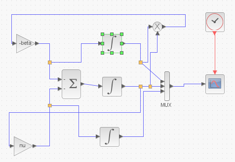{width=45%}

## Параметры блоков интегрирования

Задала следующие параметры для блоков интегрирования (для верхнего и среднего, на картинке представлены параметры для верхнего):

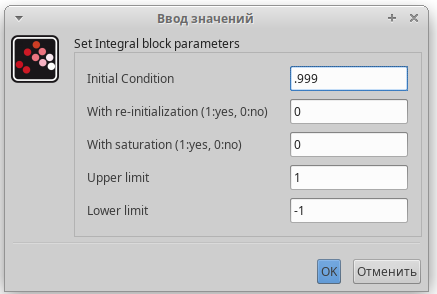{#fig:2 width=40%}

## Длительность

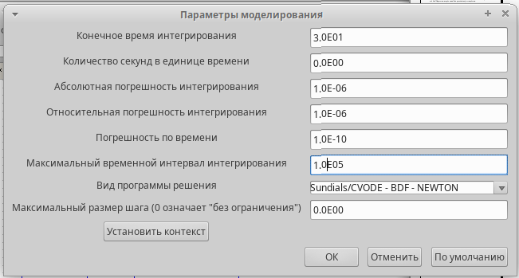{#fig:4 width=40%}

## График

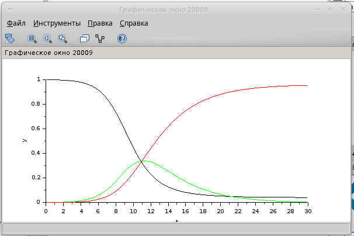{#fig:5 width=50%}

## Модель с блоком Modelica

Далее построила то же самое, но с блоком Modelica:

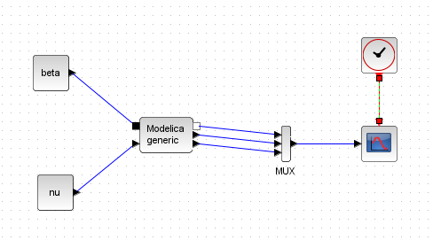{#fig:6 width=50%}

## Код

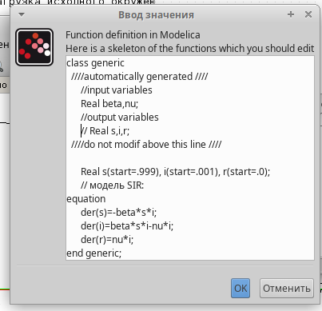{#fig:8 width=40%}

## График

{width=50%}

## OpenModelica

Выполнила то же самое в OpenModelica, ниже часть кода, отвечающая за сами уравнения:

```
equation
  der(s)=-beta*s*i;
  der(i)=beta*s*i-nu*i;
  der(r)=nu*i;
```

## График

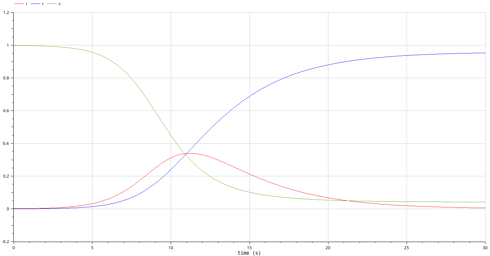{#fig:9 width=50%}

## Схема второй модели

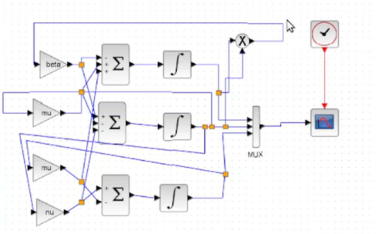{#fig:10 width=50%}

## Схема с блоком Modelica

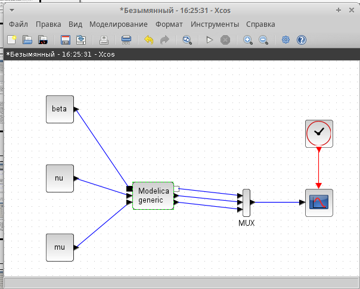{#fig:13 width=50%}

## График

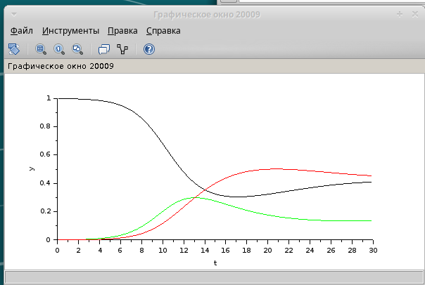{#fig:11 width=50%}

## График

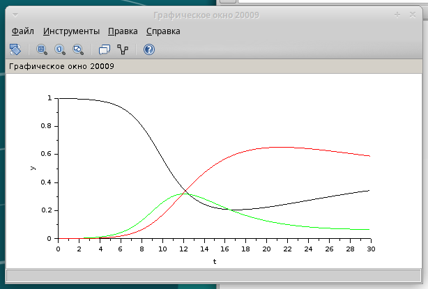{#fig:12 width=50%}

## OpenModelica

Далее я реализовала эту модель в OpenModelica. Для этого я отредактировала предыдущий код, введя новую переменную и извенив часть с уравнениями:

```
equation
  der(s)=-beta*s*i+mu*i+mu*r;
  der(i)=beta*s*i-nu*i-mu*i;
  der(r)=nu*i-mu*r;
```

## График

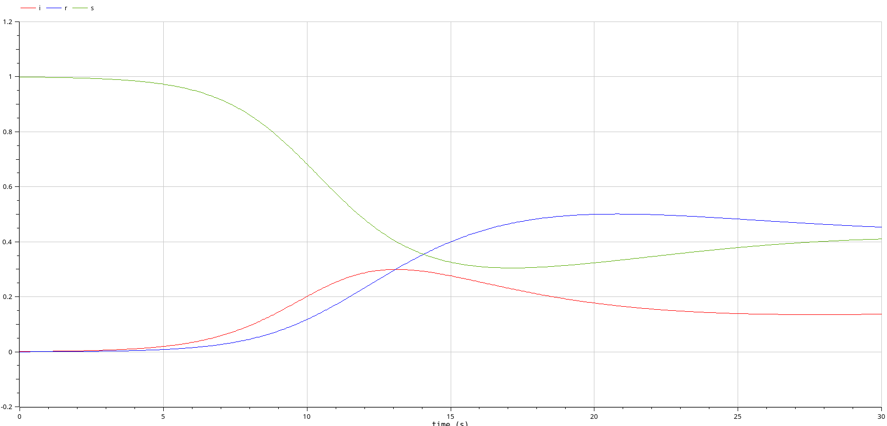{#fig:14 width=50%}

## График

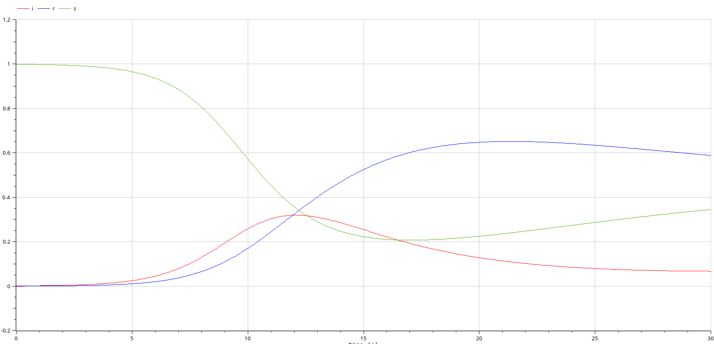{#fig:15 width=50%}

# Заключение

## Вывод

Построили модель SIR в xcos и OpenModelica.