---
## Front matter
title: "Лабораторная работа №5"
subtitle: "Имитационное моделирование"
author: "Екатерина Канева, НФИбд-02-22"

## Generic otions
lang: ru-RU
toc-title: "Содержание"

## Bibliography
bibliography: bib/cite.bib
csl: pandoc/csl/gost-r-7-0-5-2008-numeric.csl

## Pdf output format
toc: true # Table of contents
toc-depth: 2
lof: true # List of figures
lot: true # List of tables
fontsize: 12pt
linestretch: 1.5
papersize: a4
documentclass: scrreprt
## I18n polyglossia
polyglossia-lang:
  name: russian
  options:
	- spelling=modern
	- babelshorthands=true
polyglossia-otherlangs:
  name: english
## I18n babel
babel-lang: russian
babel-otherlangs: english
## Fonts
mainfont: IBM Plex Serif
romanfont: IBM Plex Serif
sansfont: IBM Plex Sans
monofont: IBM Plex Mono
mathfont: STIX Two Math
mainfontoptions: Ligatures=Common,Ligatures=TeX,Scale=0.94
romanfontoptions: Ligatures=Common,Ligatures=TeX,Scale=0.94
sansfontoptions: Ligatures=Common,Ligatures=TeX,Scale=MatchLowercase,Scale=0.94
monofontoptions: Scale=MatchLowercase,Scale=0.94,FakeStretch=0.9
mathfontoptions:
## Biblatex
biblatex: true
biblio-style: "gost-numeric"
biblatexoptions:
  - parentracker=true
  - backend=biber
  - hyperref=auto
  - language=auto
  - autolang=other*
  - citestyle=gost-numeric
## Pandoc-crossref LaTeX customization
figureTitle: "Рис."
tableTitle: "Таблица"
listingTitle: "Листинг"
lofTitle: "Список иллюстраций"
lotTitle: "Список таблиц"
lolTitle: "Листинги"
## Misc options
indent: true
header-includes:
  - \usepackage{indentfirst}
  - \usepackage{float} # keep figures where there are in the text
  - \floatplacement{figure}{H} # keep figures where there are in the text
---

# Цель работы

Построить модель SIR в xcos и OpenModelica.

# Задание

1. Реализовать модель SIR в в xcos.
2. Реализовать модель SIR с помощью блока Modelica в в xcos.
3. Реализовать модель SIR в OpenModelica.
4. Реализовать модель SIR с учётом процесса рождения / гибели особей в xcos (в том числе и с использованием блока Modelica), а также в OpenModelica.
5. Построить графики эпидемического порога при различных значениях параметров модели (в частности изменяя параметр $\mu$).
6. Сделать анализ полученных графиков в зависимости от выбранных значений параметров модели.

# Теоретическое введение

Задача о распространении эпидемии описывается системой дифференциальных уравнений:

$$
\begin{cases}
  \dot s = - \beta s(t)i(t); \\
  \dot i = \beta s(t)i(t) - \nu i(t);\\
  \dot r = \nu i(t),
\end{cases}
$$

где $\beta$ -- скорость заражения, $\nu$ -- скорость выздоровления.

Если брать в расчёт демографические процессы (рождение и гибель), то система выглдяит так:

$$
\begin{cases}
  \dot s = - \beta s(t)i(t) + \mu (N - s(t)); \\
  \dot i = \beta s(t)i(t) - \nu i(t) - \mu i(t);\\
  \dot r = \nu i(t) - \mu r(t),
\end{cases}
$$

где $\mu$ — константа, которая равна коэффициенту смертности и рождаемости.

# Выполнение лабораторной работы

Для начала я построила модель из блоков в xcos (рис. [-@fig:1]).

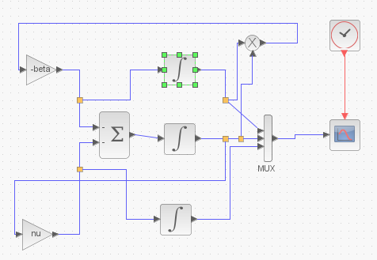{#fig:1 width=70%}

Задала следующие параметры для блоков интегрирования для верхнего рис. [-@fig:2], для среднего рис. [-@fig:3]:

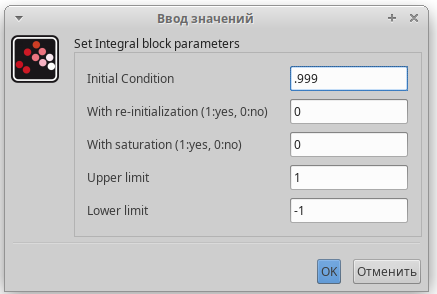{#fig:2 width=70%}

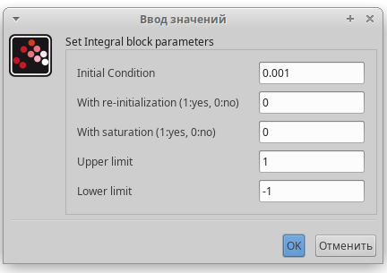{#fig:3 width=70%}

Задала длительность моделирования (рис. [-@fig:4]):

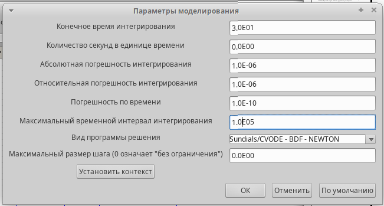{#fig:4 width=70%}

Запустила моделирование, получила следующий график (рис. [-@fig:5]):

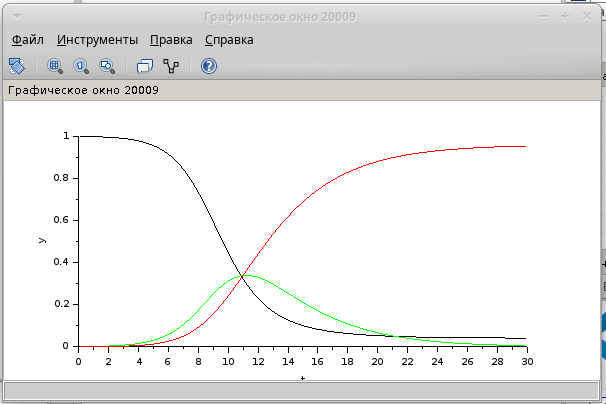{#fig:5 width=70%}

Далее построила то же самое, но с блоком Modelica (рис. [-@fig:6]):

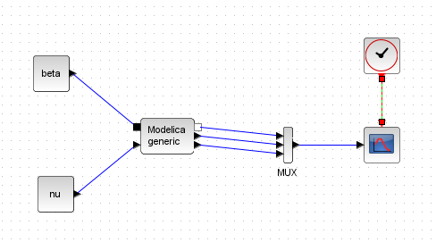{#fig:6 width=70%}

Задала параметры для блока Modelica (рис. [-@fig:7]) и написала код для этого блока (рис. [-@fig:8]):

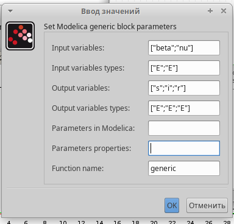{#fig:7 width=70%}

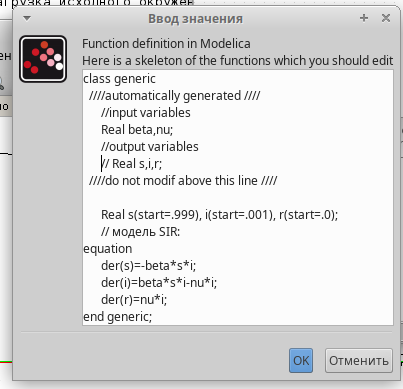{#fig:8 width=70%}

Получила такой же график, как на рис. [-@fig:5].

Далее я выполнила то же самое в OpenModelica в качестве упражнения. Там я ввела следующий код: 

```
model lab51
  parameter Real I_0 = 0.001;
  parameter Real R_0 = 0;
  parameter Real S_0 = 0.999;
  parameter Real beta = 1;
  parameter Real nu = 0.3;
  
  Real s(start=S_0);
  Real i(start=I_0);
  Real r(start=R_0);
  
equation
  der(s)=-beta*s*i;
  der(i)=beta*s*i-nu*i;
  der(r)=nu*i;

end lab51;
```

При запуске построился следуюший график (рис. [-@fig:9]):

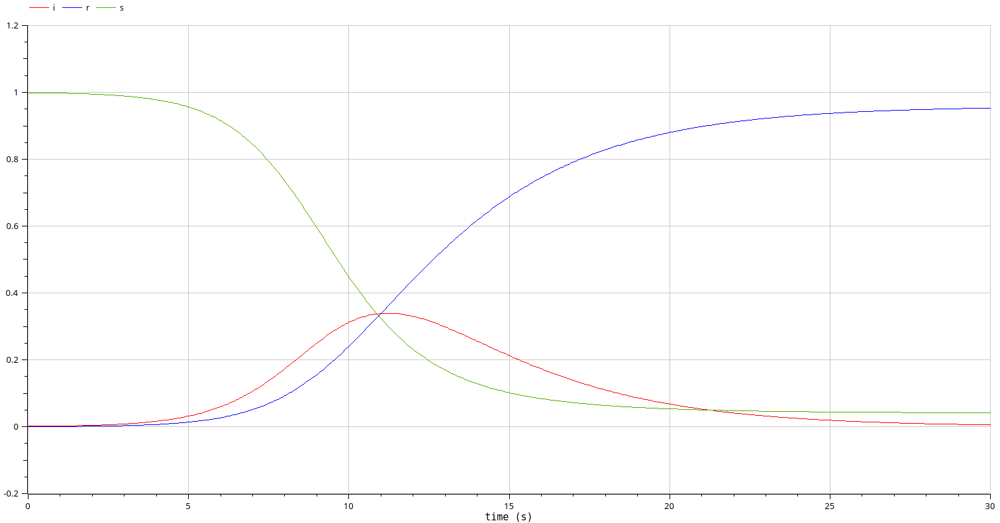{#fig:9 width=70%}

График такой же как при построении в xcos.

Потом я присупила к выполнению части с учётом демографии. Для этого я изменила схему в xcos ([-@fig:10]):

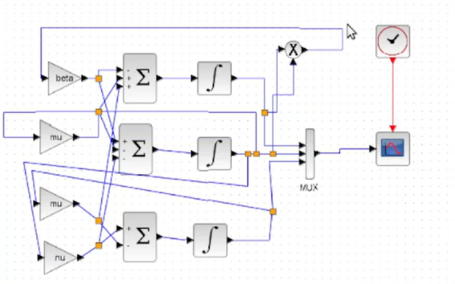{#fig:10 width=70%}

При запуске с $\mu = 0.1$ получили график на рис. [-@fig:11], при запуске с $\mu = 0.05$ получили график на рис. [-@fig:12]:

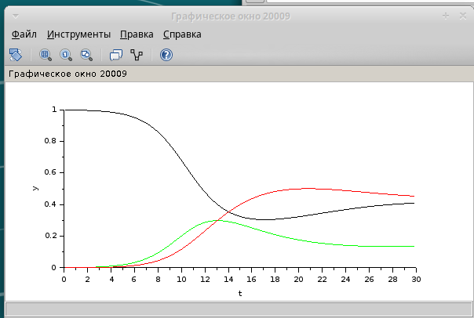{#fig:11 width=70%}

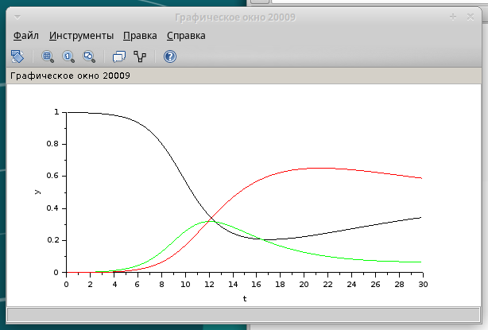{#fig:12 width=70%}

Далее я построила то же самое с блоком Modelica (рис. [-@fig:8]):

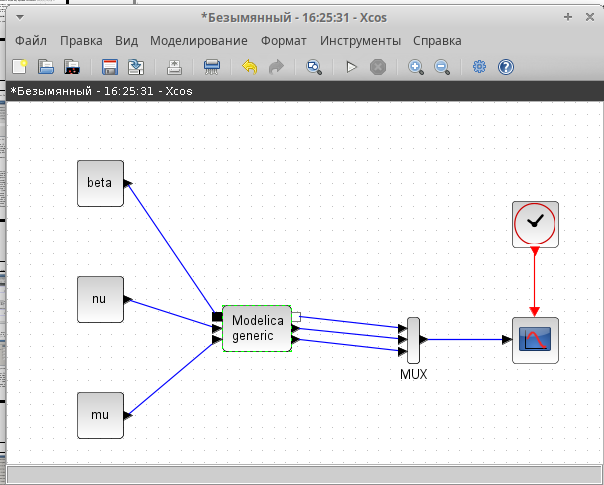{#fig:13 width=70%}

Изменила код и параметры блока, график получился такой же, как и без блока Modelica (рис. [-@fig:11] и [-@fig:12]).

Далее я реализовала эту модель в OpenModelica. Для этого я отредактировала предыдущий код и получила это:

```
model lab52
  parameter Real I_0 = 0.001;
  parameter Real R_0 = 0;
  parameter Real S_0 = 0.999;
  parameter Real beta = 1;
  parameter Real nu = 0.3;
  parameter Real mu = 0.1;
  
  Real s(start=S_0);
  Real i(start=I_0);
  Real r(start=R_0);
  
equation
  der(s)=-beta*s*i+mu*i+mu*r;
  der(i)=beta*s*i-nu*i-mu*i;
  der(r)=nu*i-mu*r;

end lab52;
```

При запуске с $\mu = 0.1$ получился график на рис. [-@fig:14], при запуске с $\mu = 0.05$ получили график на рис. [-@fig:15]:

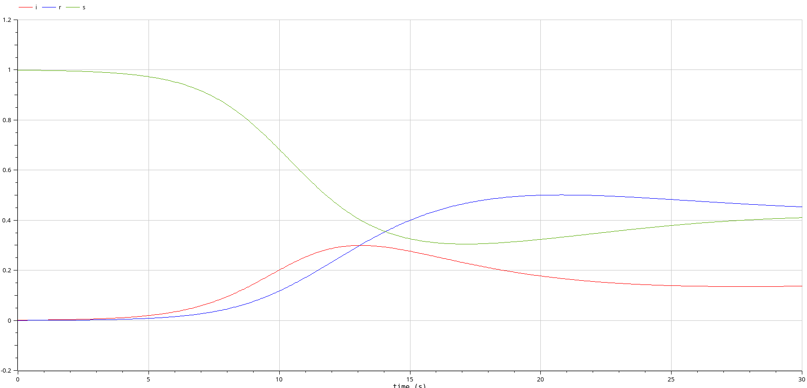{#fig:14 width=70%}

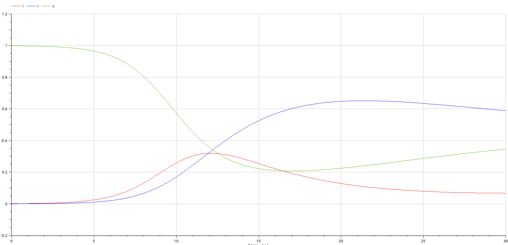{#fig:15 width=70%}

Видно, что чем больше коэффициент $\mu$, тем сильнее график отличается от начального.

# Выводы

Построили модель SIR в xcos и OpenModelica.