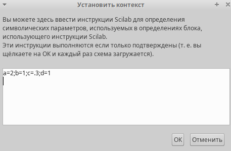
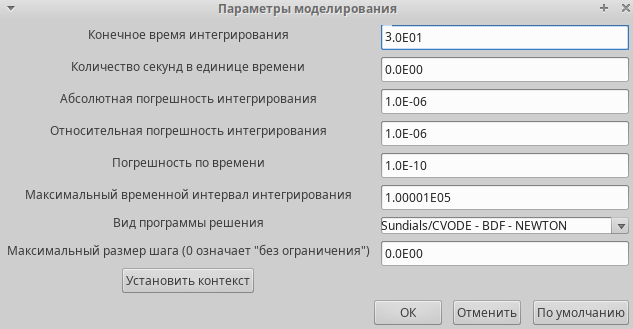
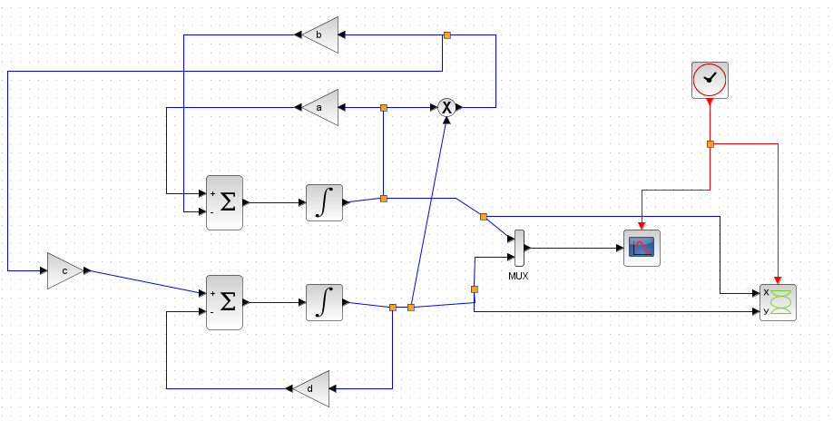
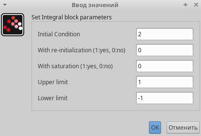
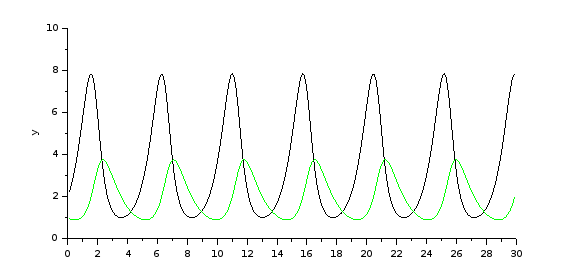
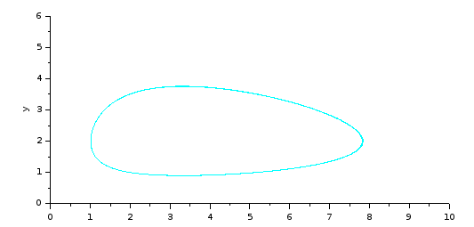
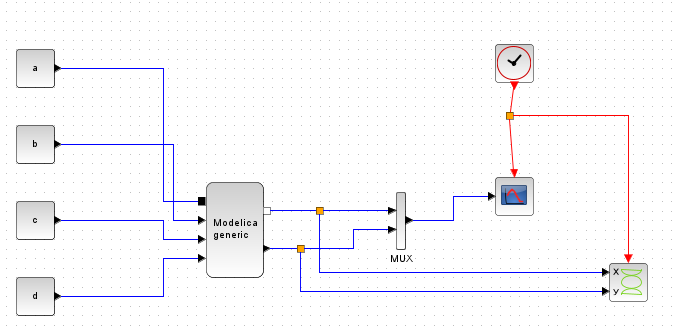
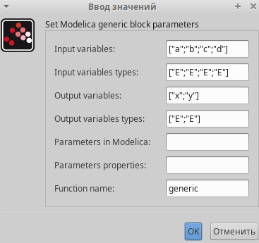
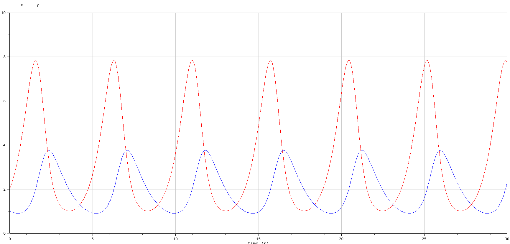
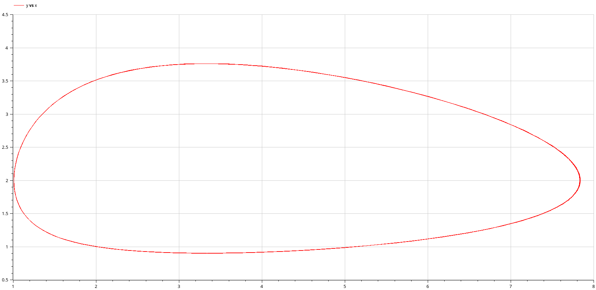

---
## Front matter
lang: ru-RU
title: Презентация по лабораторной работе №6
subtitle: Имитационное моделирование
author:
  - Екатерина Канева, НФИбд-02-22
institute:
  - Российский университет дружбы народов, Москва, Россия
date: 14 марта 2025

## i18n babel
babel-lang: russian
babel-otherlangs: english

## Formatting pdf
toc: false
toc-title: Содержание
slide_level: 2
aspectratio: 169
section-titles: true
theme: metropolis
header-includes:
 - \metroset{progressbar=frametitle,sectionpage=progressbar,numbering=fraction}
---

# Информация

## Докладчик

* Канева Екатерина Павловна
* студент группы НФИбд-02-22
* Российский университет дружбы народов
* [1132222004@rudn.ru](mailto:1132222004@rudn.ru)
* <https://nevseros.github.io/ru/>

# Вводная часть

## Цель

Построить модель "хищник-жертва" в xcos и OpenModelica.

## Задания

1. Реализовать модель "хищник-жертва" в xcos.
2. Реализовать модель "хищник-жертва" с помощью блока Modelica в xcos.
3. Реализовать модель "хищник-жертва" в OpenModelica.

# Выполнение работы

## Задание переменных

Сначала я задала переменные a, b, c, d:

{width=40%}

## Длительность

{width=40%}

## Реализация модели

Реализовала модель, ниже приведена схема, построенная в xcos:

{width=45%}

## Параметры блоков интегрирования

Задала следующие параметры для блоков интегрирования (для верхнего и нижнего, на картинке представлены параметры для верхнего):

{#fig:4 width=40%}

## Графики

{width=50%}

## Графики

{width=50%}

## Модель с блоком Modelica

Далее построила то же самое, но с блоком Modelica:

{width=50%}

## Параметры блока Modelica

Задала параметры для блока Modelica:

{width=45%}

## Код для блока Modelica

Написала код для этого блока, ниже часть с уравнениями:

```
equation
    der(x)=a*x-b*x*y;
    der(y)=c*x*y-d*y;
```

## Графики

{width=50%}

## Графики

{width=50%}

## OpenModelica

Выполнила то же самое в OpenModelica, ниже часть кода, отвечающая за сами уравнения:

```
equation
  der(x) = a*x - b*x*y;
  der(y) = c*x*y - d*y;
```
## Графики

{width=50%}

## Графики

{width=50%}

# Заключение

## Вывод

Построили модель "хищник-жертва" в xcos и OpenModelica.