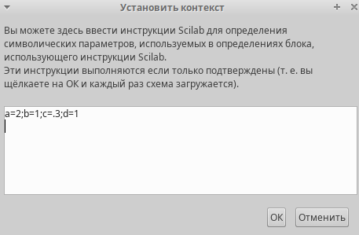
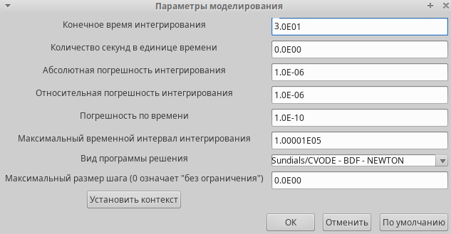
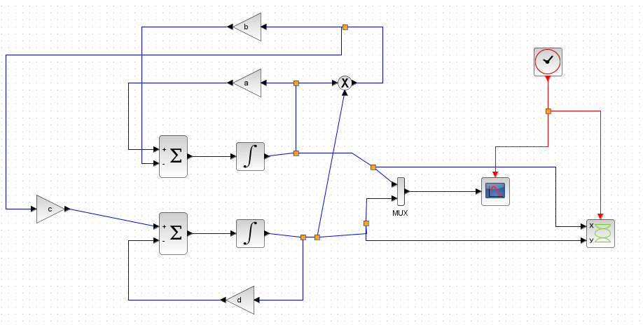
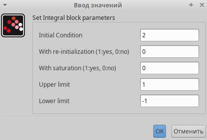
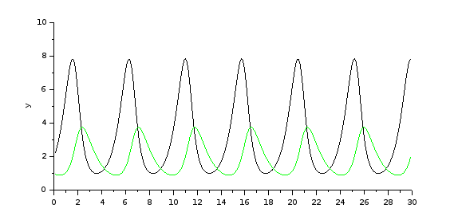
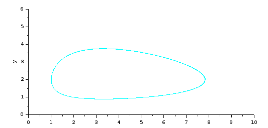
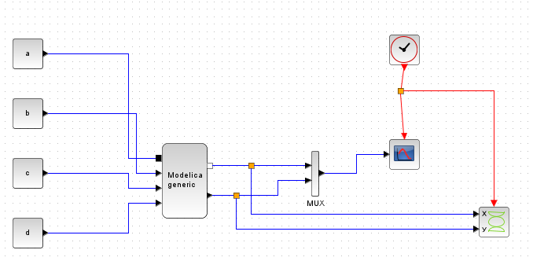
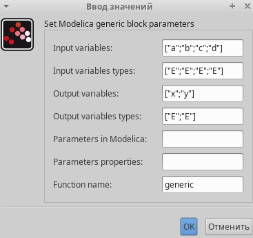
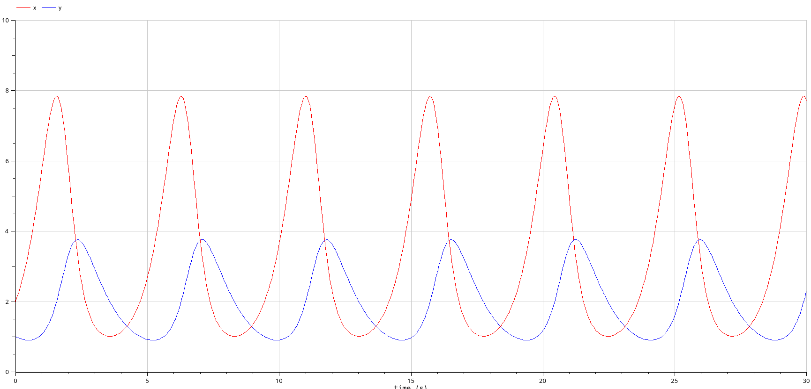
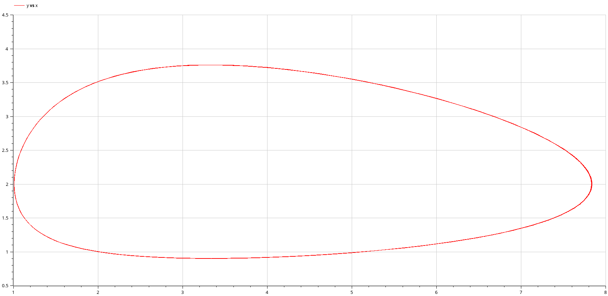

---
## Front matter
title: "Лабораторная работа №6"
subtitle: "Имитационное моделирование"
author: "Екатерина Канева, НФИбд-02-22"

## Generic otions
lang: ru-RU
toc-title: "Содержание"

## Bibliography
bibliography: bib/cite.bib
csl: pandoc/csl/gost-r-7-0-5-2008-numeric.csl

## Pdf output format
toc: true # Table of contents
toc-depth: 2
lof: true # List of figures
lot: true # List of tables
fontsize: 12pt
linestretch: 1.5
papersize: a4
documentclass: scrreprt
## I18n polyglossia
polyglossia-lang:
  name: russian
  options:
	- spelling=modern
	- babelshorthands=true
polyglossia-otherlangs:
  name: english
## I18n babel
babel-lang: russian
babel-otherlangs: english
## Fonts
mainfont: IBM Plex Serif
romanfont: IBM Plex Serif
sansfont: IBM Plex Sans
monofont: IBM Plex Mono
mathfont: STIX Two Math
mainfontoptions: Ligatures=Common,Ligatures=TeX,Scale=0.94
romanfontoptions: Ligatures=Common,Ligatures=TeX,Scale=0.94
sansfontoptions: Ligatures=Common,Ligatures=TeX,Scale=MatchLowercase,Scale=0.94
monofontoptions: Scale=MatchLowercase,Scale=0.94,FakeStretch=0.9
mathfontoptions:
## Biblatex
biblatex: true
biblio-style: "gost-numeric"
biblatexoptions:
  - parentracker=true
  - backend=biber
  - hyperref=auto
  - language=auto
  - autolang=other*
  - citestyle=gost-numeric
## Pandoc-crossref LaTeX customization
figureTitle: "Рис."
tableTitle: "Таблица"
listingTitle: "Листинг"
lofTitle: "Список иллюстраций"
lotTitle: "Список таблиц"
lolTitle: "Листинги"
## Misc options
indent: true
header-includes:
  - \usepackage{indentfirst}
  - \usepackage{float} # keep figures where there are in the text
  - \floatplacement{figure}{H} # keep figures where there are in the text
---

# Цель работы

Построить модель "хищник-жертва" в xcos и OpenModelica.

# Задание

1. Реализовать модель "хищник-жертва" в xcos.
2. Реализовать модель "хищник-жертва" с помощью блока Modelica в xcos.
3. Реализовать модель "хищник-жертва" в OpenModelica.

# Теоретическое введение

Модель «хищник–жертва» (модель Лотки — Вольтерры) представляет собой модель межвидовой конкуренции. В математической форме модель имеет вид:

$$
\begin{cases}
  \dot x = ax-bxy; \\
  \dot y = cxy-dy,
\end{cases}
$$

где $x$ — количество жертв, $y$ — количество хищников, a $a$, $b$, $c$, $d$ — коэффициенты, отражающие взаимодействия между видами: $a$ — коэффициент рождаемости жертв, $b$ — коэффициент убыли жертв, $c$ — коэффициент рождения хищников, $d$ — коэффициент убыли хищников.

# Выполнение лабораторной работы

Сначала я задала переменные среды (рис. [-@fig:1]):

{#fig:1 width=70%}

Далее я задала время моделирования (рис. [-@fig:2]):

{#fig:2 width=70%}

Потом я приступила к построению модели "хищник-жертва" в xcos. Для начала я построила модель без блока Modelica (рис. [-@fig:3]).

{#fig:3 width=70%}

Задала следующие параметры для блоков интегрирования, например, для верхнего блока параметры представлены на рис. [-@fig:4]:

{#fig:4 width=70%}

Запустила моделирование, получила следующие графики — один описывает динамику изменения численности хищников (зелёный) и жертв (чёрный), другой описывает фазовый портрет модели (рис. [-@fig:5] и [-@fig:6]):

{#fig:5 width=70%}

{#fig:6 width=70%}

Далее построила то же самое, но с блоком Modelica (рис. [-@fig:7]):

{#fig:7 width=70%}

Задала параметры для блока Modelica (рис. [-@fig:8]):

{#fig:8 width=70%}

Написала код для этого блока:

```
class generic
    ////automatically generated ////
    //input variables
    Real a,b,c,d;
    //output variables
    // Real x,y;
////do not modif above this line ////

    Real x(start=2), y(start=1);
// Модель хищник-жертва
equation
    der(x)=a*x-b*x*y;
    der(y)=c*x*y-d*y;
end generic;
```

Получила такие же графики, как на рис. [-@fig:5] и [-@fig:6].

Далее я выполнила то же самое в OpenModelica в качестве упражнения. Там я ввела следующий код: 

```
model lab6
  parameter Real a = 2;
  parameter Real b = 1;
  parameter Real c = 0.3;
  parameter Real d = 1;
  parameter Real x0 = 2;
  parameter Real y0 = 1;

  Real x(start=x0);
  Real y(start=y0);
  
equation
  der(x) = a*x - b*x*y;
  der(y) = c*x*y - d*y;

end lab6;
```

При запуске построился следуюшие графики — один описывает динамику изменения численности хищников (синий) и жертв (красный), другой описывает фазовый портрет модели (рис. [-@fig:9] и [-@fig:10]):

{#fig:9 width=70%}

{#fig:10 width=70%}

Как мы видим, "хищники" и "жертвы" очень тесно связаны в этой модели. У них одинаковый период "колебания" численности.

# Выводы

Построили модель "хищник-жертва" в xcos и OpenModelica.