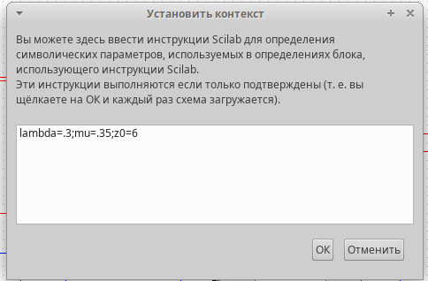
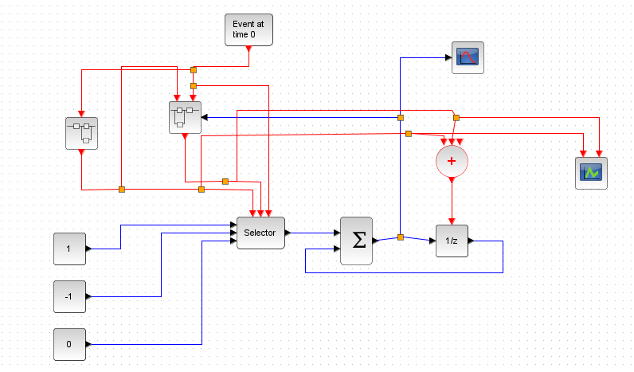
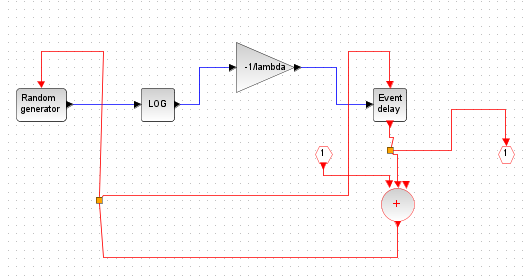
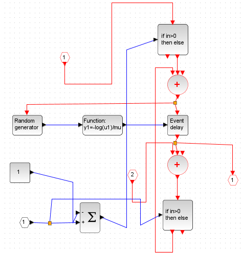
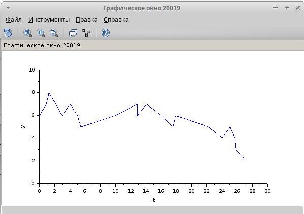

---
## Front matter
lang: ru-RU
title: Презентация по лабораторной работе №7
subtitle: Имитационное моделирование
author:
  - Екатерина Канева, НФИбд-02-22
institute:
  - Российский университет дружбы народов, Москва, Россия
date: 22 марта 2025

## i18n babel
babel-lang: russian
babel-otherlangs: english

## Formatting pdf
toc: false
toc-title: Содержание
slide_level: 2
aspectratio: 169
section-titles: true
theme: metropolis
header-includes:
 - \metroset{progressbar=frametitle,sectionpage=progressbar,numbering=fraction}
---

# Информация

## Докладчик

* Канева Екатерина Павловна
* студент группы НФИбд-02-22
* Российский университет дружбы народов
* [1132222004@rudn.ru](mailto:1132222004@rudn.ru)
* <https://nevseros.github.io/ru/>

# Вводная часть

## Цель

Построить модель СМО M|M|1|inf.

## Задания

1. Реализовать модель в xcos.
2. Построить графики поступления и обработки заявок и длины очереди.

# Выполнение работы

## Задание переменных

Сначала я задала переменные lambda, mu, z0:

{width=40%}

## Реализация модели

Реализовала модель, ниже приведена общая схема, построенная в xcos:

{width=45%}

## Суперблок "поступление заявок"

{width=40%}

## Суперблок "обслуживание заявок"

{width=40%}

## Графики

{width=50%}

## Графики

{width=50%}

# Заключение

## Вывод

Построили модель СМО M|M|1|inf в xcos.