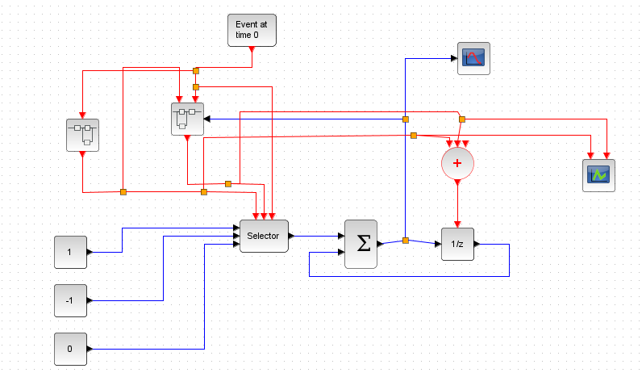
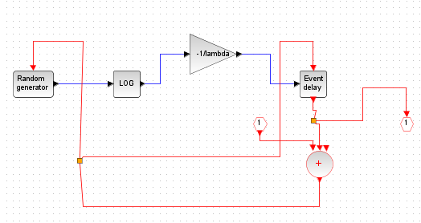

---
## Front matter
title: "Лабораторная работа №7"
subtitle: "Имитационное моделирование"
author: "Екатерина Канева, НФИбд-02-22"

## Generic otions
lang: ru-RU
toc-title: "Содержание"

## Bibliography
bibliography: bib/cite.bib
csl: pandoc/csl/gost-r-7-0-5-2008-numeric.csl

## Pdf output format
toc: true # Table of contents
toc-depth: 2
lof: true # List of figures
lot: true # List of tables
fontsize: 12pt
linestretch: 1.5
papersize: a4
documentclass: scrreprt
## I18n polyglossia
polyglossia-lang:
  name: russian
  options:
  - spelling=modern
  - babelshorthands=true
polyglossia-otherlangs:
  name: english
## I18n babel
babel-lang: russian
babel-otherlangs: english
## Fonts
mainfont: IBM Plex Serif
romanfont: IBM Plex Serif
sansfont: IBM Plex Sans
monofont: IBM Plex Mono
mathfont: STIX Two Math
mainfontoptions: Ligatures=Common,Ligatures=TeX,Scale=0.94
romanfontoptions: Ligatures=Common,Ligatures=TeX,Scale=0.94
sansfontoptions: Ligatures=Common,Ligatures=TeX,Scale=MatchLowercase,Scale=0.94
monofontoptions: Scale=MatchLowercase,Scale=0.94,FakeStretch=0.9
mathfontoptions:
## Biblatex
biblatex: true
biblio-style: "gost-numeric"
biblatexoptions:
  - parentracker=true
  - backend=biber
  - hyperref=auto
  - language=auto
  - autolang=other*
  - citestyle=gost-numeric
## Pandoc-crossref LaTeX customization
figureTitle: "Рис."
tableTitle: "Таблица"
listingTitle: "Листинг"
lofTitle: "Список иллюстраций"
lotTitle: "Список таблиц"
lolTitle: "Листинги"
## Misc options
indent: true
header-includes:
  - \usepackage{indentfirst}
  - \usepackage{float} # keep figures where there are in the text
  - \floatplacement{figure}{H} # keep figures where there are in the text
---

# Цель работы

Построить модель СМО M|M|1|$\inf$.

# Задание

1. Реализовать модель в xcos.
2. Построить графики поступления и обработки заявок и длины очереди.

# Выполнение лабораторной работы

Сначала я задала переменные среды (рис. [-@fig:1]):

{#fig:1 width=70%}

Далее я задала время моделирования и приступила к построению модели СМО M|M|1|$\inf$ в xcos. Общая модель получилась такая (рис. [-@fig:2])

{#fig:2 width=70%}

Для левого суперблока собрала следующую схему (рис. [-@fig:3]):

{#fig:3 width=70%}

Для правого суперблока собрала следующую схему (рис. [-@fig:4]):

{#fig:4 width=70%}

Запустила моделирование, получила следующие графики — один описывает поступление и обработку заявок, где чёрный — поступление, зелёный — обработка (рис. [-@fig:5]), а другой описывает длину очереди (рис. [-@fig:6]):

{#fig:5 width=70%}

{#fig:6 width=70%}

График длины очереди начинается с 6, потому что это то значение, которое мы задали в константах для $z_0$, а позже задали $z_0$ в одном из блоков.

# Выводы

Построили модель СМО M|M|1|$\inf$ в xcos.

# Список литературы{.unnumbered}

::: {#refs}
:::