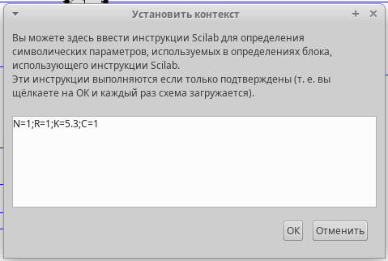
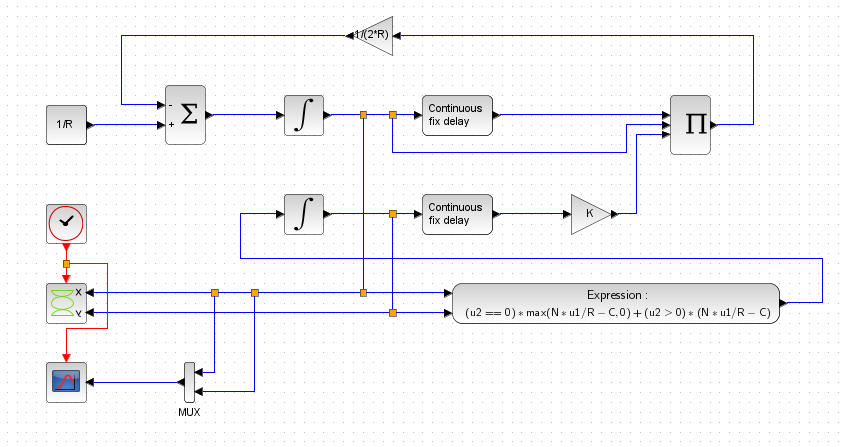
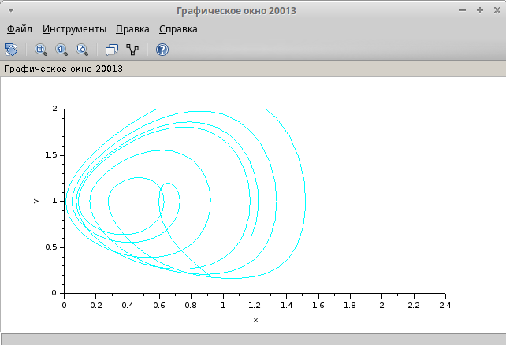
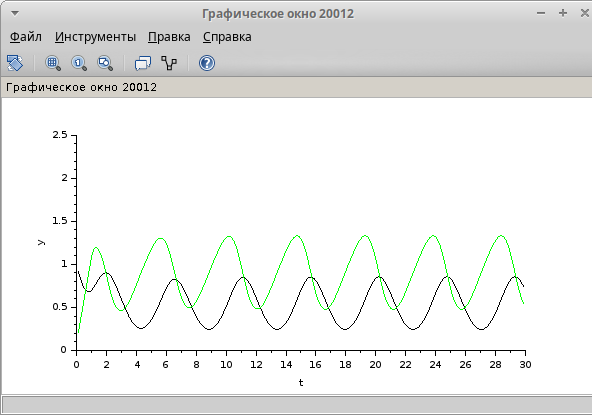
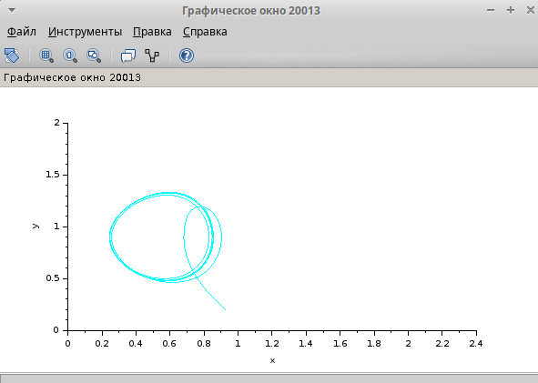
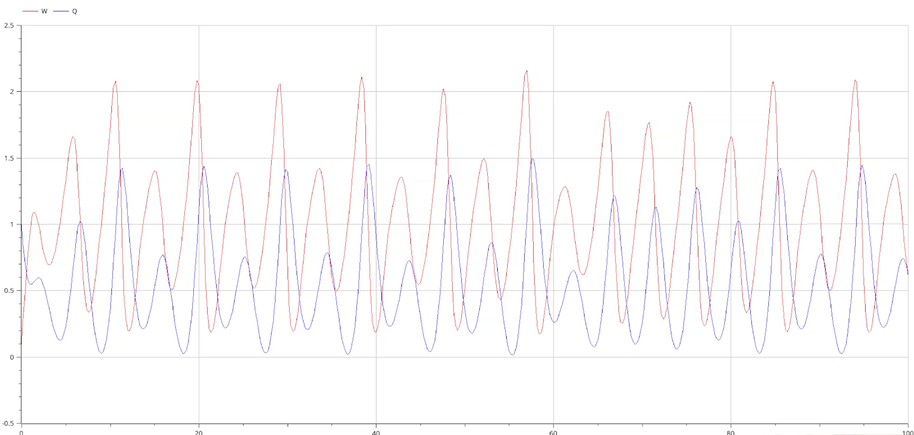
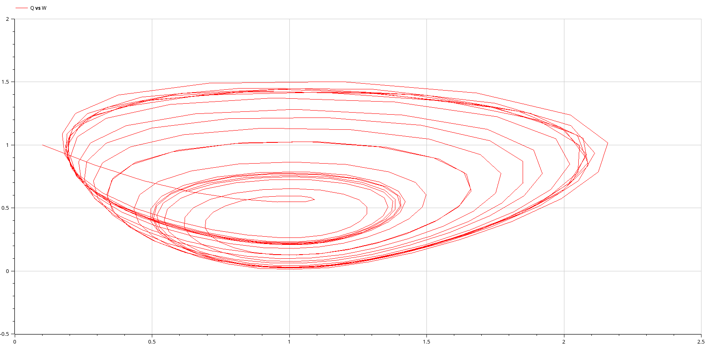
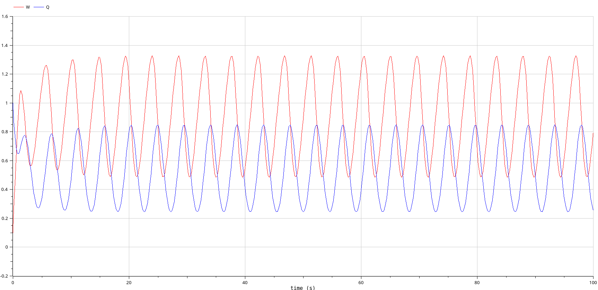
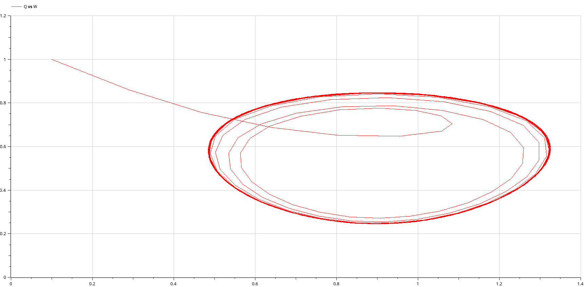

---
## Front matter
lang: ru-RU
title: Презентация по лабораторной работе №8
subtitle: Имитационное моделирование
author:
  - Екатерина Канева, НФИбд-02-22
institute:
  - Российский университет дружбы народов, Москва, Россия
date: 28 марта 2025

## i18n babel
babel-lang: russian
babel-otherlangs: english

## Formatting pdf
toc: false
toc-title: Содержание
slide_level: 2
aspectratio: 169
section-titles: true
theme: metropolis
header-includes:
 - \metroset{progressbar=frametitle,sectionpage=progressbar,numbering=fraction}
---

# Информация

## Докладчик

* Канева Екатерина Павловна
* студент группы НФИбд-02-22
* Российский университет дружбы народов
* [1132222004@rudn.ru](mailto:1132222004@rudn.ru)
* <https://nevseros.github.io/ru/>

# Вводная часть

## Цель

Построить модель TCP/AQM в xcos и OpenModelica.

## Задания

1. Реализовать модель TCP/AQM в xcos.
2. Реализовать модель TCP/AQM в OpenModelica.

# Выполнение работы

## Задание переменных

Сначала я задала переменные N, R, K, C:

{width=40%}

## Реализация модели в xcos

Реализовала модель, ниже приведена общая схема, построенная в xcos:

{width=45%}

## Графики

{width=50%}

## Графики

{width=50%}

## Графики

{width=50%}

## Графики

{width=50%}

## Реализация модели в OpenModelica

Реализовала модель в OpenModelica, ниже преведена часть кода с уравнениями:

```
equation
  
  der(W) = 1/R - W*delay(W, R)/(2*R)*K*delay(Q, R);
  der(Q) = if (Q==0) then max(N*W/R-C, 0) else (N*W/R-C);
```

## Графики

{width=50%}

## Графики

{width=50%}

## Графики

{width=50%}

## Графики

{width=50%}

# Заключение

## Вывод

Построили модель TCP/AQM в xcos и OpenModelica.