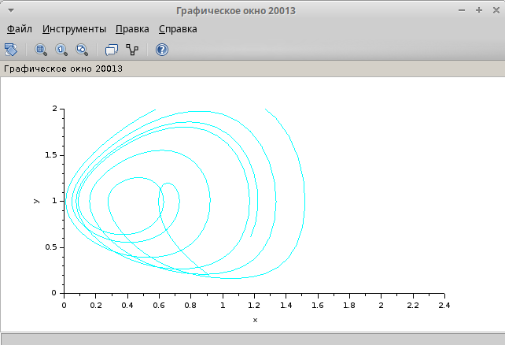

---
## Front matter
title: "Лабораторная работа №8"
subtitle: "Имитационное моделирование"
author: "Екатерина Канева, НФИбд-02-22"

## Generic otions
lang: ru-RU
toc-title: "Содержание"

## Bibliography
bibliography: bib/cite.bib
csl: pandoc/csl/gost-r-7-0-5-2008-numeric.csl

## Pdf output format
toc: true # Table of contents
toc-depth: 2
lof: true # List of figures
lot: true # List of tables
fontsize: 12pt
linestretch: 1.5
papersize: a4
documentclass: scrreprt
## I18n polyglossia
polyglossia-lang:
  name: russian
  options:
  - spelling=modern
  - babelshorthands=true
polyglossia-otherlangs:
  name: english
## I18n babel
babel-lang: russian
babel-otherlangs: english
## Fonts
mainfont: IBM Plex Serif
romanfont: IBM Plex Serif
sansfont: IBM Plex Sans
monofont: IBM Plex Mono
mathfont: STIX Two Math
mainfontoptions: Ligatures=Common,Ligatures=TeX,Scale=0.94
romanfontoptions: Ligatures=Common,Ligatures=TeX,Scale=0.94
sansfontoptions: Ligatures=Common,Ligatures=TeX,Scale=MatchLowercase,Scale=0.94
monofontoptions: Scale=MatchLowercase,Scale=0.94,FakeStretch=0.9
mathfontoptions:
## Biblatex
biblatex: true
biblio-style: "gost-numeric"
biblatexoptions:
  - parentracker=true
  - backend=biber
  - hyperref=auto
  - language=auto
  - autolang=other*
  - citestyle=gost-numeric
## Pandoc-crossref LaTeX customization
figureTitle: "Рис."
tableTitle: "Таблица"
listingTitle: "Листинг"
lofTitle: "Список иллюстраций"
lotTitle: "Список таблиц"
lolTitle: "Листинги"
## Misc options
indent: true
header-includes:
  - \usepackage{indentfirst}
  - \usepackage{float} # keep figures where there are in the text
  - \floatplacement{figure}{H} # keep figures where there are in the text
---

# Цель работы

Построить модель TCP/AQM в xcos и OpenModelica.

# Задание

1. Реализовать модель TCP/AQM в xcos.
2. Реализовать модель TCP/AQM в OpenModelica.

# Выполнение лабораторной работы

Сначала я задала переменные среды (рис. [-@fig:1]):

{#fig:1 width=70%}

Далее я задала время моделирования и приступила к построению модели TCP/AQM в xcos. Общая модель получилась такая (рис. [-@fig:2])

{#fig:2 width=70%}

Далее я задала параметры всем необходимым блокам и запустила моделирование. Я получила следующие графики — один описывает размер окна TCP (зелёный) и длину очереди (чёрный) (рис. [-@fig:3]), а другой описывает фазовый портрет системы (рис. [-@fig:4]):

{#fig:3 width=70%}

{#fig:4 width=70%}

Потом я изменила параметр C=0.9 и получила следующие графики (рис. [-@fig:5] и [-@fig:6]):

{#fig:5 width=70%}

{#fig:6 width=70%}

При уменьшении C колебания стали более равномерными.

Далее в рамказ задания для самостоятельной работы я построила такую же модель в OpenModelica. Для этого я использовала следующий код:

```
model lab8

  parameter Real N=1;
  parameter Real R=1;
  parameter Real K=5.3;
  parameter Real C=0.9;
  
  Real W(start=0.1);
  Real Q(start=1);
  
equation
  
  der(W) = 1/R - W*delay(W, R)/(2*R)*K*delay(Q, R);
  der(Q) = if (Q==0) then max(N*W/R-C, 0) else (N*W/R-C);

end lab8;
```

После запуска моделирования и установки времени моделирования получила следующие графики при C = 1 — красный описывает размер окна TCP, а синий — длину очереди (рис. [-@fig:7] и [-@fig:8]):

{#fig:7 width=70%}

{#fig:8 width=70%}

Графики получились идентичными соответствующим графикам в xcos (с учётом другого времени моделирования). 

Далее я изменила параметр C = 0.9 и получила следующие графики — красный описывает размер окна TCP, а синий — длину очереди (рис. [-@fig:9] и [-@fig:10])

{#fig:9 width=70%}

{#fig:10 width=70%}

Эти графики также получились идентичными соответствующим графикам в xcos (с учётом другого времени моделирования).

# Выводы

Построили модель TCP/AQM в xcos и OpenModelica.

# Список литературы{.unnumbered}

::: {#refs}
:::