---
## Front matter
lang: ru-RU
title: Презентация по лабораторной работе №11
subtitle: Имитационное моделирование
author:
  - Екатерина Канева, НФИбд-02-22
institute:
  - Российский университет дружбы народов, Москва, Россия
date: 18 апреля 2025

## i18n babel
babel-lang: russian
babel-otherlangs: english

## Formatting pdf
toc: false
toc-title: Содержание
slide_level: 2
aspectratio: 169
section-titles: true
theme: metropolis
header-includes:
 - \metroset{progressbar=frametitle,sectionpage=progressbar,numbering=fraction}
---

# Информация

## Докладчик

* Канева Екатерина Павловна
* студент группы НФИбд-02-22
* Российский университет дружбы народов
* [1132222004@rudn.ru](mailto:1132222004@rudn.ru)
* <https://nevseros.github.io/ru/>

# Вводная часть

## Цель

Построить модель M|M|1 в CPN Tools.

## Задания

1. Построить модель M|M|1.
2. Выполнить мониторинг параметров модели, построить графики.

# Выполнение работы

## Лист System

Сначала я построила лист System:

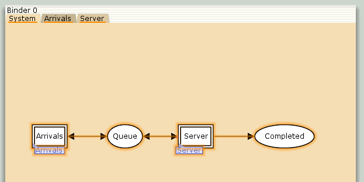{width=50%}

## Задание деклараций

Задала множества цветов:

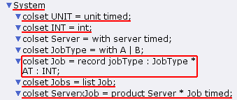{width=50%}

## Задание деклараций

Задала переменные:

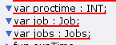{width=50%}

## Задание деклараций

Задала функции модели:

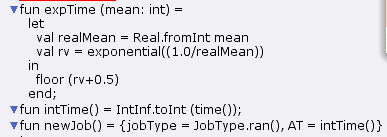{width=50%}

## Лист Arrivals

Построила граф на листе Arrivals:

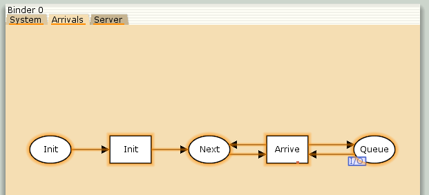{width=50%}

## Лист Server

Построила граф на листе Server:

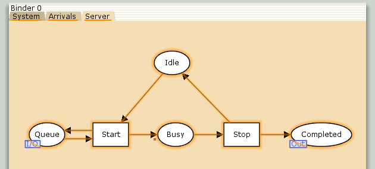{width=50%}

## Задание параметров на графах

Потом на каждом из листов я задала параметры. Для листа System:

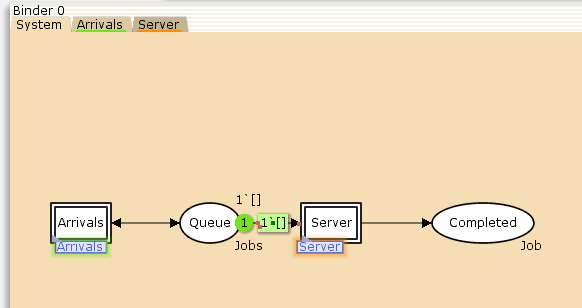{width=50%}

## Задание параметров на графах

Для листа Arrivals:

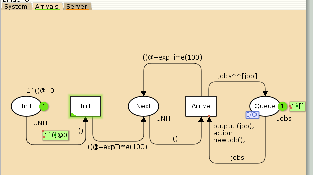{width=50%}

## Задание параметров на графах

Для листа Server:

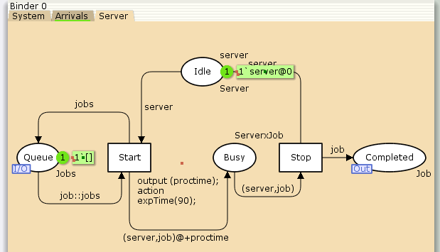{width=50%}

## Мониторинг

С помощью палитры Monitoring установила точку останова на переход Start, новый монитор назвала Ostanovka. Функцию Predicate отредактировала, ниже изменённая часть:

```
fun predBindElem (Server'Start (1, {job,jobs,proctime}))
  = Queue_Delay.count()=200
```

## Мониторинг

Далее на Start установила Data Coll, назвала новый монитор Queue Delay, отредактировала функцию Observer:

```
fun obsBindElem (Server'Start (1, {job, jobs, proctime}))
  = (intTime() - (#AT job))
```

## Запуск моделирования

Запустила моделирование, получила на выводе файл `Queue_Delay.log`:

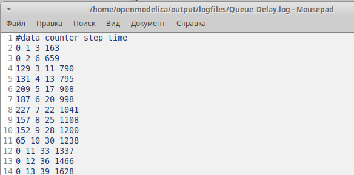{width=50%}

## Скрипт для построения графиков

Написала скрипт, подходящий для построения обоих графиков, нужных в лабораторной:

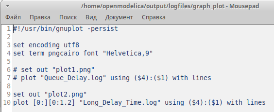{width=50%}

## График задержки в очереди

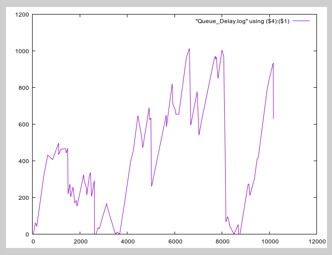{width=50%}

## Мониторинг

Далее на Start снова установила Data Coll, назвала новый монитор Queue Delay Real, отредактировала функцию Observer:

```
fun obsBindElem (Server'Start (1, {job, jobs, proctime}))
  = Real.fromInt(intTime() - (#AT job))
```

## Мониторинг

Далее на Start снова установила Data Coll, назвала новый монитор Long Delay Time, отредактировала функцию Observer:

```
fun obs (bindelem) =
  if IntInf.tiInt(Queue_Delay.last())>=(!longdelaytime)
    then 1
  else 0
```

## Глобальная переменная longdelaytime

Задала глобальную переменную, используемую в прошлой функции Observer:

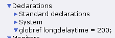{width=50%}

## График превышения периодов задержки

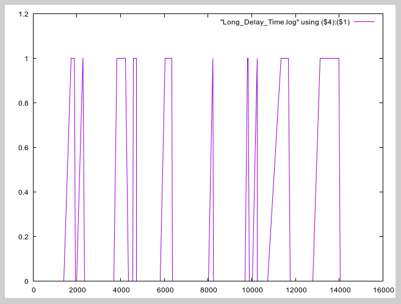{width=50%}

# Заключение

## Вывод

Построили модель M|M|1 в CPN Tools.