---
## Front matter
title: "Лабораторная работа №11"
subtitle: "Имитационное моделирование"
author: "Екатерина Канева, НФИбд-02-22"

## Generic otions
lang: ru-RU
toc-title: "Содержание"

## Bibliography
bibliography: bib/cite.bib
csl: pandoc/csl/gost-r-7-0-5-2008-numeric.csl

## Pdf output format
toc: true # Table of contents
toc-depth: 2
lof: true # List of figures
lot: true # List of tables
fontsize: 12pt
linestretch: 1.5
papersize: a4
documentclass: scrreprt
## I18n polyglossia
polyglossia-lang:
  name: russian
  options:
	- spelling=modern
	- babelshorthands=true
polyglossia-otherlangs:
  name: english
## I18n babel
babel-lang: russian
babel-otherlangs: english
## Fonts
mainfont: IBM Plex Serif
romanfont: IBM Plex Serif
sansfont: IBM Plex Sans
monofont: IBM Plex Mono
mathfont: STIX Two Math
mainfontoptions: Ligatures=Common,Ligatures=TeX,Scale=0.94
romanfontoptions: Ligatures=Common,Ligatures=TeX,Scale=0.94
sansfontoptions: Ligatures=Common,Ligatures=TeX,Scale=MatchLowercase,Scale=0.94
monofontoptions: Scale=MatchLowercase,Scale=0.94,FakeStretch=0.9
mathfontoptions:
## Biblatex
biblatex: true
biblio-style: "gost-numeric"
biblatexoptions:
  - parentracker=true
  - backend=biber
  - hyperref=auto
  - language=auto
  - autolang=other*
  - citestyle=gost-numeric
## Pandoc-crossref LaTeX customization
figureTitle: "Рис."
tableTitle: "Таблица"
listingTitle: "Листинг"
lofTitle: "Список иллюстраций"
lotTitle: "Список таблиц"
lolTitle: "Листинги"
## Misc options
indent: true
header-includes:
  - \usepackage{indentfirst}
  - \usepackage{float} # keep figures where there are in the text
  - \floatplacement{figure}{H} # keep figures where there are in the text
---

# Цель работы

Построить модель M|M|1 в CPN Tools.

# Задание

1. Построить модель M|M|1.
2. Выполнить мониторинг параметров модели, построить графики.

# Выполнение лабораторной работы

Модель состояла из 3 листов. Сначала я построила лист System (рис. [-@fig:1]):

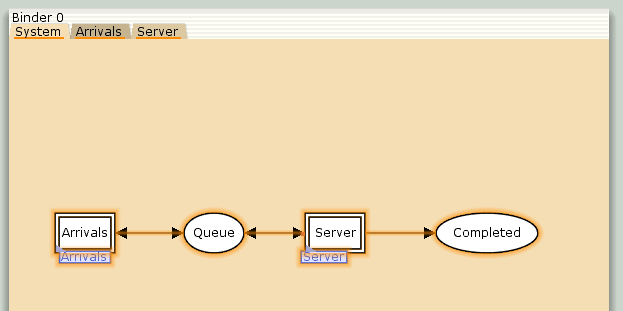{#fig:1 width=70%}

Далее я задала декларации системы: множества цветов (рис. [-@fig:2]), переменные (рис. [-@fig:3]), функции (рис. [-@fig:4]) модели.

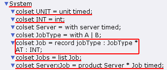{#fig:2 width=70%}

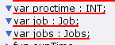{#fig:3 width=70%}

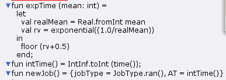{#fig:4 width=70%}

Далее я построила листы Arrivals (рис. [-@fig:5]) и Server (рис. [-@fig:6]):

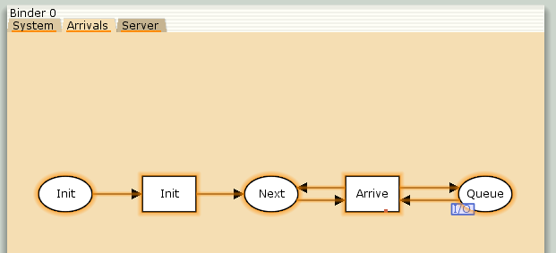{#fig:5 width=70%}

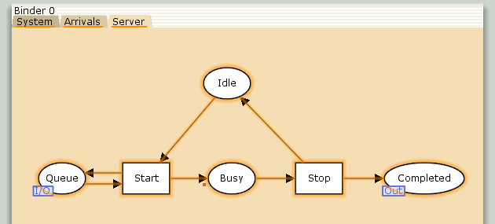{#fig:6 width=70%}

Потом я задала параметры модели на графах сети. Там было много параметров, поэтому вся информация будет на картинках (рис. [-@fig:7], [-@fig:8] и [-@fig:9]):

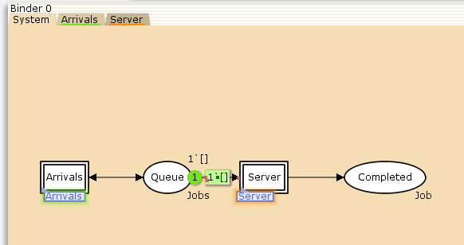{#fig:7 width=70%}

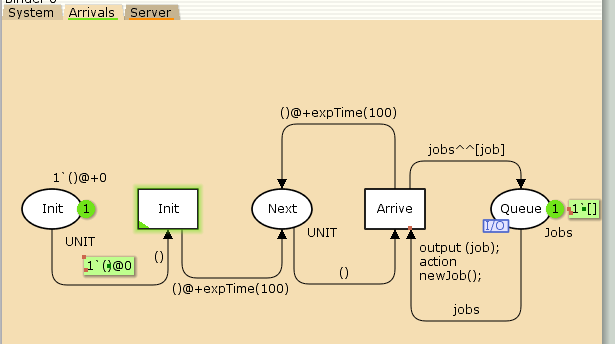{#fig:8 width=70%}

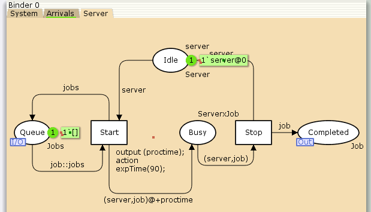{#fig:9 width=70%}

Далее я приступила к мониторингу сети. Для этого с помощью палитры Monitoring установила точку останова на переход Start, новый монитор назвала Ostanovka, функцию Predicate изменила на следующую:

```
fun pred (bindelem) =
  let
    fun predBindElem (Server'Start (1, {job,jobs,proctime}))
      = Queue_Delay.count()=200
    | predBindElem _ = false
  in
    predBindElem bindelem
end
```

Потом выбрала Data Coll, установила снова на Start, назвала Queue Delay и изменила функцию Observer на следующую:

```
fun obs (bindelem) =
  let
    fun obsBindElem (Server'Start (1, {job, jobs, proctime}))
      = (intTime() - (#AT job))
      | obsBindElem _ = ~1
  in
    obsBindElem bindelem
  end
```

Далее я запустила моделирование, выполнила более 300 шагов, получила на выводе файл `Queue_Delay.log` (рис. [-@fig:10]):

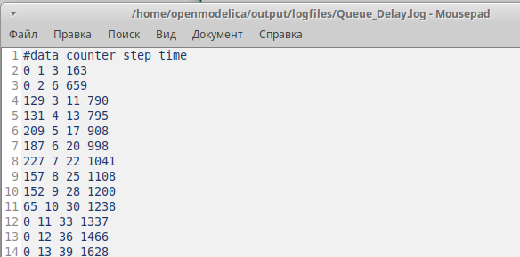{#fig:10 width=70%}

Далее я построила график значений задержки в очереди, для этого я написала следующий код — он также подходит и для графика, который надо будет построить позже (рис. [-@fig:11]):

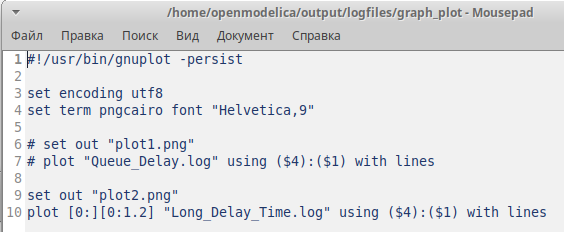{#fig:11 width=70%}

Получился следующий график (рис. [-@fig:12]):

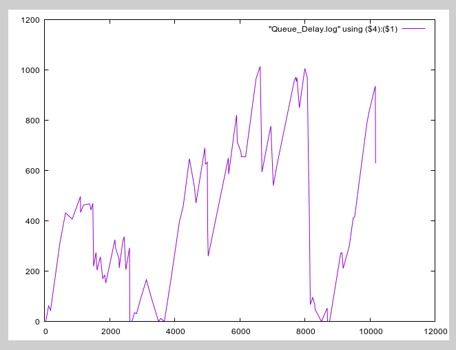{#fig:12 width=70%}

Далее я с помощью палитры Monitoring снова установила точку останова на переход Start, новый монитор назвала Queue Delay Real, функцию Observer изменила на следующую:

```
fun obs (bindelem) =
  let
    fun obsBindElem (Server'Start (1, {job, jobs, proctime}))
      = Real.fromInt(intTime() - (#AT job))
      | obsBindElem _ = ~1.0
  in
    obsBindElem bindelem
  end
```

После этого я получила файл `Queue_Delay_Real.log`, похожий на `Queue_Delay.log`, только здесь значения имеют действительный тип. После этого я с помощью палитры Monitoring я снова установила Data Coll на Start. Теперь новый монитор я назвала Long Delay Time и сделала следующйю функцию Observer:

```
fun obs (bindelem) =
  if IntInf.tiInt(Queue_Delay.last())>=(!longdelaytime)
    then 1
  else 0
```

Далее было необходимо определить глобальную переменную `longdelaytime`, которая бы была границей для большой задержки (рис. [-@fig:13]):

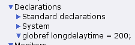{#fig:13 width=70%}

После этого я немного изменила скрипт для построения графика в GNU Plot (рис. [-@fig:11]) и построила график (рис. [-@fig:14]), демонстрирующий, в какие периоды времени значения задержки в очереди превышали заданное значение 200:

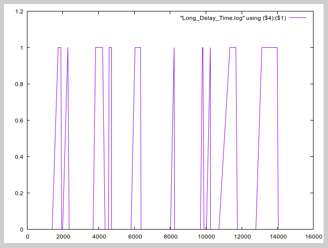{#fig:14 width=70%}

Когда значение графика равно 1, была задержка больше допустимой, когда 0 — превышения не было. Видим, что если ставить переменную 200, то задержка редко превышала допустимую.

# Выводы

Построили модель M|M|1 в CPN Tools.

# Список литературы{.unnumbered}

::: {#refs}
:::