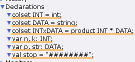
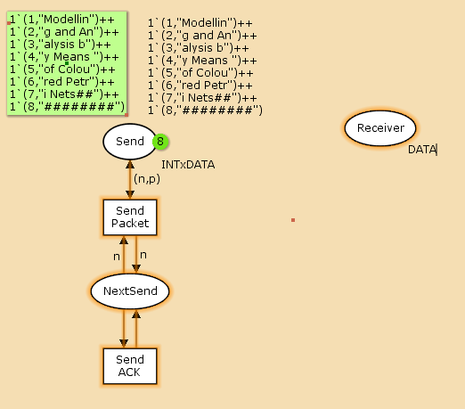
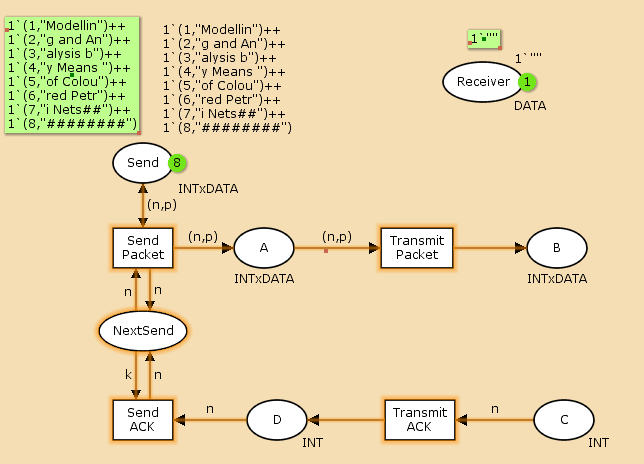
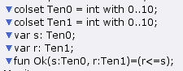
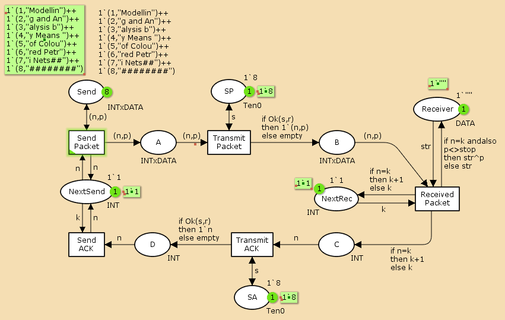
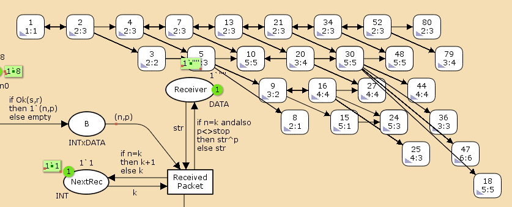

---
## Front matter
lang: ru-RU
title: Презентация по лабораторной работе №12
subtitle: Имитационное моделирование
author:
  - Екатерина Канева, НФИбд-02-22
institute:
  - Российский университет дружбы народов, Москва, Россия
date: 26 апреля 2025

## i18n babel
babel-lang: russian
babel-otherlangs: english

## Formatting pdf
toc: false
toc-title: Содержание
slide_level: 2
aspectratio: 169
section-titles: true
theme: metropolis
header-includes:
 - \metroset{progressbar=frametitle,sectionpage=progressbar,numbering=fraction}
---

# Информация

## Докладчик

* Канева Екатерина Павловна
* студент группы НФИбд-02-22
* Российский университет дружбы народов
* [1132222004@rudn.ru](mailto:1132222004@rudn.ru)
* <https://nevseros.github.io/ru/>

# Вводная часть

## Цель

Построить ненадёжную сеть передачи данных в CPN Tools.

## Задания

1. Построить сеть с источником и получаетелем.
2. Смоделировать передачу сообщения "Modelling and Analysis by Means of Coloured Petry Nets".
3. Вычислить пространство состояний, сформировать отчёт о пространстве состояний, построить граф пространства состояний.

# Выполнение работы

## Задание деклараций

Задала начальные декларации:

{width=40%}

## Начальный граф

Построила начальный граф:

{width=45%}

## Добавление промежуточных состояний

Добавила промежуточные состояния:

{width=50%}

## Задание оставшихся деклараций

Задала остальные декларации:

{width=50%}

## Итоговый граф

Достроила граф:

{width=50%}

## Отчёт

Потом я вычислила пространство состояний, начиная с нулевого шага, и сформировала отчёт. Вот его часть:

```
State Space
    Nodes:  18148
    Arcs:   285215
    Secs:   300
    Status: Partial
```

## Отчёт

Ещё одна интересная часть отчёта:

```
1`"Modellin"++
1`"Modelling and An"++
1`"Modelling and Analysis b"++
1`"Modelling and Analysis by Means "
     Data_transfer'SA 1  1`8
```

## Отчёт

Ещё одна интересная часть отчёта:

```
Dead Markings
    6399 [18148,18147,18146,18145,18144,...]
```

## Граф пространства состояний

Построила часть графа пространства состояний:

{width=50%}

# Заключение

## Вывод

Построила простой протокол передачи данных в CPN Tools.