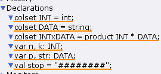
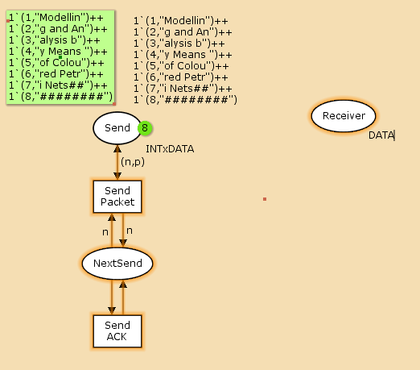
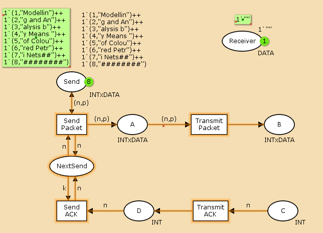
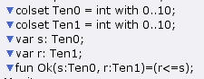
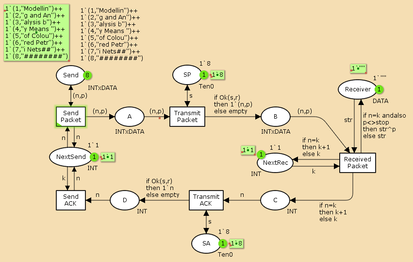
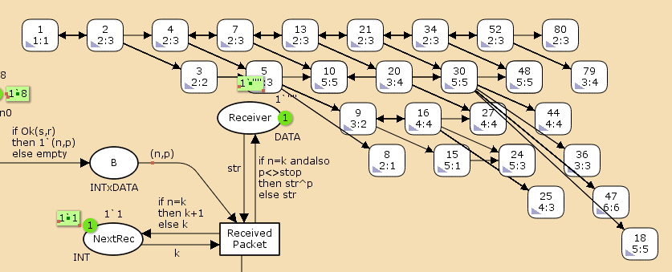

---
## Front matter
title: "Лабораторная работа №12"
subtitle: "Имитационное моделирование"
author: "Екатерина Канева, НФИбд-02-22"

## Generic otions
lang: ru-RU
toc-title: "Содержание"

## Bibliography
bibliography: bib/cite.bib
csl: pandoc/csl/gost-r-7-0-5-2008-numeric.csl

## Pdf output format
toc: true # Table of contents
toc-depth: 2
lof: true # List of figures
lot: true # List of tables
fontsize: 12pt
linestretch: 1.5
papersize: a4
documentclass: scrreprt
## I18n polyglossia
polyglossia-lang:
  name: russian
  options:
  - spelling=modern
  - babelshorthands=true
polyglossia-otherlangs:
  name: english
## I18n babel
babel-lang: russian
babel-otherlangs: english
## Fonts
mainfont: IBM Plex Serif
romanfont: IBM Plex Serif
sansfont: IBM Plex Sans
monofont: IBM Plex Mono
mathfont: STIX Two Math
mainfontoptions: Ligatures=Common,Ligatures=TeX,Scale=0.94
romanfontoptions: Ligatures=Common,Ligatures=TeX,Scale=0.94
sansfontoptions: Ligatures=Common,Ligatures=TeX,Scale=MatchLowercase,Scale=0.94
monofontoptions: Scale=MatchLowercase,Scale=0.94,FakeStretch=0.9
mathfontoptions:
## Biblatex
biblatex: true
biblio-style: "gost-numeric"
biblatexoptions:
  - parentracker=true
  - backend=biber
  - hyperref=auto
  - language=auto
  - autolang=other*
  - citestyle=gost-numeric
## Pandoc-crossref LaTeX customization
figureTitle: "Рис."
tableTitle: "Таблица"
listingTitle: "Листинг"
lofTitle: "Список иллюстраций"
lotTitle: "Список таблиц"
lolTitle: "Листинги"
## Misc options
indent: true
header-includes:
  - \usepackage{indentfirst}
  - \usepackage{float} # keep figures where there are in the text
  - \floatplacement{figure}{H} # keep figures where there are in the text
---

# Цель работы

Построить ненадёжную сеть передачи данных в CPN Tools.

# Задание

1. Построить сеть с источником и получаетелем.
2. Смоделировать передачу сообщения "Modelling and Analysis by Means of Coloured Petry Nets".
3. Вычислить пространство состояний, сформировать отчёт о пространстве состояний, построить граф пространства состояний.

# Выполнение лабораторной работы

Модель состояла из 1 листа. Сначала я задала декларации системы (рис. [-@fig:1]):

{#fig:1 width=50%}

Далее я построила начальную часть графа (рис. [-@fig:2]):

{#fig:2 width=70%}

Далее я добавила промежуточные значения (рис. [-@fig:3]):

{#fig:3 width=70%}

Потом я дополнила декларации необходимыми для остальной модели строками (рис. [-@fig:4]):

{#fig:4 width=50%}

Далее я достроила граф модели (рис. [-@fig:5]):

{#fig:5 width=70%}

Потом я вычислила пространство состояний, начиная с нулевого шага, и сформировала отчёт. Он получился следующий:

```
CPN Tools state space report for:
/home/openmodelica/lab12.cpn
Report generated: Sat Apr 26 19:16:17 2025


 Statistics
------------------------------------------------------------------------

  State Space
     Nodes:  18148
     Arcs:   285215
     Secs:   300
     Status: Partial

  Scc Graph
     Nodes:  9536
     Arcs:   237179
     Secs:   13


 Boundedness Properties
------------------------------------------------------------------------

  Best Integer Bounds
                             Upper      Lower
     Data_transfer'A 1       20         0
     Data_transfer'B 1       10         0
     Data_transfer'C 1       6          0
     Data_transfer'D 1       5          0
     Data_transfer'NextRec 1 1          1
     Data_transfer'NextSend 1
                             1          1
     Data_transfer'Receiver 1
                             1          1
     Data_transfer'SA 1      1          1
     Data_transfer'SP 1      1          1
     Data_transfer'Send 1    8          8

  Best Upper Multi-set Bounds
     Data_transfer'A 1   20`(1,"Modellin")++
16`(2,"g and An")++
11`(3,"alysis b")++
6`(4,"y Means ")++
1`(5,"of Colou")
     Data_transfer'B 1   10`(1,"Modellin")++
8`(2,"g and An")++
5`(3,"alysis b")++
3`(4,"y Means ")
     Data_transfer'C 1   6`2++
5`3++
3`4++
2`5
     Data_transfer'D 1   5`2++
4`3++
2`4++
1`5
     Data_transfer'NextRec 1
                         1`1++
1`2++
1`3++
1`4++
1`5
     Data_transfer'NextSend 1
                         1`1++
1`2++
1`3++
1`4++
1`5
     Data_transfer'Receiver 1
                         1`""++
1`"Modellin"++
1`"Modelling and An"++
1`"Modelling and Analysis b"++
1`"Modelling and Analysis by Means "
     Data_transfer'SA 1  1`8
     Data_transfer'SP 1  1`8
     Data_transfer'Send 1
                         1`(1,"Modellin")++
1`(2,"g and An")++
1`(3,"alysis b")++
1`(4,"y Means ")++
1`(5,"of Colou")++
1`(6,"red Petr")++
1`(7,"i Nets##")++
1`(8,"########")

  Best Lower Multi-set Bounds
     Data_transfer'A 1   empty
     Data_transfer'B 1   empty
     Data_transfer'C 1   empty
     Data_transfer'D 1   empty
     Data_transfer'NextRec 1
                         empty
     Data_transfer'NextSend 1
                         empty
     Data_transfer'Receiver 1
                         empty
     Data_transfer'SA 1  1`8
     Data_transfer'SP 1  1`8
     Data_transfer'Send 1
                         1`(1,"Modellin")++
1`(2,"g and An")++
1`(3,"alysis b")++
1`(4,"y Means ")++
1`(5,"of Colou")++
1`(6,"red Petr")++
1`(7,"i Nets##")++
1`(8,"########")


 Home Properties
------------------------------------------------------------------------

  Home Markings
     None


 Liveness Properties
------------------------------------------------------------------------

  Dead Markings
     6399 [18148,18147,18146,18145,18144,...]

  Dead Transition Instances
     None

  Live Transition Instances
     None


 Fairness Properties
------------------------------------------------------------------------
       Data_transfer'Received_Packet 1
                         No Fairness
       Data_transfer'Send_ACK 1
                         No Fairness
       Data_transfer'Send_Packet 1
                         Impartial
       Data_transfer'Transmit_ACK 1
                         No Fairness
       Data_transfer'Transmit_Packet 1
                         Impartial
```

Как мы видим, получилось очень много узлов (18148) и переходов между ними (285215), а за время t = 300 с моделирование прошло только частично (об этом говорит статус `Partial` и неполное сообщение).

Также указаны границы значений для каждого элемента: промежуточные состояния A (после которого пакеты отбрасываются), B, C, вспомогательные состояния SP, SA, NextRec, NextSend, Receiver, в которых может быть только 1 пакет. В Send 8 пакетов, потому что это изначальное состояние.

Также видим, что есть 6399 состояний, из которых переходов нет (`Dead Markings`).

В конце я построила часть графа состояний. В силу большого числа узлов построить весь граф не получится (рис. [-@fig:6]):

{#fig:6 width=70%}

# Выводы

Построила простой протокол передачи данных в CPN Tools.

# Список литературы{.unnumbered}

::: {#refs}
:::