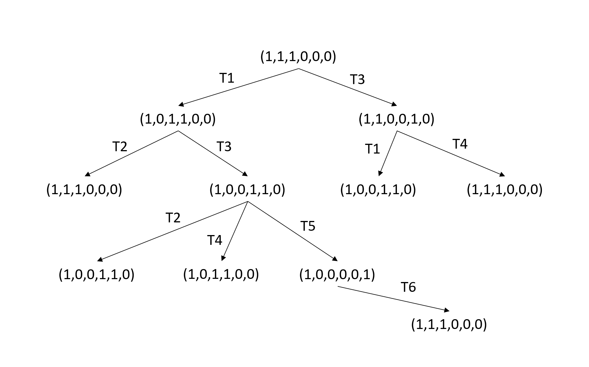
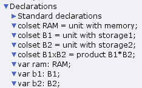
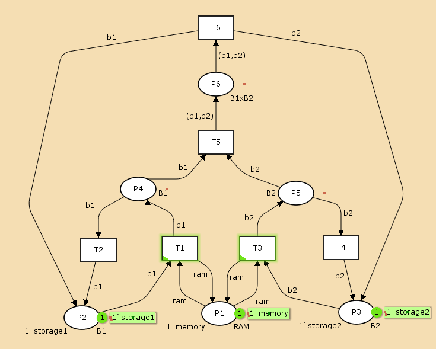
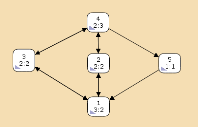

---
## Front matter
lang: ru-RU
title: Презентация по лабораторной работе №13
subtitle: Имитационное моделирование
author:
  - Екатерина Канева, НФИбд-02-22
institute:
  - Российский университет дружбы народов, Москва, Россия
date: 3 мая 2025

## i18n babel
babel-lang: russian
babel-otherlangs: english

## Formatting pdf
toc: false
toc-title: Содержание
slide_level: 2
aspectratio: 169
section-titles: true
theme: metropolis
header-includes:
 - \metroset{progressbar=frametitle,sectionpage=progressbar,numbering=fraction}
---

# Информация

## Докладчик

* Канева Екатерина Павловна
* студент группы НФИбд-02-22
* Российский университет дружбы народов
* [1132222004@rudn.ru](mailto:1132222004@rudn.ru)
* <https://nevseros.github.io/ru/>

# Вводная часть

## Цель

Выполнить задание для самостоятельной работы.

## Задания

1. Используя теоретические методы анализа сетей Петри, провести анализ сети (с помощью построения дерева достижимости). Определить, является ли сеть безопасной, ограниченной, сохраняющей, имеются ли тупики.
2. Промоделировать сеть Петри с помощью CPNTools.
3. Вычислить пространство состояний. Сформировать отчёт о пространстве состояний и проанализировать его. Построить граф пространства состояний.

# Выполнение работы

## Дерево достижимости

Построила дерево достижимости:

{width=50%}

## Декларации системы

Задала декларации системы:

{width=40%}

## Начальный граф

Построила граф:

{width=40%}

## Отчёт

Потом я вычислила пространство состояний, начиная с нулевого шага, и сформировала отчёт. Вот его часть:

```
State Space
    Nodes:  5
    Arcs:   10
    Secs:   0
    Status: Full
```

## Отчёт

Ещё одна интересная часть отчёта:

```
Best Integer Bounds
                            Upper      Lower
    net'P1 1                1          1
    net'P2 1                1          0
    net'P3 1                1          0
    net'P4 1                1          0
    net'P5 1                1          0
    net'P6 1                1          0
```

## Отчёт

Ещё одна интересная часть отчёта:

```
Dead Markings
   None
```

## Граф пространства состояний

Построила граф пространства состояний:

{width=50%}

# Заключение

## Вывод

Выполнила задание для самостоятельной работы