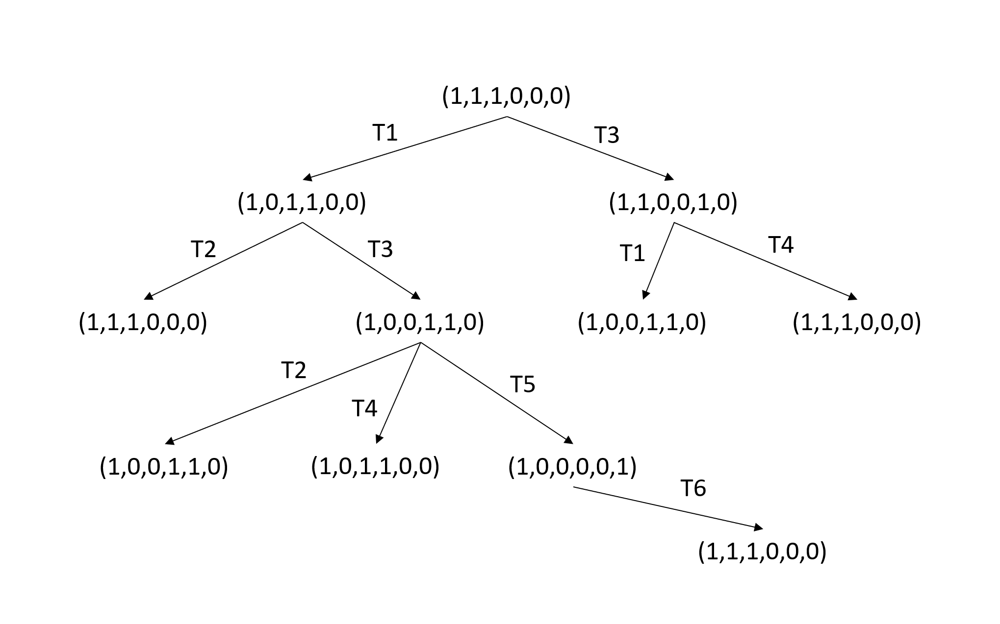
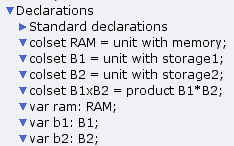
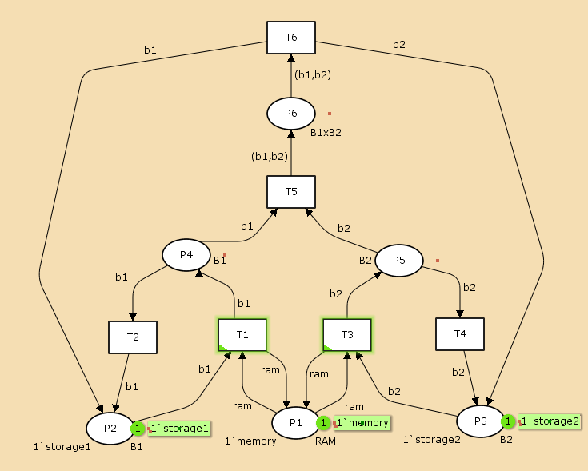
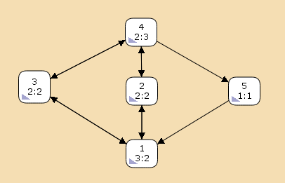

---
## Front matter
title: "Лабораторная работа №13"
subtitle: "Имитационное моделирование"
author: "Екатерина Канева, НФИбд-02-22"

## Generic otions
lang: ru-RU
toc-title: "Содержание"

## Bibliography
bibliography: bib/cite.bib
csl: pandoc/csl/gost-r-7-0-5-2008-numeric.csl

## Pdf output format
toc: true # Table of contents
toc-depth: 2
lof: true # List of figures
lot: true # List of tables
fontsize: 12pt
linestretch: 1.5
papersize: a4
documentclass: scrreprt
## I18n polyglossia
polyglossia-lang:
  name: russian
  options:
  - spelling=modern
  - babelshorthands=true
polyglossia-otherlangs:
  name: english
## I18n babel
babel-lang: russian
babel-otherlangs: english
## Fonts
mainfont: IBM Plex Serif
romanfont: IBM Plex Serif
sansfont: IBM Plex Sans
monofont: IBM Plex Mono
mathfont: STIX Two Math
mainfontoptions: Ligatures=Common,Ligatures=TeX,Scale=0.94
romanfontoptions: Ligatures=Common,Ligatures=TeX,Scale=0.94
sansfontoptions: Ligatures=Common,Ligatures=TeX,Scale=MatchLowercase,Scale=0.94
monofontoptions: Scale=MatchLowercase,Scale=0.94,FakeStretch=0.9
mathfontoptions:
## Biblatex
biblatex: true
biblio-style: "gost-numeric"
biblatexoptions:
  - parentracker=true
  - backend=biber
  - hyperref=auto
  - language=auto
  - autolang=other*
  - citestyle=gost-numeric
## Pandoc-crossref LaTeX customization
figureTitle: "Рис."
tableTitle: "Таблица"
listingTitle: "Листинг"
lofTitle: "Список иллюстраций"
lotTitle: "Список таблиц"
lolTitle: "Листинги"
## Misc options
indent: true
header-includes:
  - \usepackage{indentfirst}
  - \usepackage{float} # keep figures where there are in the text
  - \floatplacement{figure}{H} # keep figures where there are in the text
---

# Цель работы

Выполнить задание для самостоятельной работы.

# Задание

1. Используя теоретические методы анализа сетей Петри, провести анализ сети (с помощью построения дерева достижимости). Определить, является ли сеть безопасной, ограниченной, сохраняющей, имеются ли тупики.
2. Промоделировать сеть Петри с помощью CPNTools.
3. Вычислить пространство состояний. Сформировать отчёт о пространстве состояний и проанализировать его. Построить граф пространства состояний.

# Выполнение лабораторной работы

Сначала я построила дерево достижимости. Оно получилось следующее (рис. [-@fig:1]):

{#fig:1 width=70%}

Сеть является безопасной, ограниченной, несохраняющей, тупиков нет.

Далее я приступила к моделированию в CPN Tools. Модель состояла из 1 листа. Сначала я задала декларации системы (рис. [-@fig:2]):

{#fig:2 width=50%}

Далее я построила граф (рис. [-@fig:3]):

{#fig:3 width=70%}

Потом я вычислила пространство состояний, начиная с нулевого шага, и сформировала отчёт. Он получился следующий:

```
CPN Tools state space report for:
/home/openmodelica/lab13.cpn
Report generated: Sat May  3 13:09:21 2025


 Statistics
------------------------------------------------------------------------

  State Space
     Nodes:  5
     Arcs:   10
     Secs:   0
     Status: Full

  Scc Graph
     Nodes:  1
     Arcs:   0
     Secs:   0


 Boundedness Properties
------------------------------------------------------------------------

  Best Integer Bounds
                             Upper      Lower
     net'P1 1                1          1
     net'P2 1                1          0
     net'P3 1                1          0
     net'P4 1                1          0
     net'P5 1                1          0
     net'P6 1                1          0

  Best Upper Multi-set Bounds
     net'P1 1            1`memory
     net'P2 1            1`storage1
     net'P3 1            1`storage2
     net'P4 1            1`storage1
     net'P5 1            1`storage2
     net'P6 1            1`(storage1,storage2)

  Best Lower Multi-set Bounds
     net'P1 1            1`memory
     net'P2 1            empty
     net'P3 1            empty
     net'P4 1            empty
     net'P5 1            empty
     net'P6 1            empty


 Home Properties
------------------------------------------------------------------------

  Home Markings
     All


 Liveness Properties
------------------------------------------------------------------------

  Dead Markings
     None

  Dead Transition Instances
     None

  Live Transition Instances
     All


 Fairness Properties
------------------------------------------------------------------------
       net'T1 1               No Fairness
       net'T2 1               No Fairness
       net'T3 1               No Fairness
       net'T4 1               No Fairness
       net'T5 1               Just
       net'T6 1               Fair
```

Как мы видим, получилось всего 5 узлов и 10 переходов между ними, моделирование прошло полностью.

Тупиков нет, о чём говорит `None` в графе `Dead Markings`. В P1 всегда была фишка, в остальных состояниях могла быть или не быть одна фишка.

В конце я построила часть графа состояний (рис. [-@fig:4]):

{#fig:4 width=70%}

# Выводы

Выполнила задание для самостоятельной работы

# Список литературы{.unnumbered}

::: {#refs}
:::