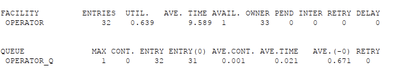
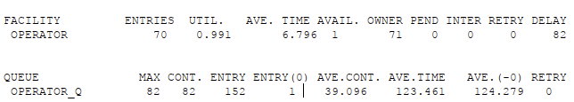
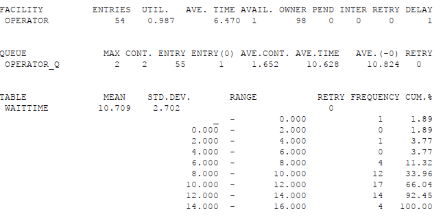
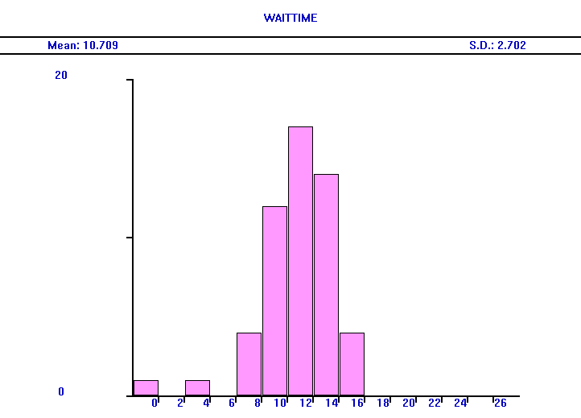
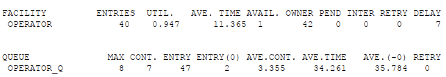
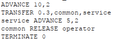
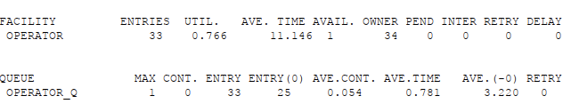
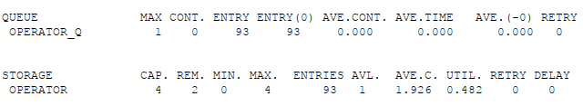
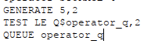
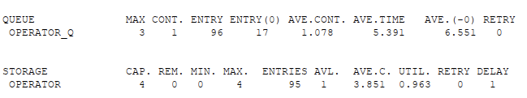

---
## Front matter
lang: ru-RU
title: Презентация по лабораторной работе №14
subtitle: Имитационное моделирование
author:
  - Екатерина Канева, НФИбд-02-22
institute:
  - Российский университет дружбы народов, Москва, Россия
date: 10 мая 2025

## i18n babel
babel-lang: russian
babel-otherlangs: english

## Formatting pdf
toc: false
toc-title: Содержание
slide_level: 2
aspectratio: 169
section-titles: true
theme: metropolis
header-includes:
 - \metroset{progressbar=frametitle,sectionpage=progressbar,numbering=fraction}
---

# Информация

## Докладчик

* Канева Екатерина Павловна
* студент группы НФИбд-02-22
* Российский университет дружбы народов
* [1132222004@rudn.ru](mailto:1132222004@rudn.ru)
* <https://nevseros.github.io/ru/>

# Вводная часть

## Цель

Реализовать модели обработки заказов.

## Задания

1. Построить базовую модель, проанализировать отчёт.
2. Построить гистограмму распредедения заявок в очереди для первой модели.
3. Построить модель с двумя типами заявок, проанализировать отчёт.
4. Построить модель с несколькими операторами, проанализировать отчёт.

# Выполнение работы

## Первая модель

Построила простейшую модель, получила отчёт:

{width=60%}

## Изменённые параметры

Изменила параметры, получила отчёт:

{width=60%}

## Отчёт к гистограмме

Изменила код, как было написано в задании, получила отчёт:

{width=50%}

## Гистограмма

Потом я построила гистограмму:

{width=50%}

## Несколько типов заявок

Написала код для нескольких типов заявок, получила отчёт:

{width=60%}

## 30% заявок имеют дополнительные услуги

Изменила код так, чтобы 30% заявок имели дополнительные услуги:

{width=60%}

## Отчёт

Получила отчёт:

{width=60%}

## Несколько операторов

Написала код для нескольких операторов, получила отчёт:

{width=60%}

## Нетерпеливые заявки

Изменила код для учёта нетерпеливых типов заявок:

{width=60%}

## Отчёт

Получила отчёт:

{width=60%}

# Заключение

## Вывод

Построила различные модели обслуживания заявок.