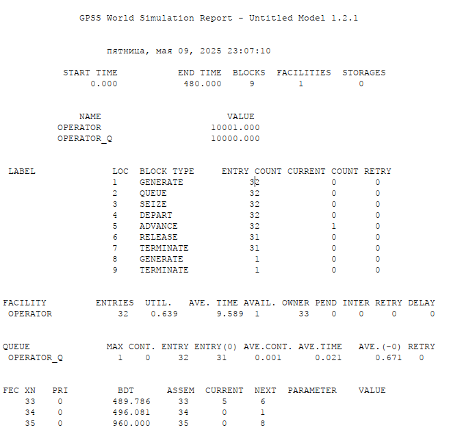
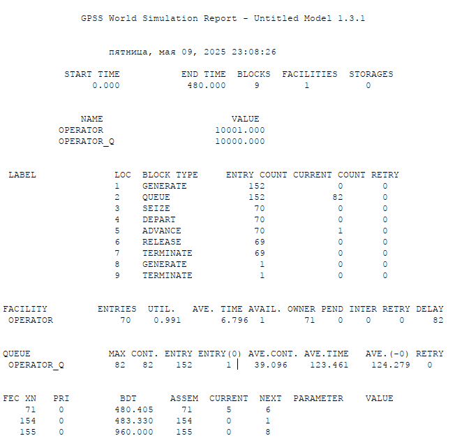
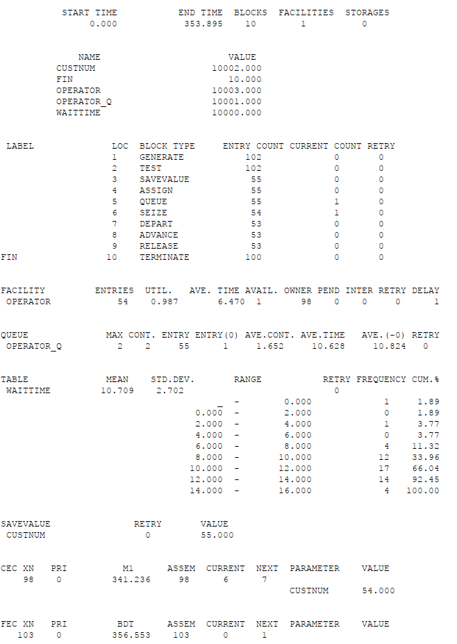
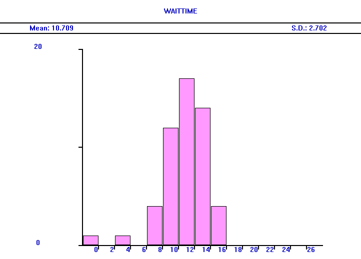
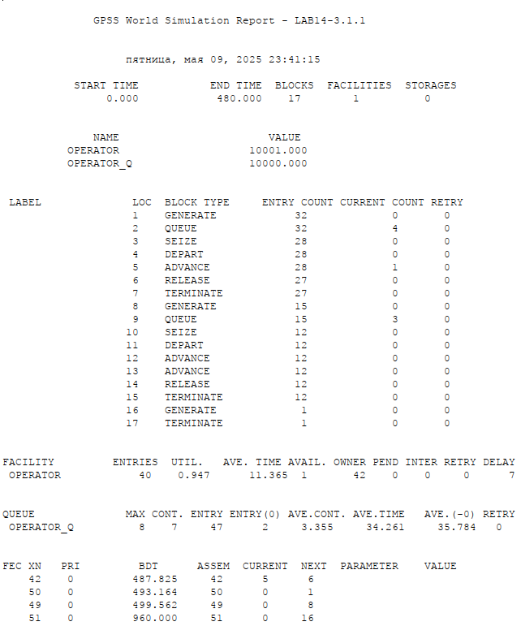
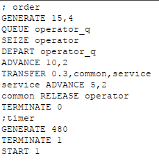
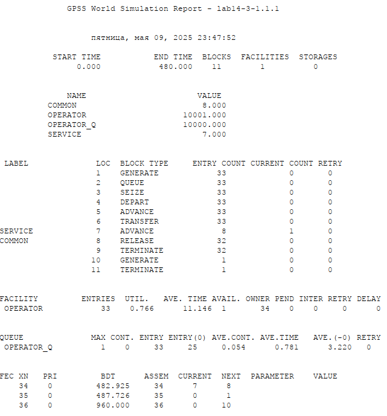
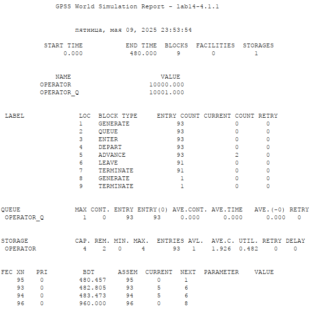
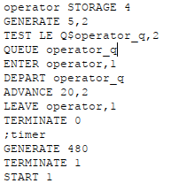
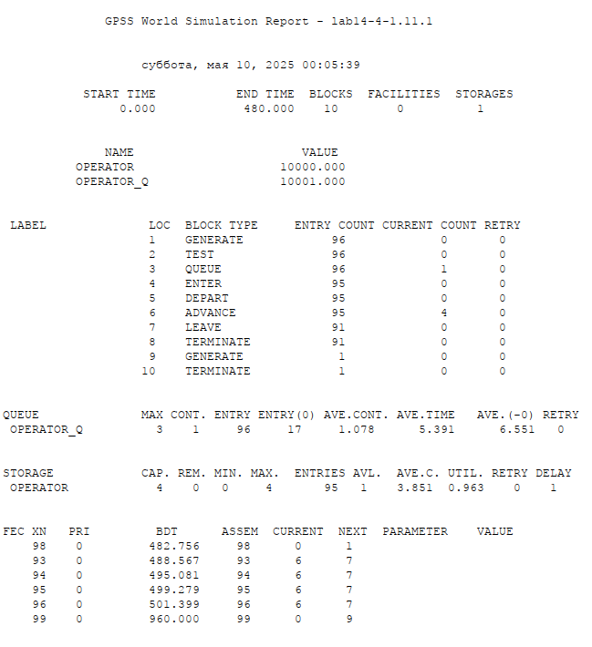

---
## Front matter
title: "Лабораторная работа №14"
subtitle: "Имитационное моделирование"
author: "Екатерина Канева, НФИбд-02-22"

## Generic otions
lang: ru-RU
toc-title: "Содержание"

## Bibliography
bibliography: bib/cite.bib
csl: pandoc/csl/gost-r-7-0-5-2008-numeric.csl

## Pdf output format
toc: true # Table of contents
toc-depth: 2
lof: true # List of figures
lot: true # List of tables
fontsize: 12pt
linestretch: 1.5
papersize: a4
documentclass: scrreprt
## I18n polyglossia
polyglossia-lang:
  name: russian
  options:
  - spelling=modern
  - babelshorthands=true
polyglossia-otherlangs:
  name: english
## I18n babel
babel-lang: russian
babel-otherlangs: english
## Fonts
mainfont: IBM Plex Serif
romanfont: IBM Plex Serif
sansfont: IBM Plex Sans
monofont: IBM Plex Mono
mathfont: STIX Two Math
mainfontoptions: Ligatures=Common,Ligatures=TeX,Scale=0.94
romanfontoptions: Ligatures=Common,Ligatures=TeX,Scale=0.94
sansfontoptions: Ligatures=Common,Ligatures=TeX,Scale=MatchLowercase,Scale=0.94
monofontoptions: Scale=MatchLowercase,Scale=0.94,FakeStretch=0.9
mathfontoptions:
## Biblatex
biblatex: true
biblio-style: "gost-numeric"
biblatexoptions:
  - parentracker=true
  - backend=biber
  - hyperref=auto
  - language=auto
  - autolang=other*
  - citestyle=gost-numeric
## Pandoc-crossref LaTeX customization
figureTitle: "Рис."
tableTitle: "Таблица"
listingTitle: "Листинг"
lofTitle: "Список иллюстраций"
lotTitle: "Список таблиц"
lolTitle: "Листинги"
## Misc options
indent: true
header-includes:
  - \usepackage{indentfirst}
  - \usepackage{float} # keep figures where there are in the text
  - \floatplacement{figure}{H} # keep figures where there are in the text
---

# Цель работы

Реализовать модели обработки заказов.

# Задание

1. Построить базовую модель, проанализировать отчёт.
2. Построить гистограмму распредедения заявок в очереди для первой модели.
3. Построить модель с двумя типами заявок, проанализировать отчёт.
4. Построить модель с несколькими операторами, проанализировать отчёт.

# Выполнение лабораторной работы

Сначала я построила простейшую модель, сформировала отчёт (рис. [-@fig:1]):

{#fig:1 width=70%}

Он получился точно такой же, как в тексте лабораторной работы.

Далее я изменила параметры с 15+-4 минут на поступление до 3.14+-1.7 и с 10+-2 минут на обработку до 6.66+-1.7 минут, получила следующий отчёт (рис. [-@fig:2]):

{#fig:2 width=50%}

Как мы видим, увеличилось количество заявок (чуть меньше чем в 3 раза, как и уменьшение интервалов поступления). Также резко увеличилось количество заявок, попадавших в очередь, потому что теперь заявки дольше обрабатывались, чем поступали. Увеличилось среднее время, проведённое заявками в очереди.

Далее я приступила к построению гистограммы. Я изменила код как требовалось в задании и получила следующий отчёт (рис. [-@fig:3]):

{#fig:3 width=70%}

Как мы видим, теперь время моделирования было не фиксированное, фиксированным было число заявок (мы вводили 100). Также сформировалась таблица WAITTIME, от которой была построена гситограмма (рис. [-@fig:4]):

{#fig:4 width=70%}

И по гистограмме, и по отчёту видно, что большинство заявок ожидали в очереди от 10 до 12 минут. Распределение в гистограмме говорит о том, что были зявки со временем ожидания до 16 минут. Некоторые заявки были "везучими" и ожидали от 0 до 4 минут.

Потом я написала код для моделирования оформления заказов с заявками двух типов - один тип обслуживался 10+-2 минуты и поступал каждые 15+-4 минуты, а второй поступал каждые 30+-8 минут и обслуживался дополнительные 5+-2 минуты. Получила следующий отчёт (рис. [-@fig:5]):

{#fig:5 width=70%}

Как мы видим, в очереди было максимум 8 заявок, моделирование также шло 480 минут (8 часов). 2 заявки прошли обслуживание без очереди. Среднее времяобслуживания заявки - 11.365 минуты, среднее время, проведённое в очереди - 34.261 минуты (среди заявок, которые проходили через очередь - 35.784 минуты). 

Далее я скорректировала код так, чтобы 30% заявок имели дополнительные услуги. Получился следующий код, где common - обычные заявки, service - заявки с дополнительным обслуживанием (рис. [-@fig:6]):

{#fig:6 width=70%}

Далее построила отчёт (рис. [-@fig:7]):

{#fig:7 width=70%}

Моделирование шло также 8 часов. Среднее время обслуживания составило 11.146 минуты, 25 заявок обслужились, не попав в очередь. В среднем 0.054 заявки было в очереди, а среднее время ожидания в очереди было 3.22 минуты (то есть мало заявок туда в принципе попадали и это было ненадолго).

Далее я написала код для оформления заявок несколькими операторами. У нас было 4 оператора, заявки приходили каждые 5+-2 минуты и обслуживались 10+-2 минуты. Получила следующий отчёт (рис. [-@fig:8]):

{#fig:8 width=70%}

Время моделирования 8 часов. Максимум 1 заявка была в момент времени в очереди, но это, видимо, первая, которая через неё попала дальше, потому что остальная статистика по очереди говорит о том, что в ней не было заявок, все обслуживались сразу - это и подразумевалось с 4 операторами и данными нам интервалами.

Далее я изменила код так, чтобы при наличии более двух заявок в очереди новые заявки отказывались от выполнения сами ("нетерпеливые" заявки). Поулчился следующий код (рис. [-@fig:9]):

{#fig:9 width=70%}

Получила следующий отчёт (рис. [-@fig:10]):

{#fig:10 width=70%}

Поскольку при данных ранее числах очереди были нулевыми, я увеличила время обслуживания до 20+-2 минут. Видим, что в среднем в очереди было 1.078 заявки, и они там проводили в среднем 5.391 минуты (среди заявок, которые проходили через очередь - 6.551 минуты).

# Выводы

Построила различные модели обслуживания заявок.

# Список литературы{.unnumbered}

::: {#refs}
:::