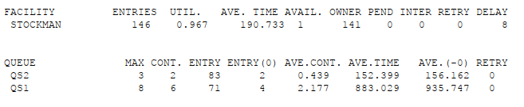
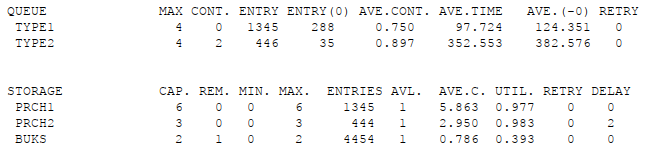

---
## Front matter
lang: ru-RU
title: Презентация по лабораторной работе №15
subtitle: Имитационное моделирование
author:
  - Екатерина Канева, НФИбд-02-22
institute:
  - Российский университет дружбы народов, Москва, Россия
date: 16 мая 2025

## i18n babel
babel-lang: russian
babel-otherlangs: english

## Formatting pdf
toc: false
toc-title: Содержание
slide_level: 2
aspectratio: 169
section-titles: true
theme: metropolis
header-includes:
 - \metroset{progressbar=frametitle,sectionpage=progressbar,numbering=fraction}
---

# Информация

## Докладчик

* Канева Екатерина Павловна
* студент группы НФИбд-02-22
* Российский университет дружбы народов
* [1132222004@rudn.ru](mailto:1132222004@rudn.ru)
* <https://nevseros.github.io/ru/>

# Вводная часть

## Цель

Реализовать модели обслуживания с приоритетами.

## Задания

1. Построить модель обслуживания механиков на складе.
2. Построить модель обслуживания в порту судов двух типов.
3. Проанализировать отчёты.

# Выполнение работы

## Механики на складе

Построила модель обслуживания механиков на складе, получила отчёт:

{width=60%}

## Суда в порту

Построила модель обслуживания в порту судов двух типов, получила отчёт:

{width=60%}

# Заключение

## Вывод

Построила различные модели обслуживания с приоритетами.