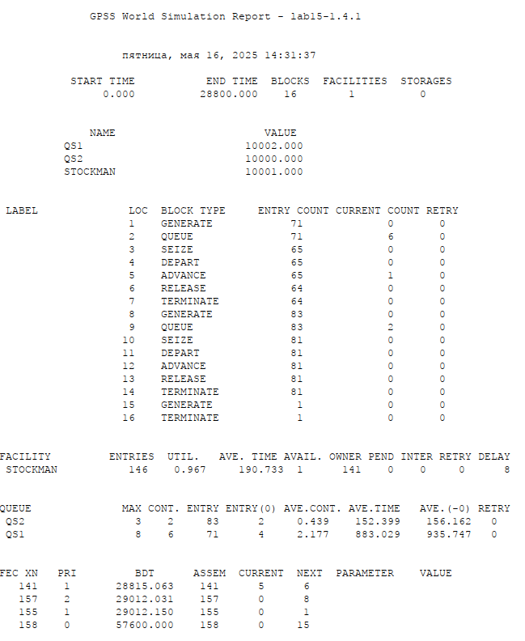
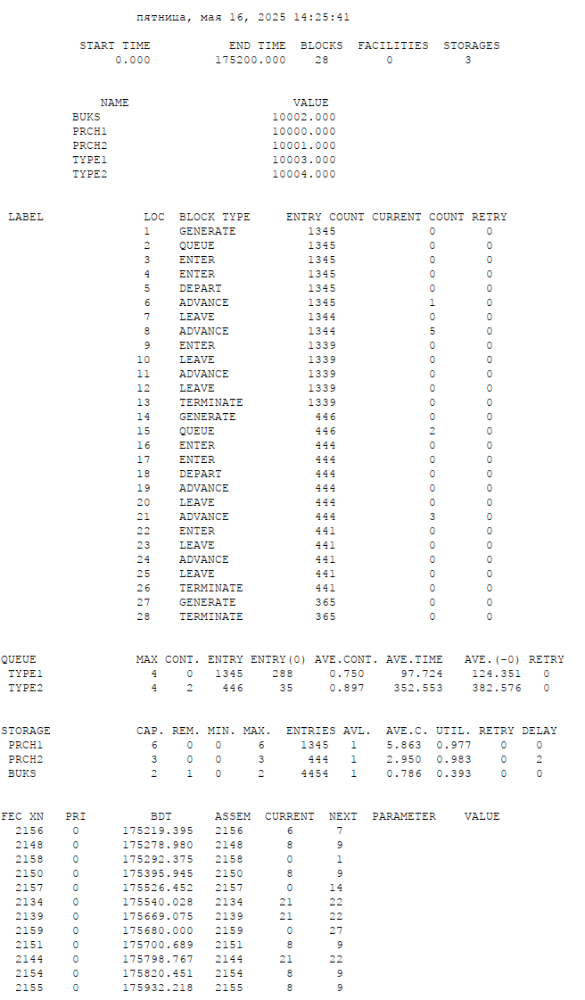

---
## Front matter
title: "Лабораторная работа №15"
subtitle: "Имитационное моделирование"
author: "Екатерина Канева, НФИбд-02-22"

## Generic otions
lang: ru-RU
toc-title: "Содержание"

## Bibliography
bibliography: bib/cite.bib
csl: pandoc/csl/gost-r-7-0-5-2008-numeric.csl

## Pdf output format
toc: true # Table of contents
toc-depth: 2
lof: true # List of figures
lot: true # List of tables
fontsize: 12pt
linestretch: 1.5
papersize: a4
documentclass: scrreprt
## I18n polyglossia
polyglossia-lang:
  name: russian
  options:
  - spelling=modern
  - babelshorthands=true
polyglossia-otherlangs:
  name: english
## I18n babel
babel-lang: russian
babel-otherlangs: english
## Fonts
mainfont: IBM Plex Serif
romanfont: IBM Plex Serif
sansfont: IBM Plex Sans
monofont: IBM Plex Mono
mathfont: STIX Two Math
mainfontoptions: Ligatures=Common,Ligatures=TeX,Scale=0.94
romanfontoptions: Ligatures=Common,Ligatures=TeX,Scale=0.94
sansfontoptions: Ligatures=Common,Ligatures=TeX,Scale=MatchLowercase,Scale=0.94
monofontoptions: Scale=MatchLowercase,Scale=0.94,FakeStretch=0.9
mathfontoptions:
## Biblatex
biblatex: true
biblio-style: "gost-numeric"
biblatexoptions:
  - parentracker=true
  - backend=biber
  - hyperref=auto
  - language=auto
  - autolang=other*
  - citestyle=gost-numeric
## Pandoc-crossref LaTeX customization
figureTitle: "Рис."
tableTitle: "Таблица"
listingTitle: "Листинг"
lofTitle: "Список иллюстраций"
lotTitle: "Список таблиц"
lolTitle: "Листинги"
## Misc options
indent: true
header-includes:
  - \usepackage{indentfirst}
  - \usepackage{float} # keep figures where there are in the text
  - \floatplacement{figure}{H} # keep figures where there are in the text
---

# Цель работы

Реализовать модели обслуживания с приоритетами.

# Задание

1. Построить модель обслуживания механиков на складе.
2. Построить модель обслуживания в порту судов двух типов.
3. Проанализировать отчёты.

# Выполнение лабораторной работы

Сначала я построила модель обслуживания механиков на складе, сформировала отчёт (рис. [-@fig:1]):

{#fig:1 width=70%}

Он получился точно такой же, как в тексте лабораторной работы.

Время моделирования - рабочий день (8 часов; в секундах). Обслужено 146 заявок (механиков). В очереди максимум было 8 механиков с запросом первого типа и 3 с запросом 2 типа, это отражает то, что приоритет был у запросов 2 типа. Ресурсы использовались на 96.7%, среднее время обслуживания было около 191 секунды для обоих типов. В очереди первый тип проводил значительно больше (935.747 секунд), чем второй тип (156.162 секунды). Если считать тех, кро прошёл без очереди, то это 883.029 секунд против 152.399 секунд.

Потом я написала код для моделирования обслуживания в порту судов двух типов. Получила следующий отчёт (рис. [-@fig:2]):

{#fig:2 width=70%}

Время моделирования - 365 дней по 8 часов (в минутах). Обслужилось 1345 заявок 1 типа (малых судов) и 446 заявок 2 типа (больших судов) - это отражает то. что малые суды поступали в 3 раза чаще больших. В среднем ожидало обслуживания 288 судов 1 типа и 35 судов 2 типа. В среднем ожидание длилось 97.724 минут для первого типа и 352.553 минуты для второго (если не считать тех, кто прошёл без очереди, то 124.351 и 382.576 минут соответственно).

# Выводы

Построила различные модели обслуживания с приоритетами.

# Список литературы{.unnumbered}

::: {#refs}
:::