---
## Front matter
lang: ru-RU
title: Презентация по лабораторной работе №16
subtitle: Имитационное моделирование
author:
  - Екатерина Канева, НФИбд-02-22
institute:
  - Российский университет дружбы народов, Москва, Россия
date: 23 мая 2025

## i18n babel
babel-lang: russian
babel-otherlangs: english

## Formatting pdf
toc: false
toc-title: Содержание
slide_level: 2
aspectratio: 169
section-titles: true
theme: metropolis
header-includes:
 - \metroset{progressbar=frametitle,sectionpage=progressbar,numbering=fraction}
---

# Информация

## Докладчик

* Канева Екатерина Павловна
* студент группы НФИбд-02-22
* Российский университет дружбы народов
* [1132222004@rudn.ru](mailto:1132222004@rudn.ru)
* <https://nevseros.github.io/ru/>

# Вводная часть

## Цель

Реализовать модели двух стратегий обслуживания.

## Задания

1. Реализовать две стратегии обслуживания автомобилей.
2. Оптимизировать стратегии и сравнить данные.

# Выполнение работы

## Первая стратегия, 2 пункта

Сначала я построила модель по первой стратегии обслуживания с двумя пунктами, получила отчёт:

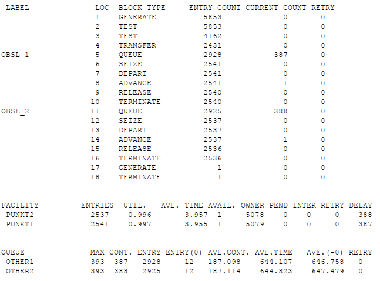{width=40%}

## Вторая стратегия, 2 пункта

Написала код для второй стратегии и 2 пунктов:

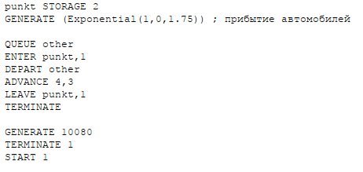{width=60%}

## Вторая стратегия, 2 пункта

Получила отчёт:

{width=60%}

## Сравнение

: Сравнение двух стратегий при двух пунктах

| Показатель                 |             |стратегия 1|          | стратегия 2 |
|----------------------------|-------------|-------------|----------|-------------|
|                            | пункт 1     | пункт 2   | в целом  |             |
| Поступило автомобилей      | 2928        | 2925      | 5853     |5719         |
| Обслужено автомобилей      | 2540        | 2536      | 5076     |5049         |
| Коэффициент загрузки       | 0,997       | 0,996     | 0,9965   |1            |
| Максимальная длина очереди | 393         | 393       | 786      | 668         |
| Средняя длина очереди      | 187,098     | 187,114   | 374,212  | 344,466     |
| Среднее время ожидания     | 644,107     | 644,823   | 644,465  | 607,138     |

## 1 пункт

Написала код для одного пункта:

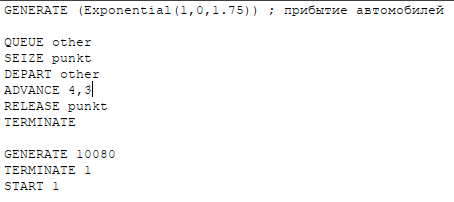{width=60%}

## 1 пункт

Получила следующий отчёт:

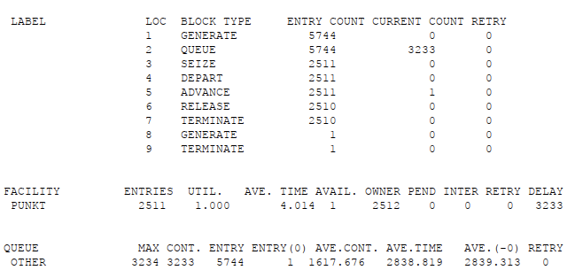{width=60%}

## Первая стратегия, 3 пункта

Написала код для 3 пунктов и первой стратегии:

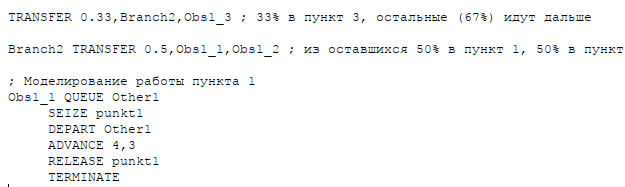{width=60%}

## Первая стратегия, 3 пункта

Получила отчёт:

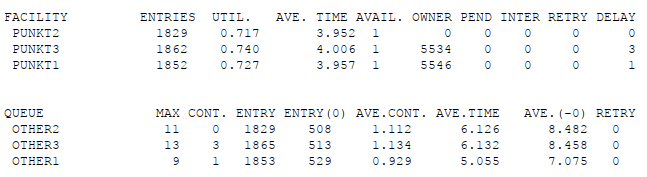{width=60%}

## Первая стратегия, 4 пункта

Написала код для 4 пунктов и первой стратегии:

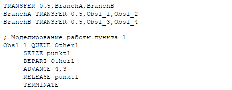{width=60%}

## Первая стратегия, 4 пункта

Получила отчёт:

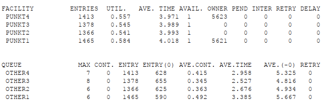{width=60%}

## Вторая стратегия, 3 пункта

Написала код для 3 пунктов и второй стратегии:

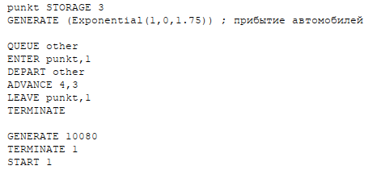{width=60%}

## Вторая стратегия, 3 пункта

Получила отчёт:

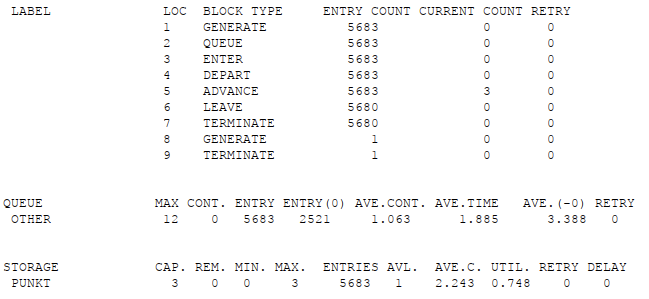{width=60%}

## Вторая стратегия, 4 пункта

Написала код для 4 пунктов и второй стратегии:

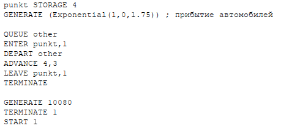{width=60%}

## Вторая стратегия, 4 пункта

Получила отчёт:

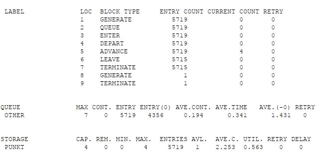{width=60%}

# Заключение

## Вывод

Реализовали модели двух стратегий обслуживания, оптимизировали их.