---
## Front matter
title: "Лабораторная работа №16"
subtitle: "Имитационное моделирование"
author: "Екатерина Канева, НФИбд-02-22"

## Generic otions
lang: ru-RU
toc-title: "Содержание"

## Bibliography
bibliography: bib/cite.bib
csl: pandoc/csl/gost-r-7-0-5-2008-numeric.csl

## Pdf output format
toc: true # Table of contents
toc-depth: 2
lof: true # List of figures
lot: true # List of tables
fontsize: 12pt
linestretch: 1.5
papersize: a4
documentclass: scrreprt
## I18n polyglossia
polyglossia-lang:
  name: russian
  options:
  - spelling=modern
  - babelshorthands=true
polyglossia-otherlangs:
  name: english
## I18n babel
babel-lang: russian
babel-otherlangs: english
## Fonts
mainfont: IBM Plex Serif
romanfont: IBM Plex Serif
sansfont: IBM Plex Sans
monofont: IBM Plex Mono
mathfont: STIX Two Math
mainfontoptions: Ligatures=Common,Ligatures=TeX,Scale=0.94
romanfontoptions: Ligatures=Common,Ligatures=TeX,Scale=0.94
sansfontoptions: Ligatures=Common,Ligatures=TeX,Scale=MatchLowercase,Scale=0.94
monofontoptions: Scale=MatchLowercase,Scale=0.94,FakeStretch=0.9
mathfontoptions:
## Biblatex
biblatex: true
biblio-style: "gost-numeric"
biblatexoptions:
  - parentracker=true
  - backend=biber
  - hyperref=auto
  - language=auto
  - autolang=other*
  - citestyle=gost-numeric
## Pandoc-crossref LaTeX customization
figureTitle: "Рис."
tableTitle: "Таблица"
listingTitle: "Листинг"
lofTitle: "Список иллюстраций"
lotTitle: "Список таблиц"
lolTitle: "Листинги"
## Misc options
indent: true
header-includes:
  - \usepackage{indentfirst}
  - \usepackage{float} # keep figures where there are in the text
  - \floatplacement{figure}{H} # keep figures where there are in the text
---

# Цель работы

Реализовать модели двух стратегий обслуживания.

# Задание

1. Реализовать две стратегии обслуживания автомобилей.
2. Оптимизировать стратегии и сравнить данные.

# Теоретическая часть

На пограничном контрольно-пропускном пункте транспорта имеются 2 пункта пропуска. Интервалы времени между поступлением автомобилей имеют экспоненциальное распределение со средним значением $\mu$. Время прохождения автомобилями пограничного контроля имеет равномерное распределение на интервале [a; b]. Предлагается две стратегии обслуживания прибывающих автомобилей:

1. Автомобили образуют две очереди и обслуживаются соответствующими пунктами пропуска.
2. Автомобили образуют одну общую очередь и обслуживаются освободившимся пунктом пропуска.

# Выполнение лабораторной работы

Сначала я построила модель по первой стратегии обслуживания с двумя пунктами (код был дан), получила отчёт (рис. [-@fig:1]):

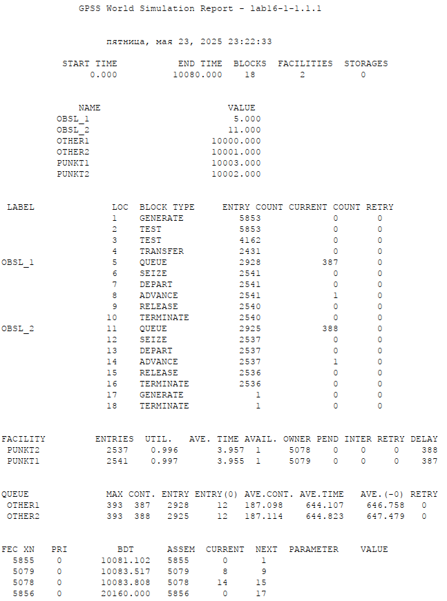{#fig:1 width=70%}

Далее я написала код для второй стратегии и 2 пунктов (рис. [-@fig:2]):

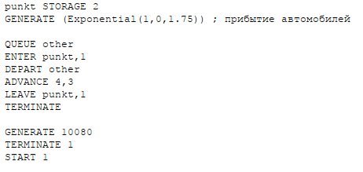{#fig:2 width=70%}

Потом я построила отчёт (рис. [-@fig:3]):

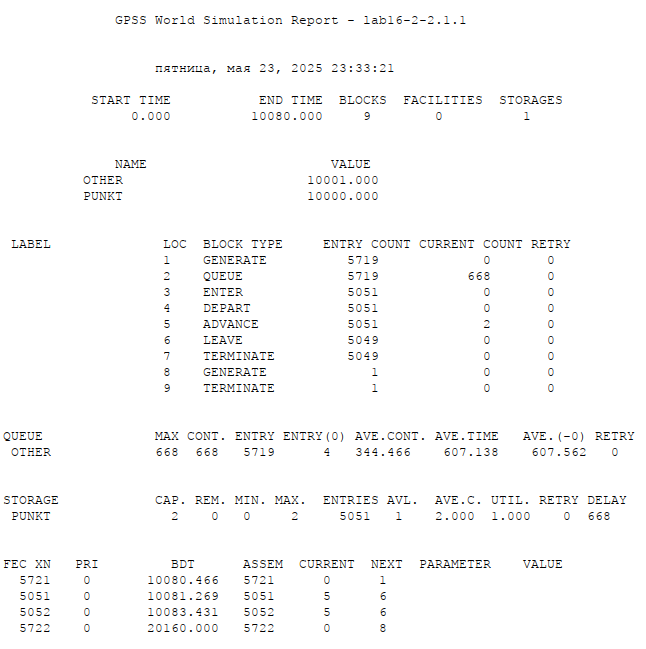{#fig:3 width=70%}

Потом я сравнила стратегии по требуемой таблице (рис. [-@tbl:comparison]):

: Сравнение двух стратегий при двух пунктах

| Показатель                 |             |стратегия 1|          | стратегия 2 |
|----------------------------|-------------|-------------|----------|-------------|
|                            | пункт 1     | пункт 2   | в целом  |             |
| Поступило автомобилей      | 2928        | 2925      | 5853     |5719         |
| Обслужено автомобилей      | 2540        | 2536      | 5076     |5049         |
| Коэффициент загрузки       | 0,997       | 0,996     | 0,9965   |1            |
| Максимальная длина очереди | 393         | 393       | 786      | 668         |
| Средняя длина очереди      | 187,098     | 187,114   | 374,212  | 344,466     |
| Среднее время ожидания     | 644,107     | 644,823   | 644,465  | 607,138     |

Как мы видим, больше автомобилей смогла обслужить стратегия 1. Однако стратегия 2 имеет больший процент обслуженных автомобилей и гораздо меньшее среднее время ожидания и среднюю длину очереди. Поэтому, на мой взгляд, вторая стратегия лучше.

Далее я создала код для модели с одним пунктом (рис. [-@fig:4]):
  
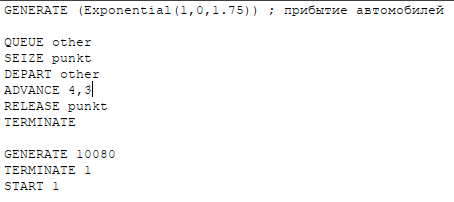{#fig:4 width=70%}

Получила следующий отчёт (рис. [-@fig:5]):

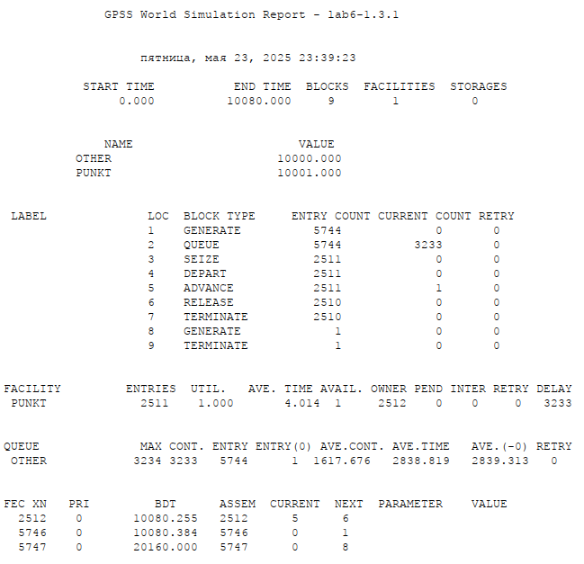{#fig:5 width=70%}

Далее я создала код для первой стратегии для 3 (рис. [-@fig:6]) и 4 (рис. [-@fig:7]) пунктов:

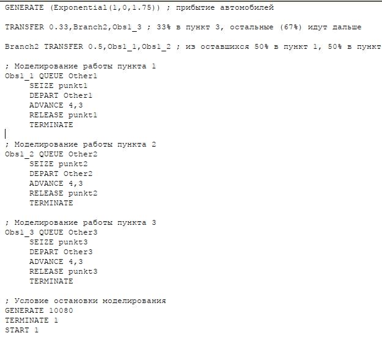{#fig:6 width=70%}

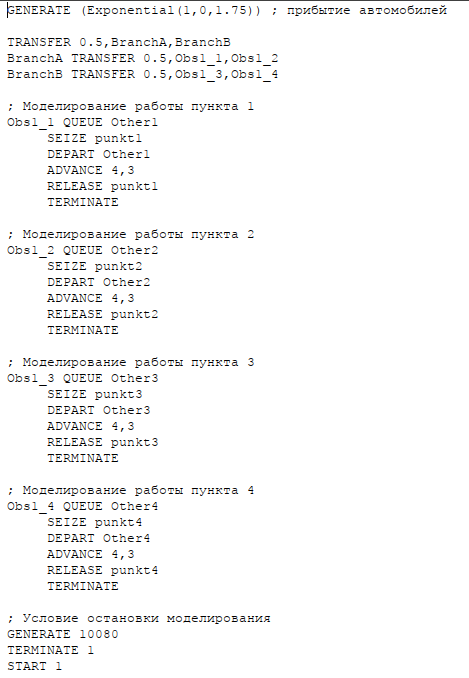{#fig:7 width=70%}

Получила следующие отчёты для 3 (рис. [-@fig:8]) и 4 (рис. [-@fig:9]) пунктов:

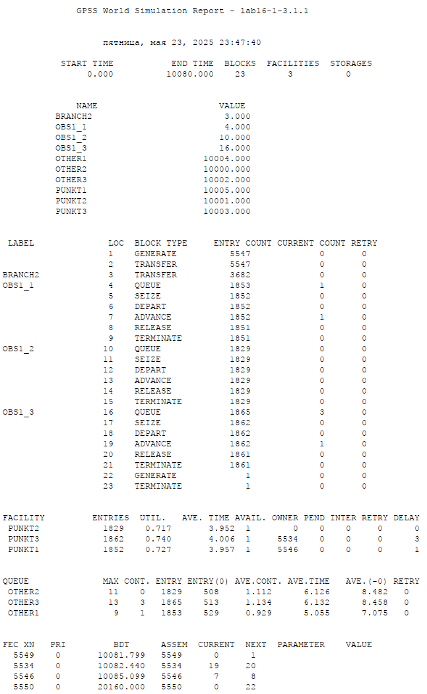{#fig:8 width=70%}

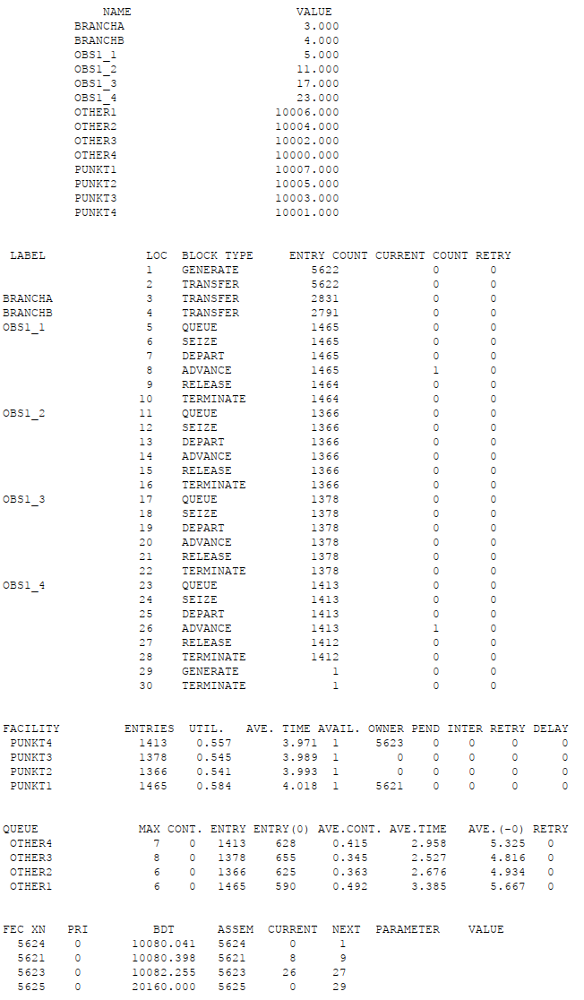{#fig:9 width=70%}

Видно, что для первой стратегии оптимально 4 пункта, потому что именно тогда начинают выполняться условия, поставленные перед нами в лабораторной.

Далее я создала код для вторвой стратегии для 3 (рис. [-@fig:10]) и 4 (рис. [-@fig:11]) пунктов:

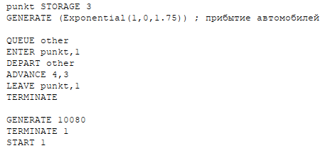{#fig:10 width=70%}

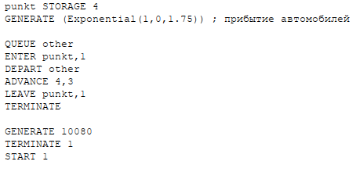{#fig:11 width=70%}

Получила следующие отчёты для 3 (рис. [-@fig:12]) и 4 (рис. [-@fig:13]) пунктов:

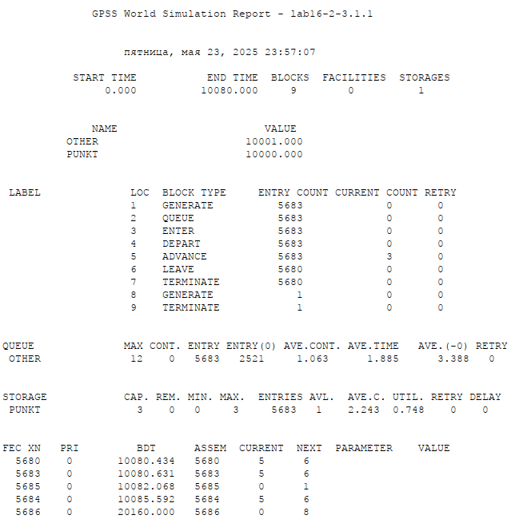{#fig:12 width=70%}

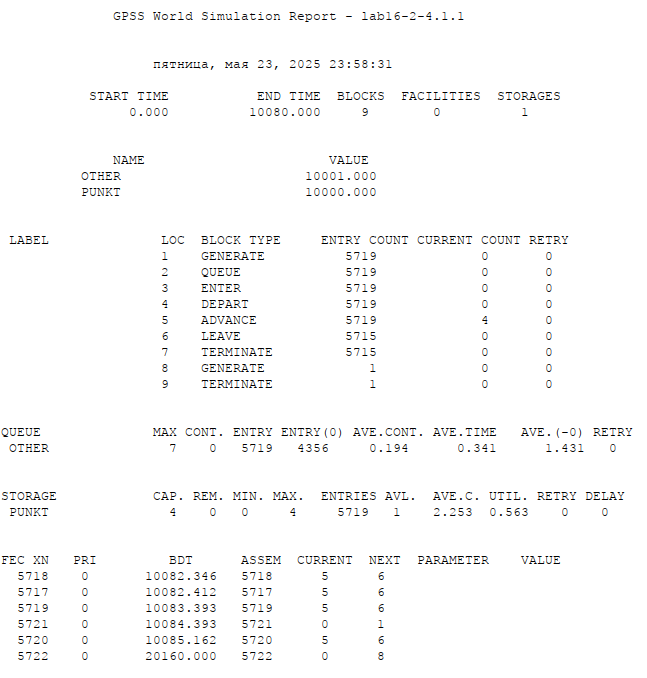{#fig:13 width=70%}

Видно, что 3 пункта для этой стратегии являются оптимальными: 4 пункт "слишком разгружает" систему, а при двух не выполняются требования.

# Выводы

Реализовали модели двух стратегий обслуживания, оптимизировали их.

# Список литературы{.unnumbered}

::: {#refs}
:::