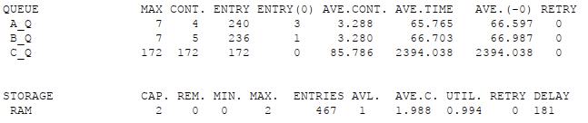
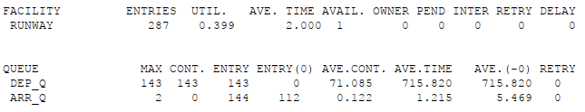
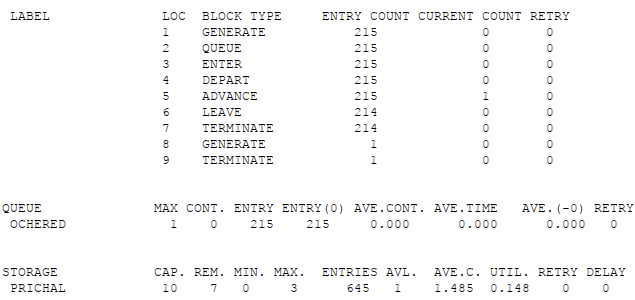
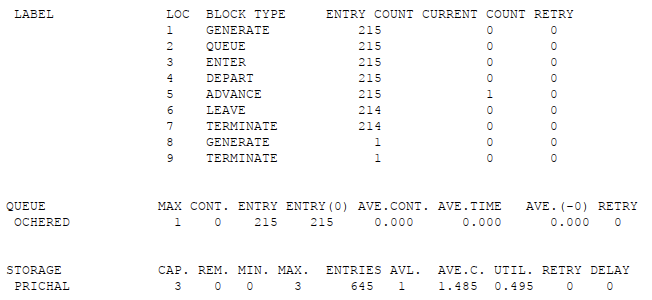
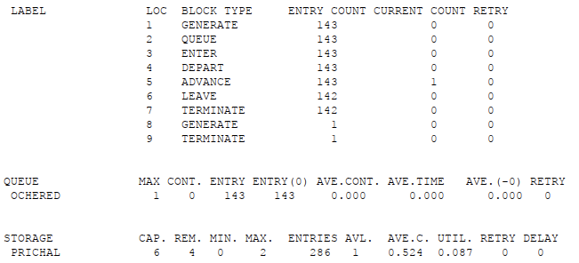
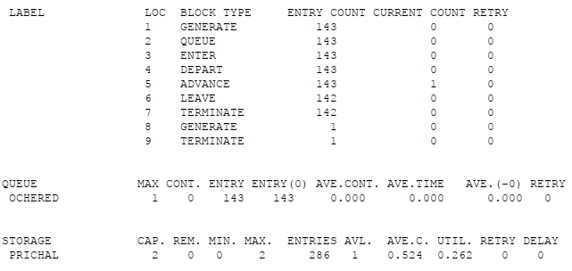

---
## Front matter
lang: ru-RU
title: Презентация по лабораторной работе №17
subtitle: Имитационное моделирование
author:
  - Екатерина Канева, НФИбд-02-22
institute:
  - Российский университет дружбы народов, Москва, Россия
date: 31 мая 2025

## i18n babel
babel-lang: russian
babel-otherlangs: english

## Formatting pdf
toc: false
toc-title: Содержание
slide_level: 2
aspectratio: 169
section-titles: true
theme: metropolis
header-includes:
 - \metroset{progressbar=frametitle,sectionpage=progressbar,numbering=fraction}
---

# Информация

## Докладчик

* Канева Екатерина Павловна
* студент группы НФИбд-02-22
* Российский университет дружбы народов
* [1132222004@rudn.ru](mailto:1132222004@rudn.ru)
* <https://nevseros.github.io/ru/>

# Вводная часть

## Цель

Выполнить задание для самостоятельной работы.

## Задания

1. Реализовать модель работы вычислительного центра.
2. Реализовать модель работы аэропорта.
3. Реализовать модель работы морского порта.

# Выполнение работы

## Модель вычислительного центра

Сначала я построила модель, ниже фрагмент кода:

```
; задание B
GENERATE 20,10
QUEUE B_q
ENTER ram,1
DEPART B_q
ADVANCE 21,3
LEAVE ram,1
TERMINATE 0
```

## Модель вычислительного центра

Запустила симуляцию, получила отчёт:

{width=60%}

## Модель аэропорта

Сначала я построила модель, ниже фрагмент кода:

```
; departure
GENERATE 10,2,,,1
QUEUE dep_q
SEIZE runway
ADVANCE 2
RELEASE runway
TERMINATE 0
```

## Модель аэропорта

Запустила симуляцию, получила отчёт:

{width=60%}

## Модель морского порта

Сначала я построила модель для данных под цифрой 1, ниже фрагмент кода:

```
GENERATE 20,5
QUEUE ochered
ENTER prichal,3
DEPART ochered
ADVANCE 10,3
LEAVE prichal,3
TERMINATE 0
```

## Модель морского порта

Запустила симуляцию, получила отчёт:

{width=50%}

## Модель морского порта

Исправила код для оптимизации, было:

```
prichal STORAGE 10
```

Стало:

```
prichal STORAGE 3
```

## Модель морского порта

Запустила симуляцию, получила отчёт:

{width=50%}

## Модель морского порта

Далее я построила модель для данных под цифрой 2, ниже фрагмент кода:

```
GENERATE 30,10
QUEUE ochered
ENTER prichal,2
DEPART ochered
ADVANCE 8,4
LEAVE prichal,2
TERMINATE 0
```

## Модель морского порта

Запустила симуляцию, получила отчёт:

{width=50%}

## Модель морского порта

Исправила код для оптимизации, было:

```
prichal STORAGE 6
```

Стало:

```
prichal STORAGE 2
```

## Модель морского порта

Запустила симуляцию, получила отчёт:

{width=50%}

# Заключение

## Вывод

Выполнила задание для самостоятельной работы.