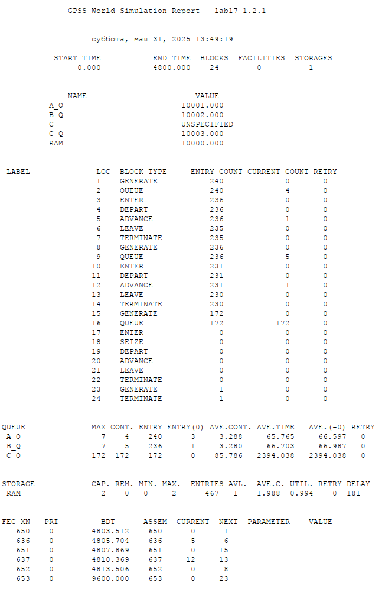
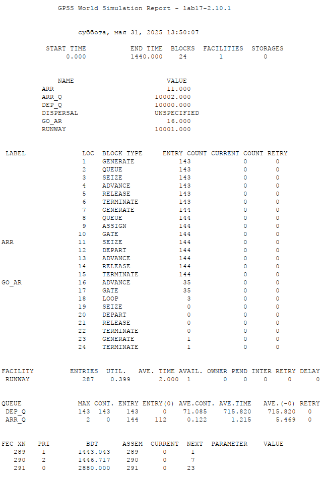
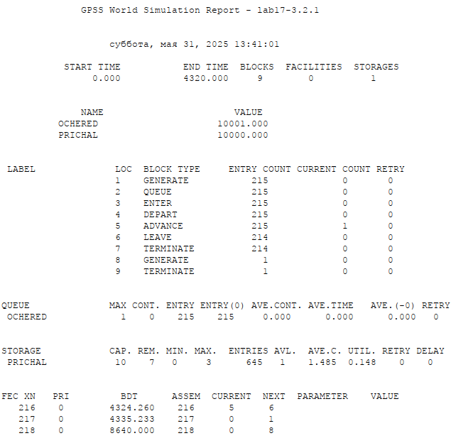
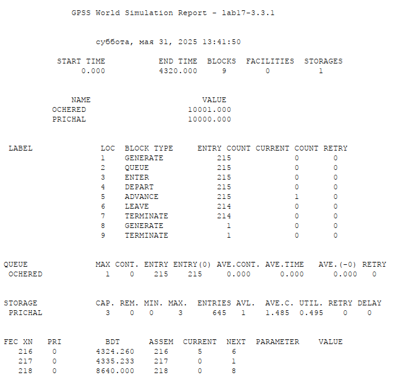
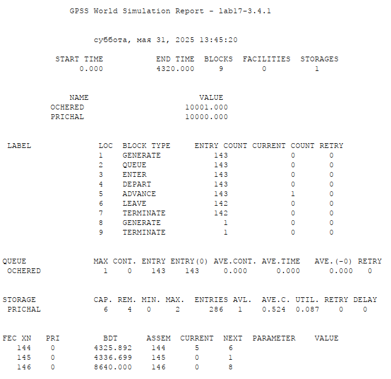
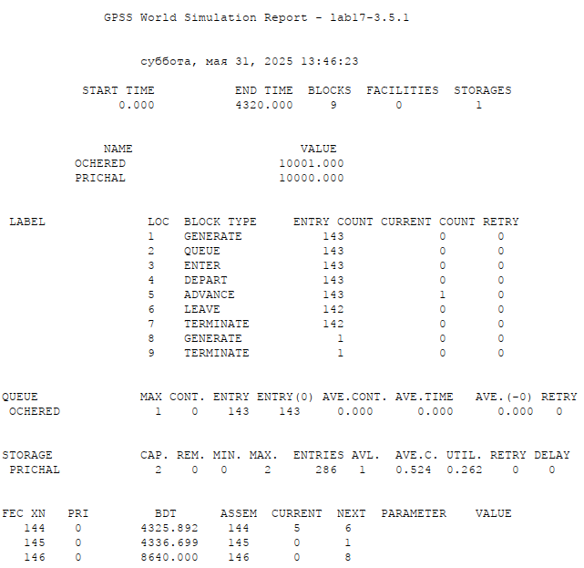

---
## Front matter
title: "Лабораторная работа №17"
subtitle: "Имитационное моделирование"
author: "Екатерина Канева, НФИбд-02-22"

## Generic otions
lang: ru-RU
toc-title: "Содержание"

## Bibliography
bibliography: bib/cite.bib
csl: pandoc/csl/gost-r-7-0-5-2008-numeric.csl

## Pdf output format
toc: true # Table of contents
toc-depth: 2
lof: true # List of figures
lot: true # List of tables
fontsize: 12pt
linestretch: 1.5
papersize: a4
documentclass: scrreprt
## I18n polyglossia
polyglossia-lang:
  name: russian
  options:
  - spelling=modern
  - babelshorthands=true
polyglossia-otherlangs:
  name: english
## I18n babel
babel-lang: russian
babel-otherlangs: english
## Fonts
mainfont: IBM Plex Serif
romanfont: IBM Plex Serif
sansfont: IBM Plex Sans
monofont: IBM Plex Mono
mathfont: STIX Two Math
mainfontoptions: Ligatures=Common,Ligatures=TeX,Scale=0.94
romanfontoptions: Ligatures=Common,Ligatures=TeX,Scale=0.94
sansfontoptions: Ligatures=Common,Ligatures=TeX,Scale=MatchLowercase,Scale=0.94
monofontoptions: Scale=MatchLowercase,Scale=0.94,FakeStretch=0.9
mathfontoptions:
## Biblatex
biblatex: true
biblio-style: "gost-numeric"
biblatexoptions:
  - parentracker=true
  - backend=biber
  - hyperref=auto
  - language=auto
  - autolang=other*
  - citestyle=gost-numeric
## Pandoc-crossref LaTeX customization
figureTitle: "Рис."
tableTitle: "Таблица"
listingTitle: "Листинг"
lofTitle: "Список иллюстраций"
lotTitle: "Список таблиц"
lolTitle: "Листинги"
## Misc options
indent: true
header-includes:
  - \usepackage{indentfirst}
  - \usepackage{float} # keep figures where there are in the text
  - \floatplacement{figure}{H} # keep figures where there are in the text
---

# Цель работы

Выполнить задание для самостоятельной работы.

# Задание

1. Реализовать модель работы вычислительного центра.
2. Реализовать модель работы аэропорта.
3. Реализовать модель работы морского порта.

# Выполнение лабораторной работы

## Модель работы вычислительного центра

На вычислительном центре в обработку принимаются три класса заданий А, В и С. Исходя из наличия оперативной памяти ЭВМ задания классов А и В могут решаться одновременно, а задания класса С монополизируют ЭВМ. Задания класса А поступают через $20 \pm 5$ мин, класса В — через $20 \pm 10$ мин, класса С — через $28 \pm 5$ мин и требуют для выполнения: класс А — $20 \pm 5$ мин, класс В — $21 \pm 3$ мин, класс С — $28 \pm 5$ мин. Задачи класса С загружаются в ЭВМ, если она полностью свободна. Задачи классов А и В могут дозагружаться к решающей задаче.

Сначала я построила модель:

```
ram STORAGE 2
; задание A
GENERATE 20,5
QUEUE A_q
ENTER ram,1
DEPART A_q
ADVANCE 20,5
LEAVE ram,1
TERMINATE 0

; задание B
GENERATE 20,10
QUEUE B_q
ENTER ram,1
DEPART B_q
ADVANCE 21,3
LEAVE ram,1
TERMINATE 0

; задание C
GENERATE 28,5
QUEUE C_q
ENTER ram,2
SEIZE C
DEPART C_q
ADVANCE 28,5
LEAVE ram,2
TERMINATE 0

; время симуляции
GENERATE 4800
TERMINATE 1
START 1
```

После чего запустила симуляцию и получила отчёт (рис. [-@fig:1]):

{#fig:1 width=70%}

Видим, что загрузка системы равна 0.994.

## Модель работы аэропорта

Самолёты прибывают для посадки в район аэропорта каждые $10 \pm 5$ мин. Если взлетно-посадочная полоса свободна, прибывший самолёт получает разрешение на посадку. Если полоса занята, самолет выполняет полет по кругу и возвращается в аэропорт каждые 5 мин. Если после пятого круга самолет не получает разрешения на посадку, он отправляется на запасной аэродром.

В аэропорту через каждые $10 \pm 2$ мин к взлетно-посадочной полосе выруливают готовые к взлёту самолёты и получают разрешение на взлёт, если полоса свободна. Для взлета и посадки самолёты занимают полосу ровно на 2 мин. Если при свободной полосе одновременно один самолёт прибывает для посадки, а другой — для взлёта, то полоса предоставляется взлетающей машине.

Сначала я построила модель:

```
; departure
GENERATE 10,2,,,1
QUEUE dep_q
SEIZE runway
ADVANCE 2
RELEASE runway
TERMINATE 0

; arrival
GENERATE 10,5,,,2
QUEUE arr_q
ASSIGN 1,5
GATE NU runway,go_ar
arr SEIZE runway
DEPART arr_q
ADVANCE 2
RELEASE runway
TERMINATE 0

; go around
go_ar ADVANCE 5
GATE U runway,arr
LOOP 1,go_ar
SEIZE dispersal
DEPART arr_q
RELEASE dispersal
TERMINATE 0

; vremya
GENERATE 1440
TERMINATE 1
START 1
```

После чего запустила симуляцию и получила отчёт (рис. [-@fig:2]):

{#fig:2 width=70%}

Видим, что прибыло 143 самолёта, вылетело 144, ни один самолёт не был перенаправлен. Это можно объяснить тем, что взлёт и посадка длятся 2 минуты, а сами самолёты поступают в среднем каждые 10 минут по 2 штуки, то есть успевают обслуживаться.

## Модель работы морского порта

Морские суда прибывают в порт каждые $a \pm \delta$ часов. В порту имеется N причалов. Каждый корабль по длине занимает M причалов и находится в порту $b \pm \epsilon$ часов.

Требуется построить GPSS-модель для анализа работы морского порта в течение полугода, определить оптимальное количество причалов для эффективной работы порта.

Исходные данные:

1) a = 20 ч, $\delta$ = 5 ч, b = 10 ч, $\epsilon$ = 3 ч, N = 10, M = 3;
2) a = 30 ч, $\delta$ = 10 ч, b = 8 ч, $\epsilon$ = 4 ч, N = 6, M = 2.

Сначала я построила модель по первому случаю:

```
prichal STORAGE 10

GENERATE 20,5
QUEUE ochered
ENTER prichal,3
DEPART ochered
ADVANCE 10,3
LEAVE prichal,3
TERMINATE 0

;timer
GENERATE 4320
TERMINATE 1
START 1
```

После чего запустила симуляцию и получила отчёт (рис. [-@fig:3]):

{#fig:3 width=70%}

Видим, что ни один корабль не попал в очередь, а использовалось всегда максимум 3 причала. Это говорит о том, что оптимальным количеством будет 3 причала. Проверим это, изменив код:

```
prichal STORAGE 3

GENERATE 20,5
QUEUE ochered
ENTER prichal,3
DEPART ochered
ADVANCE 10,3
LEAVE prichal,3
TERMINATE 0

;timer
GENERATE 4320
TERMINATE 1
START 1
```

Запустим симуляцию и получим отчёт (рис. [-@fig:4]):

{#fig:4 width=70%}

Видим, что нагрузка увеличилась (0.149 -> 0.495), но при этом обслужилось то же количество судов, и все они прошли без очереди. Значит 3 - оптимальное количество причалов.

Потом я построила модель по второму случаю:

```
prichal STORAGE 6

GENERATE 30,10
QUEUE ochered
ENTER prichal,2
DEPART ochered
ADVANCE 8,4
LEAVE prichal,2
TERMINATE 0

; vremya
GENERATE 4320
TERMINATE 1
START 1
```

После чего запустила симуляцию и получила отчёт (рис. [-@fig:5]):

{#fig:5 width=70%}

Видим, что ни один корабль не попал в очередь, а использовалось всегда максимум 2 причала. Это говорит о том, что оптимальным количеством будет 2 причала. Проверим это, изменив код:

```
prichal STORAGE 2

GENERATE 30,10
QUEUE ochered
ENTER prichal,2
DEPART ochered
ADVANCE 8,4
LEAVE prichal,2
TERMINATE 0

; vremya
GENERATE 4320
TERMINATE 1
START 1
```

Запустим симуляцию и получим отчёт (рис. [-@fig:6]):

{#fig:6 width=70%}

Видим, что нагрузка увеличилась (0.087 -> 0.262), но при этом обслужилось то же количество судов, и все они прошли без очереди. Значит 2 - оптимальное количество причалов.

# Выводы

Выполнила задание для самостоятельной работы.

# Список литературы{.unnumbered}

::: {#refs}
:::