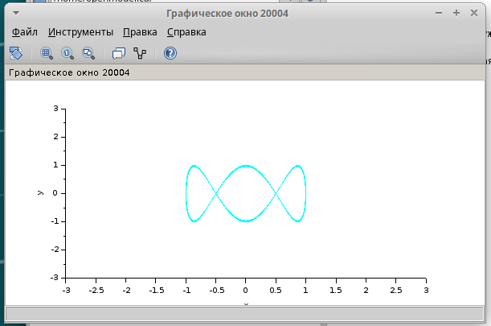

---
## Front matter
lang: ru-RU
title: Презентация по упражнению по xcos
subtitle: Имитационное моделирование
author:
  - Екатерина Канева, НФИбд-02-22
institute:
  - Российский университет дружбы народов, Москва, Россия
date: 6 марта 2025

## i18n babel
babel-lang: russian
babel-otherlangs: english

## Formatting pdf
toc: false
toc-title: Содержание
slide_level: 2
aspectratio: 169
section-titles: true
theme: metropolis
header-includes:
 - \metroset{progressbar=frametitle,sectionpage=progressbar,numbering=fraction}
---

# Информация

## Докладчик

* Канева Екатерина Павловна
* студент группы НФИбд-02-22
* Российский университет дружбы народов
* [1132222004@rudn.ru](mailto:1132222004@rudn.ru)
* <https://nevseros.github.io/ru/>

# Вводная часть

## Цель

Познакомиться с xcos.

## Задания

Построить с помощью xcos фигуры Лиссажу со следующими параметрами:

1) A = B = 1, a = 2, b = 2, d = 0; pi/4; pi/2; 3pi/4;pi;
2) A = B = 1, a = 2, b = 4, d = 0; pi/4; pi/2; 3pi/4;pi;
3) A = B = 1, a = 2, b = 6, d = 0; pi/4; pi/2; 3pi/4;pi;
4) A = B = 1, a = 2, b = 3, d = 0; pi/4; pi/2; 3pi/4;pi.

# Выполнение работы

## Построение схемы

Для начала я запустила xcos, собрала схему из нужных блоков:

{#fig:23 width=40%}

## Параметры блоков

Для блоков Gensin я задала следующие параметрыg:

{#fig:1 width=40%}

## Параметры блоков

Для блока Cscopxy ввела следующие параметры:

{#fig:2 width=30%}

## Построение

Запустила, получила следующий график:

{#fig:3 width=50%}

## Построение

{#fig:4 width=50%}

## Построение

{#fig:5 width=50%}

## Построение

{#fig:6 width=50%}

## Построение

{#fig:7 width=50%}

## Построение

{#fig:8 width=50%}

## Построение

{#fig:9 width=50%}

## Построение

{#fig:10 width=50%}

## Построение

{#fig:11 width=50%}

## Построение

{#fig:12 width=50%}

## Построение

{#fig:13 width=50%}

## Построение

{#fig:14 width=50%}

## Построение

{#fig:15 width=50%}

## Построение

{#fig:16 width=50%}

## Построение

{#fig:17 width=50%}

## Построение

{#fig:18 width=50%}

## Построение

{#fig:19 width=50%}

## Построение

{#fig:20 width=50%}

## Построение

{#fig:21 width=50%}

## Построение

{#fig:22 width=50%}

# Заключение

## Вывод

Познакомилась с xcos, построив простейшие примеры.