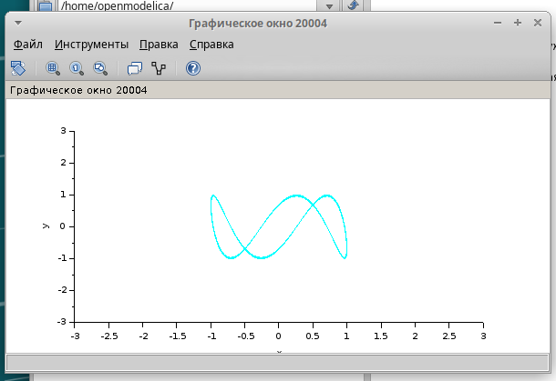

---
## Front matter
title: "Упражнение по xcos"
subtitle: "Имитационное моделирование"
author: "Екатерина Канева, НФИбд-02-22"

## Generic otions
lang: ru-RU
toc-title: "Содержание"

## Bibliography
bibliography: bib/cite.bib
csl: pandoc/csl/gost-r-7-0-5-2008-numeric.csl

## Pdf output format
toc: true # Table of contents
toc-depth: 2
lof: true # List of figures
lot: true # List of tables
fontsize: 12pt
linestretch: 1.5
papersize: a4
documentclass: scrreprt
## I18n polyglossia
polyglossia-lang:
  name: russian
  options:
	- spelling=modern
	- babelshorthands=true
polyglossia-otherlangs:
  name: english
## I18n babel
babel-lang: russian
babel-otherlangs: english
## Fonts
mainfont: IBM Plex Serif
romanfont: IBM Plex Serif
sansfont: IBM Plex Sans
monofont: IBM Plex Mono
mathfont: STIX Two Math
mainfontoptions: Ligatures=Common,Ligatures=TeX,Scale=0.94
romanfontoptions: Ligatures=Common,Ligatures=TeX,Scale=0.94
sansfontoptions: Ligatures=Common,Ligatures=TeX,Scale=MatchLowercase,Scale=0.94
monofontoptions: Scale=MatchLowercase,Scale=0.94,FakeStretch=0.9
mathfontoptions:
## Biblatex
biblatex: true
biblio-style: "gost-numeric"
biblatexoptions:
  - parentracker=true
  - backend=biber
  - hyperref=auto
  - language=auto
  - autolang=other*
  - citestyle=gost-numeric
## Pandoc-crossref LaTeX customization
figureTitle: "Рис."
tableTitle: "Таблица"
listingTitle: "Листинг"
lofTitle: "Список иллюстраций"
lotTitle: "Список таблиц"
lolTitle: "Листинги"
## Misc options
indent: true
header-includes:
  - \usepackage{indentfirst}
  - \usepackage{float} # keep figures where there are in the text
  - \floatplacement{figure}{H} # keep figures where there are in the text
---

# Цель работы

Познакомиться с xcos.

# Задание

Построить с помощью xcos фигуры Лиссажу со следующими параметрами:

1) A = B = 1, a = 2, b = 2, d = 0; pi/4; pi/2; 3pi/4;pi;
2) A = B = 1, a = 2, b = 4, d = 0; pi/4; pi/2; 3pi/4;pi;
3) A = B = 1, a = 2, b = 6, d = 0; pi/4; pi/2; 3pi/4;pi;
4) A = B = 1, a = 2, b = 3, d = 0; pi/4; pi/2; 3pi/4;pi.

# Теоретическое введение

Математическое выражение для кривой Лиссажу:

x(t) = Asin(at + d);

y(t) = B sin(bt);

где A, B — амплитуды колебаний, a, b — частоты, d — сдвиг фаз.

# Выполнение лабораторной работы

Для начала я запустила xcos, собрала схему из нужных блоков (рис. [-@fig:23]).

{#fig:23 width=70%}

Для блоков Gensin я задала следующие параметры (рис. [-@fig:1]):

{#fig:1 width=70%}

Для блока Cscopxy ввела следующие параметры (рис. [-@fig:2]):

{#fig:2 width=70%}

Запустила, получила следующий график (рис. [-@fig:3]):

{#fig:3 width=70%}

Далее, изменяя параметры блоков Gensin согласно заданию, получила следующие кривые (рис. [-@fig:4], [-@fig:5], [-@fig:6], [-@fig:7], [-@fig:8], [-@fig:9], [-@fig:10], [-@fig:11], [-@fig:12], [-@fig:13], [-@fig:14], [-@fig:15], [-@fig:16], [-@fig:17], [-@fig:18], [-@fig:19], [-@fig:20], [-@fig:21], [-@fig:22]):

{#fig:4 width=70%}

{#fig:5 width=70%}

{#fig:6 width=70%}

{#fig:7 width=70%}

{#fig:8 width=70%}

{#fig:9 width=70%}

{#fig:10 width=70%}

{#fig:11 width=70%}

{#fig:12 width=70%}

{#fig:13 width=70%}

{#fig:14 width=70%}

{#fig:15 width=70%}

{#fig:16 width=70%}

{#fig:17 width=70%}

{#fig:18 width=70%}

{#fig:19 width=70%}

{#fig:20 width=70%}

{#fig:21 width=70%}

{#fig:22 width=70%}

# Выводы

Познакомилась с xcos, построив простейшие примеры.